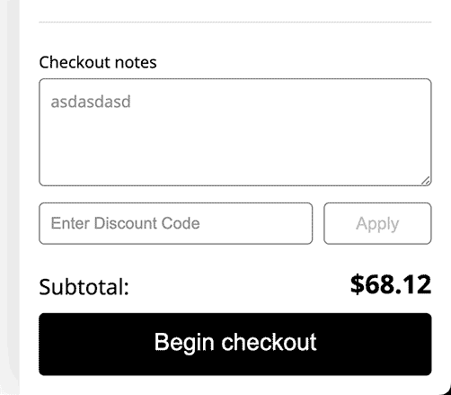
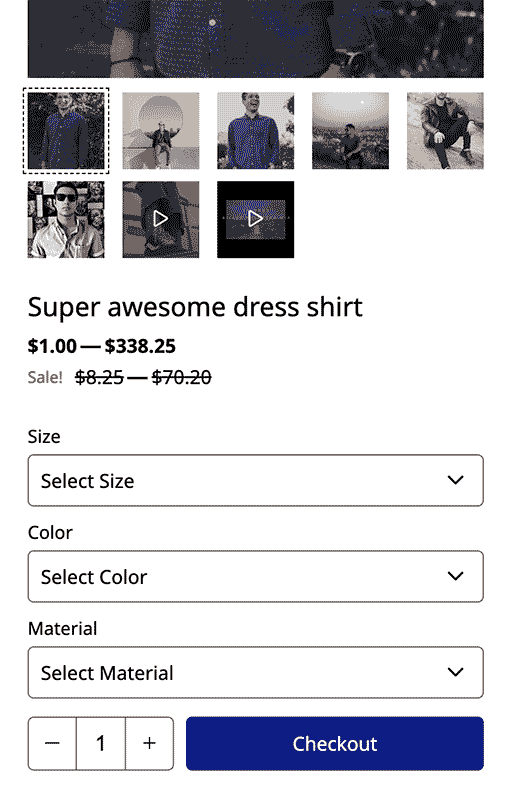
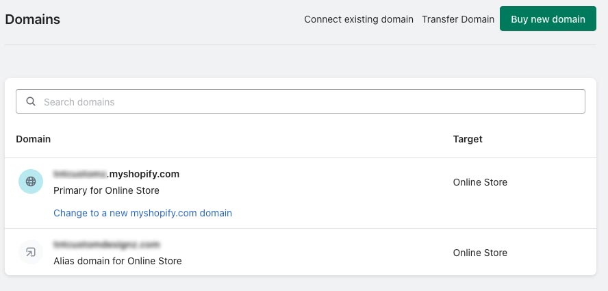
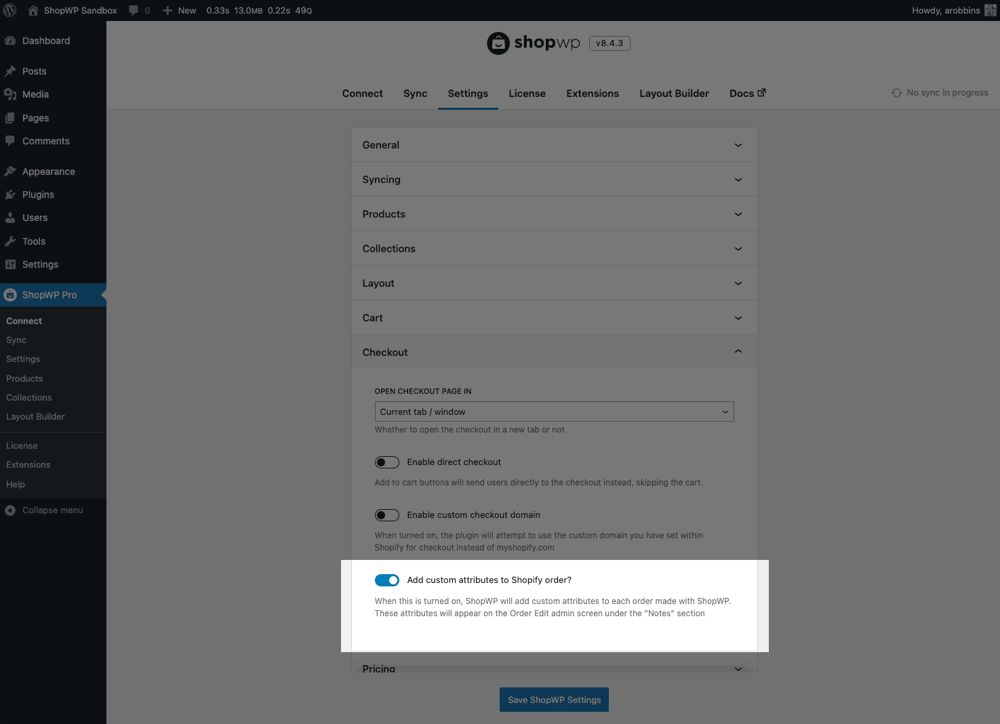
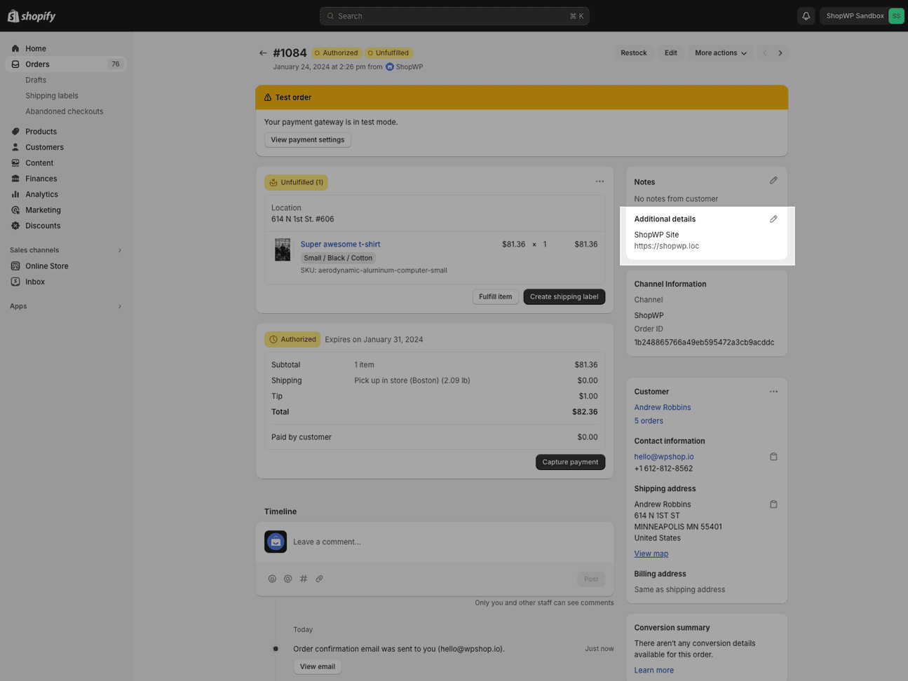

# Checkout

ShopWP does not handle the checkout process. Instead, users are sent to the default Shopify checkout page.

We believe this creates a much faster and secure checkout experience.

One of the main benefits is that you can lean on Shopify to handle the important security and performance considerations. You can also leverage any third-party apps that may modify the Shopify checkout page.

Also according to a [recent study](https://www.shopify.com/enterprise/shopify-checkout), the Shopify checkout page converts better than the competition by up to 36%, and by an average of 15%.

## How it works

ShopWP provides three main approaches to the checkout experience. Let's go through each one.

### Default checkout button



This is the default ShopWP checkout experience. Users will be given a built-in, slide-out cart experience to see the products they're about to purchase. When they're ready, they click the "Begin checkout" button in the cart which redirects them to the default Shopify checkout page.

### Direct checkout



With the Direct Checkout feature, a user will click a button and go directly to the Shopify checkout page. The specific product will be added to the checkout for the user to purchase.

Direct checkout is great if you only need to purchase a single product at a time. With this feature, you can skip using the ShopWP cart altogether.

### Programmatically

ShopWP provides two JavaScript action hooks for programmatically initiating a checkout. They are powerful features to leverage if you need to build a highly customized experience.

The first is [`do.checkout`](/javascript-actions#docheckout). This hook will simply redirect the browser to the Shopify checkout page. It uses the current state of the ShopWP cart at the moment of calling the hook.

The second is [`do.directCheckout`](/javascript-actions#dodirectcheckout). This hook is much more powerful. It allows you to specify which products are added, the quantities, any discounts etc. Then you can programmatically send customers to the Shopify checkout page.

## Domains

The domain you have set as your "primary" domain in Shopify will be used at checkout.

You can use the default `.myshopify.com` domain for checkout or a subdomain of your WordPress site. However your WordPress domain _**must be a separate top-level domain**_ from the checkout domain.



:::warning
If you have your WordPress domain set as your Shopify "primary" domain, the checkout _will_ break. The ShopWP syncing will also stop working so please make sure these domains are different.
:::

Thankfully, you _can_ use subdomains of your WordPress site. For example if your WordPress domain is `mysite.com`, you could use `shop.mysite.com` or `checkout.mysite.com`.

To do this, simply create a subdomain of your WordPress site inside your domain registrar. Once created, [set it as your “primary” domain](https://help.shopify.com/en/manual/domains/add-a-domain) inside Shopify. ShopWP will then use this domain at checkout.

## Tracking Parameters

As of ShopWP version `8.1.1`, the below tracking parameters are automatically detected and passed to the Shopify checkout page:

```
utm_source
utm_medium
utm_campaign
utm_term
utm_content
utm_keyword
guid
fbclid
gclid
li_fat_id
```

This means that cross-site tracking is automatically built in for Google Analytics and various social media ad clicks.

If you need to add additional parameters to this list you can leverage the [`misc.trackingParams`](/javascript-filters#misctrackingparams)

## Add domain to order

As of ShopWP version `8.5.0`, you can now auto assign a custom attribute to any ShopWP order. This attribute contains the domain of your WordPress site. This is helpful for making any custom integrations or improving analytics.

You can turn this on by going to `ShopWP Pro -> Settings -> Checkout`. Find the setting called "Add custom attributes to Shopify order?"



After the order is made, the attribute will show up within the "Additional details" section on the Order Edit screen. See screenshot below:



## Change logo link

The Shopify checkout pages will display your store logo in the upper left hand corner. Unfortunately, the "link" for this logo will point to your Shopify theme. To make this link to your WordPress site instead, follow this tutorial:

https://www.youtube.com/watch?v=aZbgIiGymuI
