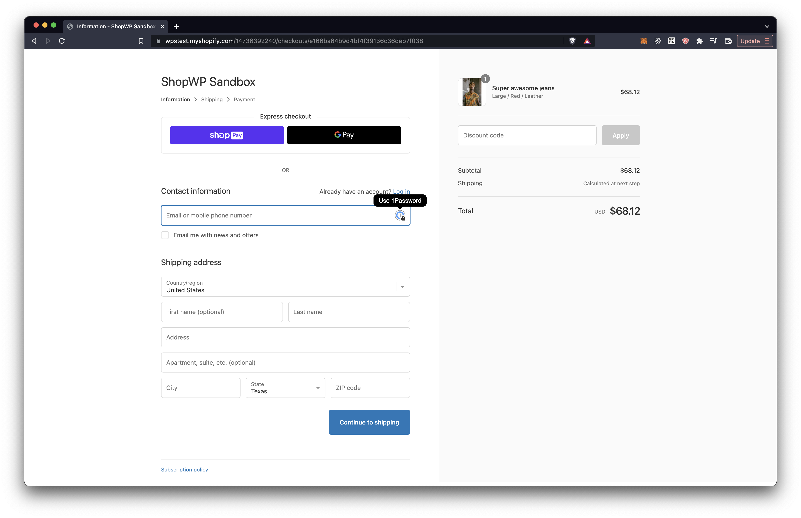

# Checkout

ShopWP does not handle any portion of the checkout process.

Instead, the plugin sends customers to the default Shopify checkout page to finish the purchase. This has it's pros and cons, but we believe it makes for a much better ecommerce experience.

One of the main benefits is that you can lean on Shopify to handle the important security and performance considerations for your checkout page. You can also leverage any third-party apps that may modify the Shopify checkout page.

## Domains

Your WordPress domain will be _separate_ from the Shopify domain used for checkout. However, you _can_ use subdomains of your WordPress site such as `shop.mysite.com` or `checkout.mysite.com`)`.

Some people are ok with just using the default `.myshopify.com` domain for checkout, but others want a subdomain of their WordPress site. Thankfully Shopify does allow this.

To do this, simply create a subdomain of your WordPress site inside your domain registrar. Something like `shop.mysite.com`. Once created, and [add it as your “primary” domain inside Shopify](https://help.shopify.com/en/manual/domains/add-a-domain).

After you're done the ShopWP cart will redirect users to `shop.mysite.com` during checkout!
