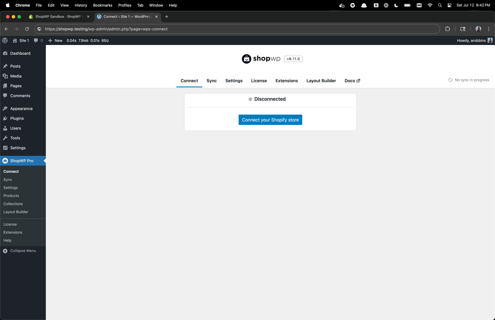
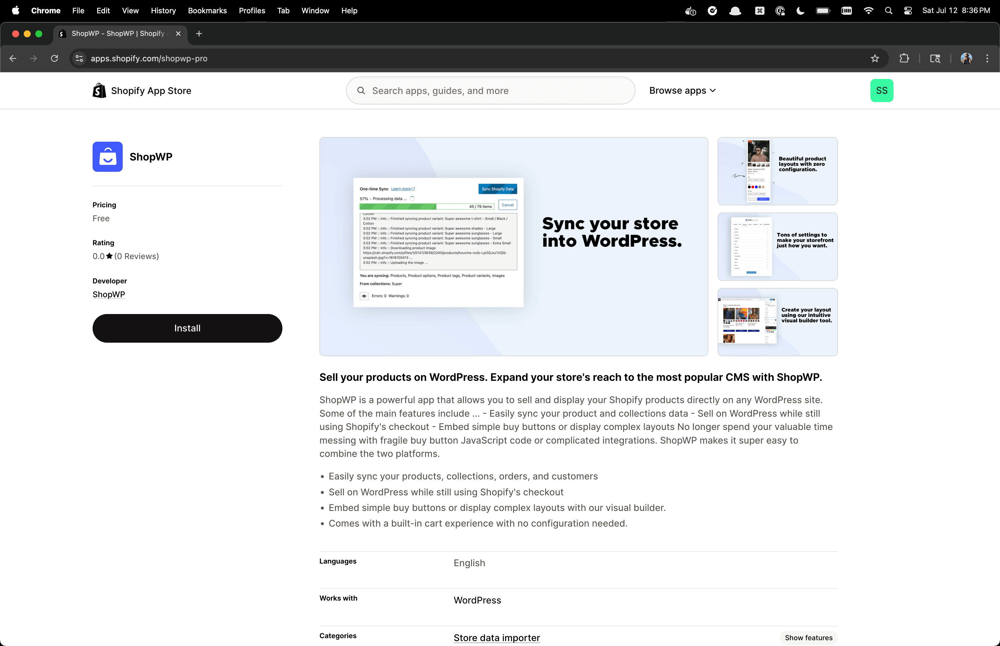
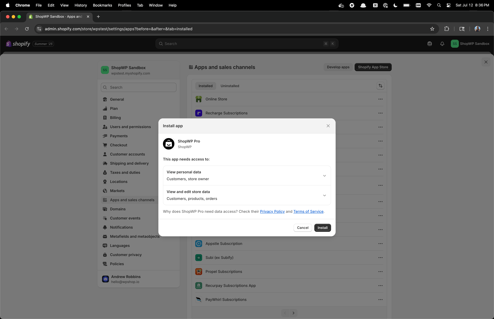
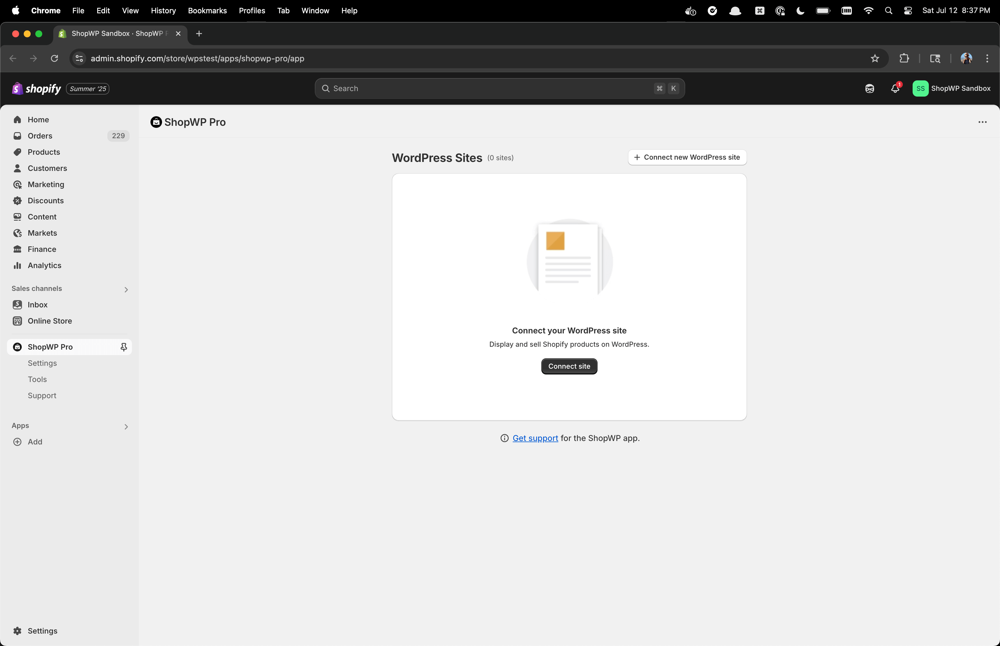
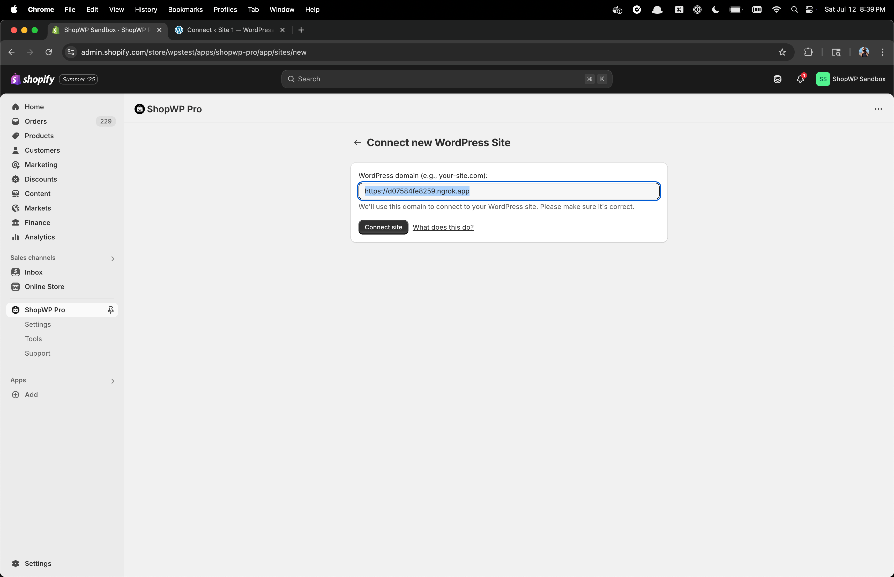
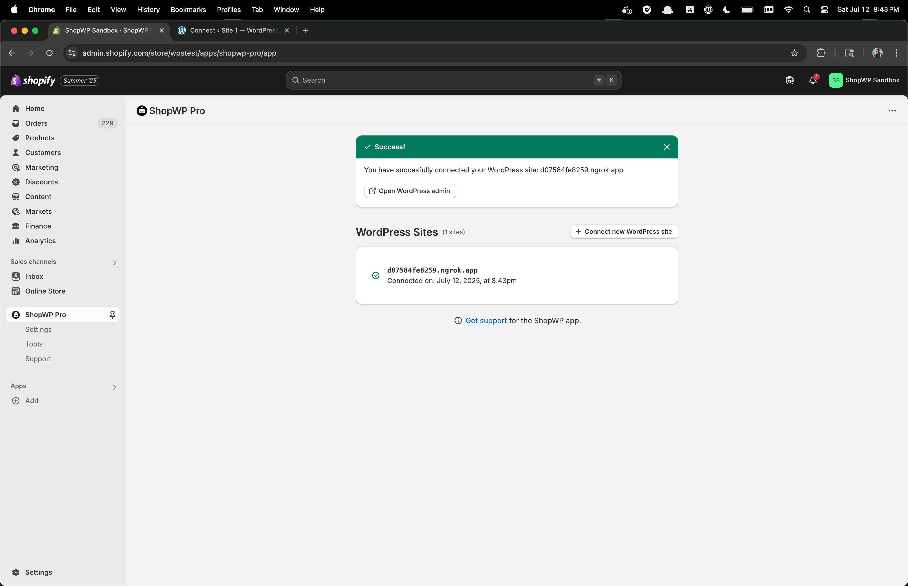
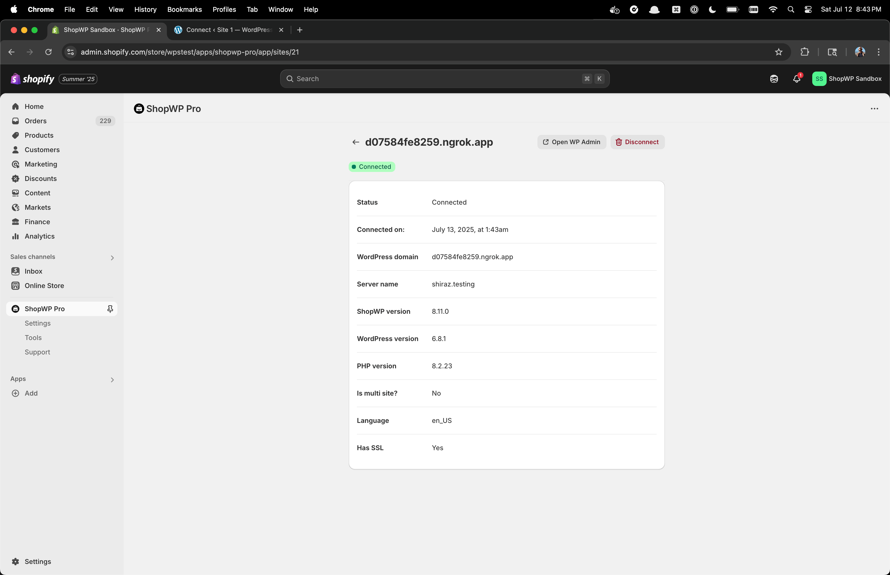
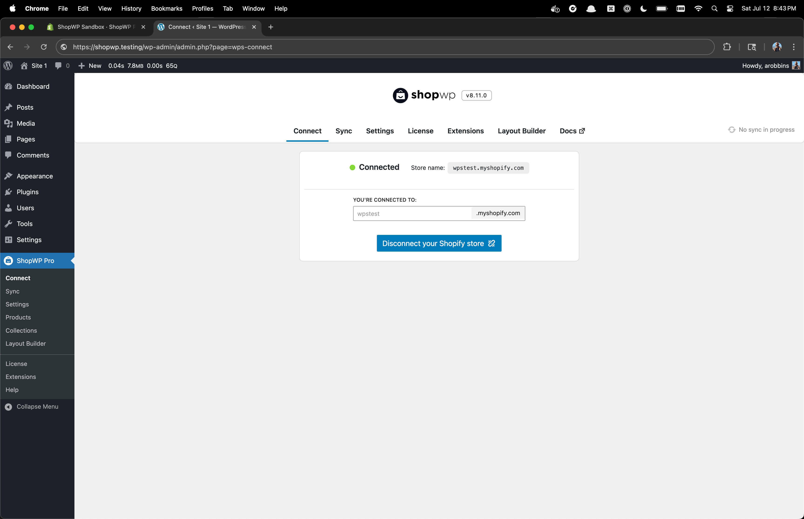

# Connecting

Connecting your [Shopify](https://shopify.com) store to WordPress is the first step in using ShopWP.

It takes just a few moments, so let's begin!

## How to connect

### 1. Start the connection

Within the WordPress plugin settings go to the "Connect" tab. Click the button that says `Connect your Shopify store`.

### 2. Install the Shopify app

You will be redirected to the Shopify app page. Click the `Install` button.

### 3. Confirm the install

You will be shown a new install screen showing which permissions the app will need. Click the `Install` button to finalize the process.

### 4. Connect your WordPress site

Click the `Connect site` button to connect your WordPress site.

### 5. Enter WordPress domain

Enter your WordPress domain and click the `Connect site` button.

:::info
If you're connecting a dev site, make sure to enter the same domain found in your ShopWP syncing url setting. This must be a [publicly accessible URL](/getting-started/syncing#using-localhost).
:::

### 6. Confirm the connection

If the connection was successful, you should see a confirmation screen like below. You can click into the site and see more details (or disconnect if needed).

### 7. Back to WordPress

At this point, you can go back to the WordPress site to see that the connection is now "active" in the plugin. 

You're all set! 

Next, learn how to [sync your products](/getting-started/syncing).

