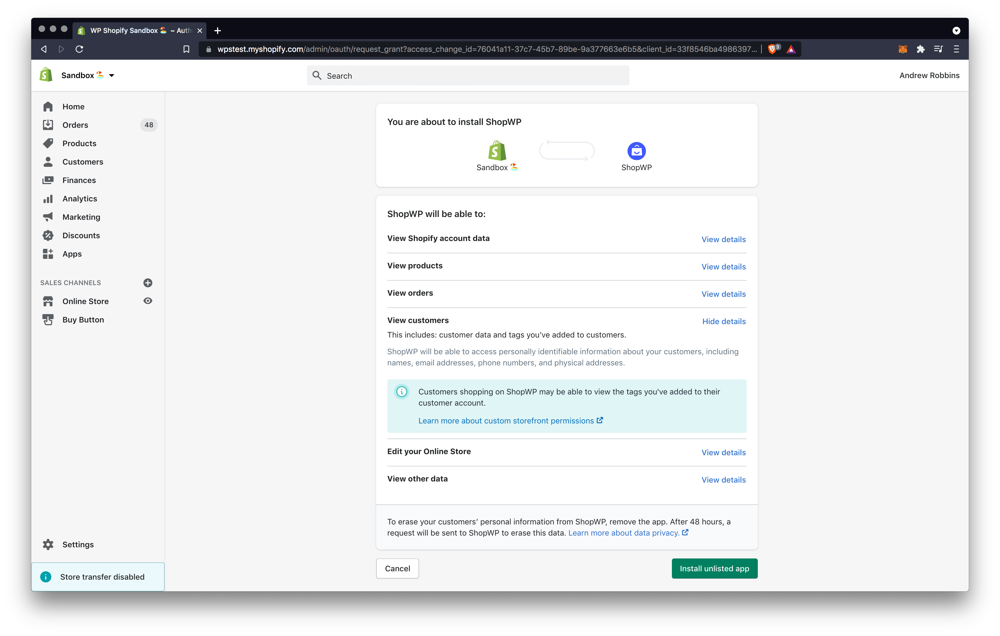
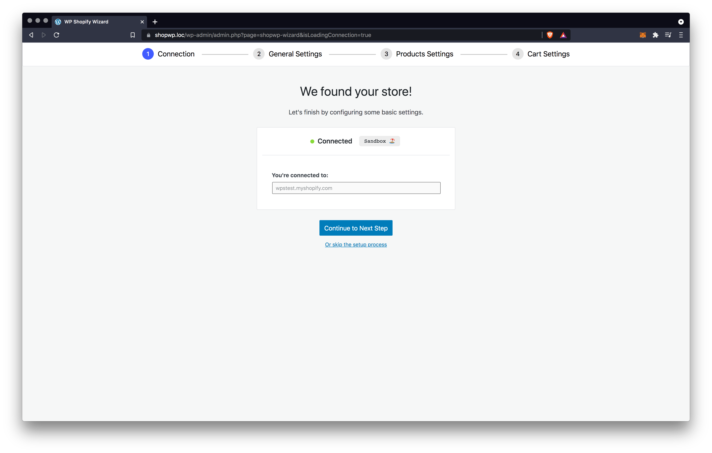
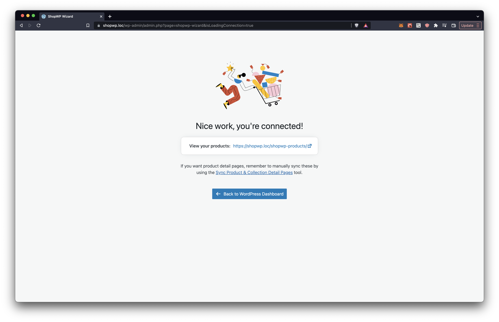
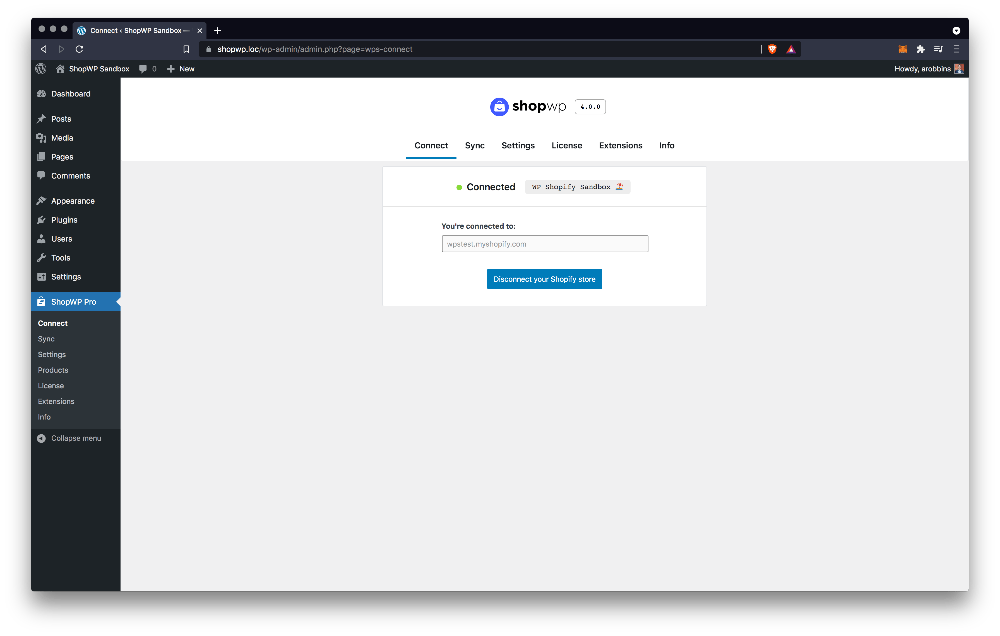
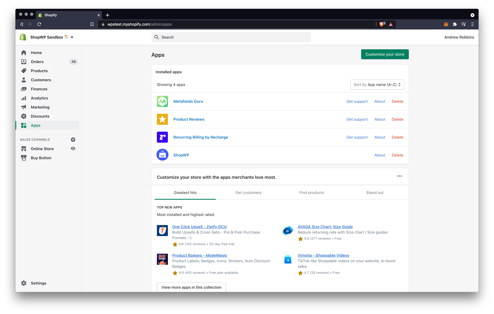

# Connecting

Connecting your Shopify store to WordPress is the first step in using ShopWP and takes just a few moments. Let's begin so you can start selling online!

## How to connect

### 1. Start the connection

To begin, navigate to the "Connect" tab within the plugin Settings. You should see a screen that says "Disconnected". Click the button that says `Begin the connection process`. This will open a wizard to guide you through the process.

### 2. Enter your Shopify domain

Once you're on the wizard page, enter your `store.myshopify.com` domain and click the `Connect your Shopify store` button.

:::info

The myshopify.com is what you use to login to Shopify with. It can also be found inside the Shopify admin. It will be the domain that's displayed in the address bar.

By default, your domain uses the format: `store.myshopify.com`. Please do not include "https://" or "www".

If you're having trouble, please refer to this [Shopify guide](https://help.shopify.com/en/manual/online-store/domains/managing-domains#myshopify-com-urls) or send us an email: hello@wpshop.io

:::

### 3. Authorize the connection

If this is your first time connecting, you will be asked to authorize the connection within Shopify. Click the `Install app` button toward the bottom.

### 4. Finish the wizard

After authorizing the connection you'll be redirected back to WordPress in order to finish the wizard process.

Once you finish the wizard you're done! You're now connected to Shopify and can begin [displaying](/getting-started/displaying) your products.

## Disconnecting

Disconnecting your Shopify store is very easy. Simply open the `Connect` tab within the plugin settings and click the disconnect button. After the process finishes, your store will no longer be connected to WordPress.

When disconnected, you won't be able to display products or use the cart.

## The Shopify App

During the connection process, ShopWP installs a companion Shopify app to your store. The purpose of this app is to manage API keys and make secure connections between the two sites. The Shopify app is unlisted, and can only be installed from inside the ShopWP WordPress plugin. The app itself provides zero functionality or features. You can think of it simply as an extension of the WordPress plugin.

While you're using ShopWP, please do not delete the companion Shopify app. If you do, you may notice that the plugin stops working properly. You must have this Shopify app installed if you wish to use ShopWP.

If the app is deleted for whatever reason, you can always "disconnect" your store from inside the WordPress plugin and reconnect again.

