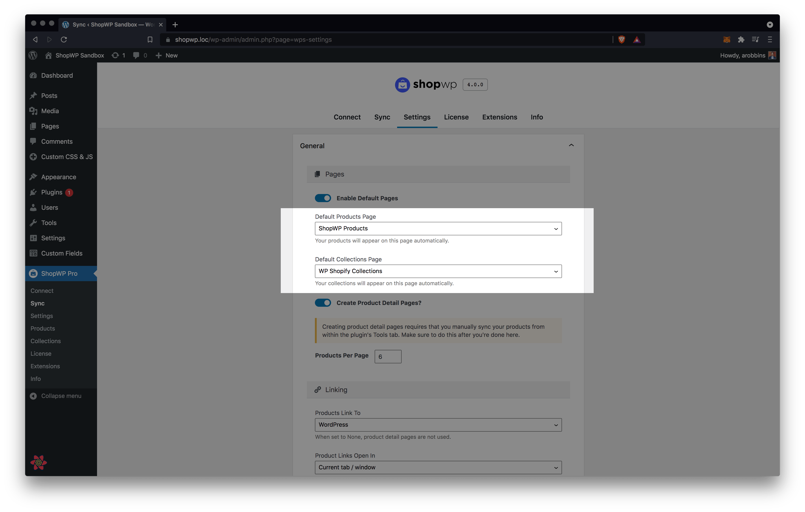
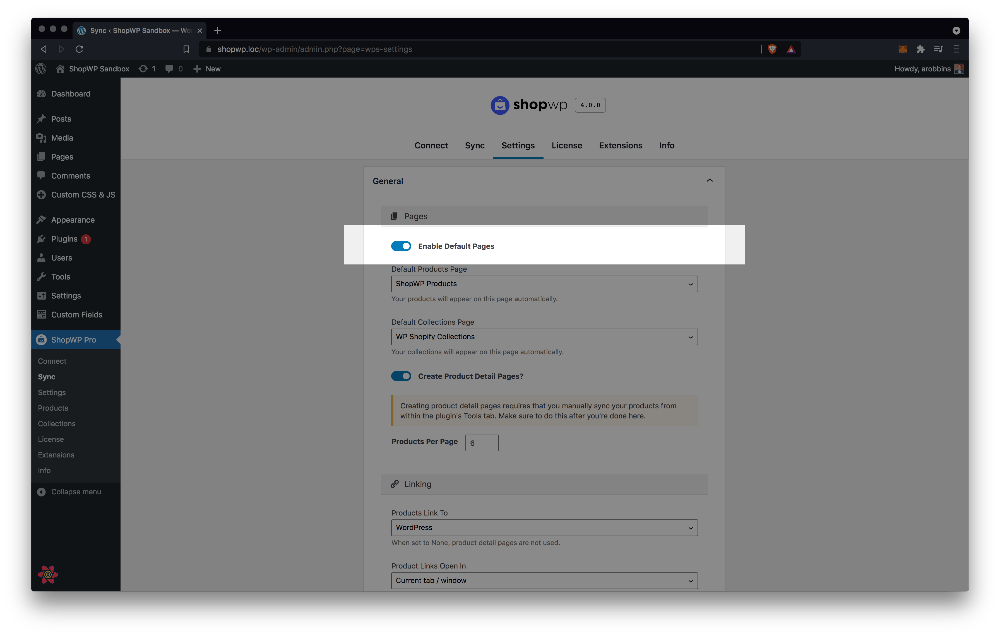
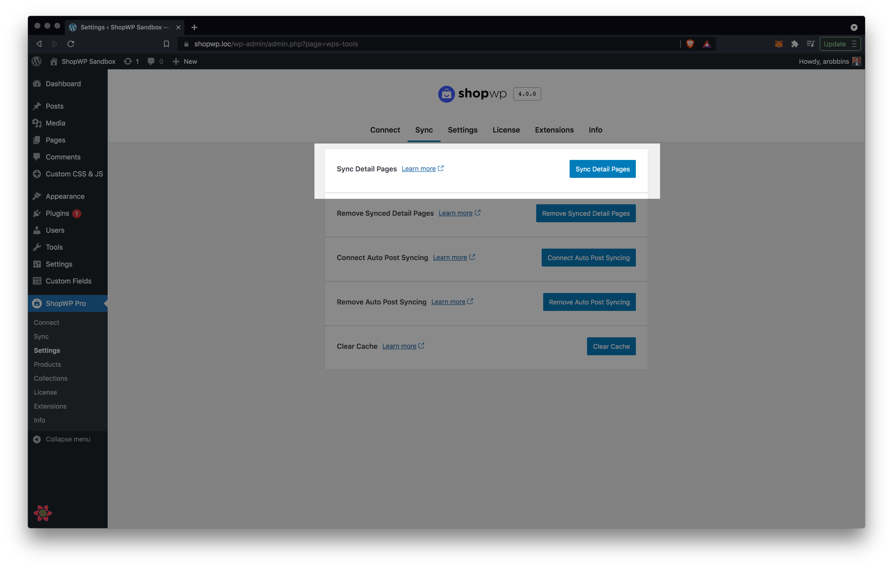
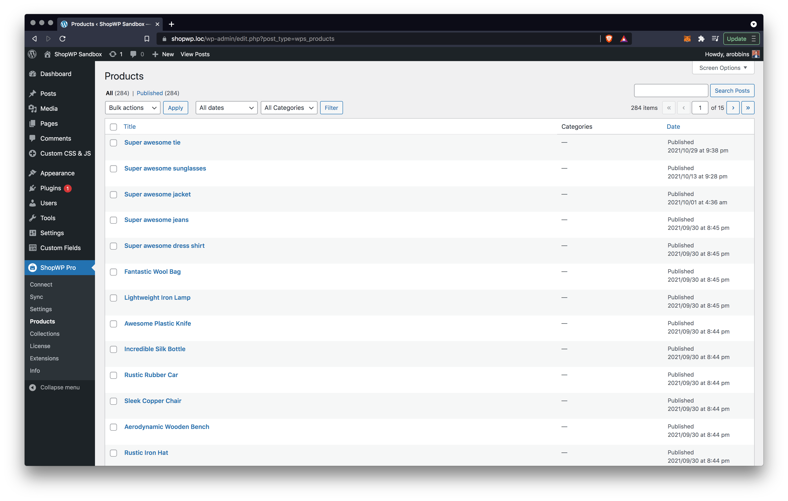

# Displaying

ShopWP allows you to display your [Shopify](https://shopify.pxf.io/5bPL0L) products in many different ways including ...

- [Default pages](#default-pages)
- [Shortcodes](/shortcodes/wps_products)
- [Gutenberg Blocks](/guides/gutenberg-blocks)
- [Elementor Extension](https://wpshop.io/extensions/elementor/)
- [Beaver Builder Extension](https://wpshop.io/extensions/beaver-builder/)
- [Render API](/render-api)

## Default Pages

ShopWP comes with two default pages: `ShopWP Products` and `ShopWP Collections`. These two pages are created when the plugin is first installed.

### Listing Pages

The purpose of these default pages is to display your products and collections without needing to configure anything. If you don't want to use them, you can turn them off within the plugin settings. You can also choose a different page to be used instead.

#### Changing the listing pages

If you would like to change the default listing pages, go into the plugin settings and open the General section. Once open, configure the `Default Products Page` and `Default Collections Page` options and click save settings toward the bottom.

#### Turning listing pages off

In order to turn the default pages off, go into the plugin settings and open the General section. Once open, toggle the `Enable Default Pages` option and save the settings.

### Detail Pages

ShopWP allows you to create detail pages for your products and collections. They are created for you automatically when you sync your products. By default they are not created.

So before you can use them you'll need to run a sync.

#### Running a sync

1. First, open the "Sync" tab and use the [One-time Sync](/getting-started/syncing#one-time-sync) button. This will attempt to sync all of your products.

If you don't wish to sync all of your products you can [adjust the syncing settings](/getting-started/syncing#products-sync-query) first.

3. Once the sync is finished, you should see a list of products within WordPress under `ShopWP - Products`.

## Caching

We've tried to make ShopWP as fast as possible. Caching is key to this, and the plugin comes pre-built with it's own caching system. There is no need to use third-party plugins to speed up ShopWP.

:::info
ShopWP will automatically clear it's cache after every sync
:::

### How caching works in ShopWP

When products first load, a network request is made to Shopify to fetch the product info. ShopWP then cache's this data to prevent additional network requests on consecutive page loads. How the long the cache lasts is determined by the `Cache length` setting. See below:

This means if you have the ShopWP cache enabled, you'll need to manually flush the ShopWP cache anytime you change your product information inside Shopify.

Our recommendation is to set the cache length to a high number (1 day) if you don't plan on changing your Shopify information very often. This will flush the cache automatically for you once a day. If you plan on changing the content frequently, 2 or 5 minutes will work just fine.

## Custom CSS

Many customizations can be made by adding a minor about of custom CSS to your WordPress theme.

We recommend adding any CSS to the WordPress Customizer. You can do this by [following this tutorial](https://wpastra.com/guides-and-tutorials/custom-css-wordpress#add-custom-css-using-the-wordpress-customizer).

We like this method because it works across all themes and doesn't require another plugin. It won't be removed after updating your theme, and will persist across any theme you choose to use.
