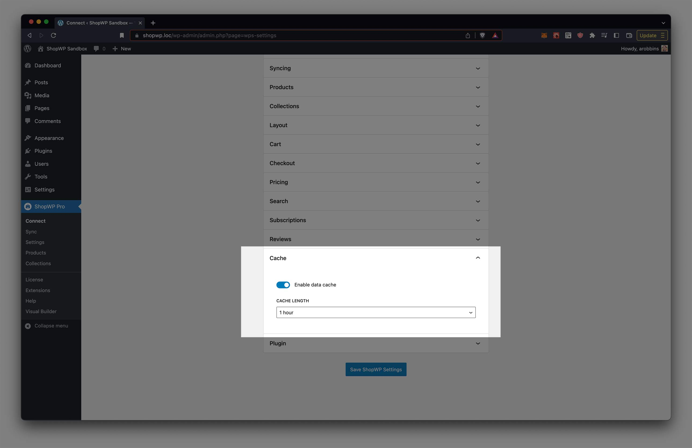

# Displaying

ShopWP allows you to display your [Shopify](https://shopify.pxf.io/5bPL0L) products in many different ways including ...

- [Default pages](#default-pages)
- [Shortcodes](/shortcodes/wps_products)
- [Gutenberg Blocks](/guides/gutenberg-blocks)
- [Elementor Extension](https://wpshop.io/extensions/elementor/)
- [Beaver Builder Extension](https://wpshop.io/extensions/beaver-builder/)
- [Render API](/render-api)

## Default Pages

We've written an [extensive tutorial](https://wpshop.io/blog/how-to-manage-your-shopwp-product-and-collection-pages/) on the ShopWP default pages.

## Caching

We've tried to make ShopWP as fast as possible. Caching is key to this, and the plugin comes pre-built with it's own caching system. There is no need to use third-party plugins to speed up ShopWP.

:::info
ShopWP will automatically clear it's cache after every sync
:::

### How caching works in ShopWP

When products first load, a network request is made to Shopify to fetch the product info. ShopWP then cache's this data to prevent additional network requests on consecutive page loads. How the long the cache lasts is determined by the `Cache length` setting. See below:

This means if you have the ShopWP cache enabled, you'll need to manually flush the ShopWP cache anytime you change your product information inside Shopify.

Our recommendation is to set the cache length to a high number (1 day) if you don't plan on changing your Shopify information very often. This will flush the cache automatically for you once a day. If you plan on changing the content frequently, 2 or 5 minutes will work just fine.

## Custom CSS

Many customizations can be made by adding a minor about of custom CSS to your WordPress theme.

We recommend adding any CSS to the WordPress Customizer. You can do this by [following this tutorial](https://wpastra.com/guides-and-tutorials/custom-css-wordpress#add-custom-css-using-the-wordpress-customizer).

We like this method because it works across all themes and doesn't require another plugin. It won't be removed after updating your theme, and will persist across any theme you choose to use.
