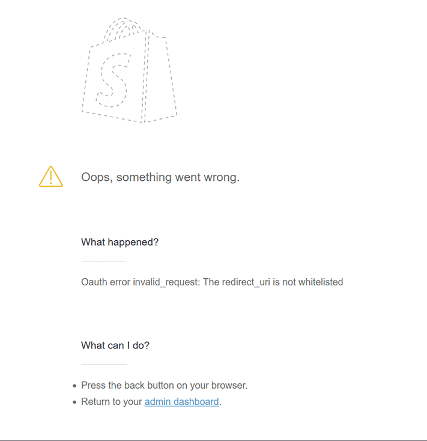

# FAQs

Below are commonly asked questions about ShopWP.

## Does ShopWP work with X app?

ShopWP does work with many Shopify apps—but not all of them. The apps that generally work are those that customize the admin area of the store. For example, an inventory app that provides additional features to shipping information.

The apps that usually do _not_ work are those that customize the front-end of the store. Common examples are apps that create "bundle" products or apps that create custom fields with date pickers. This is because ShopWP creates it's own frontend on WordPress—bypassing the Shopify theme.

Your best bet is to install the app and simply check whether the functionality works as expected. We're always considering integrating with additional Shopify apps, so if you have any recommendations please let us know.

## What are the benefits of ShopWP vs X?

ShopWP provides a few major benefits over other Shopify / WordPress solutions:

1. Ability to sync products and collections into native WordPress posts—creating detail pages automatically for you.
2. Allows for customizing the visual style to match your brand (no iFrames)
3. Lots of great functionality like image zoom, direct checkout, selling subscriptions, built in cart etc.
4. Integrates with other WordPress plugins such as Yoast, ACF, Elementor, etc

A commonly expressed frustration with the Shopify buy button is that it requires copying / pasting JavaScript code into the WordPress page. This might work for a one-time embed, however making changes requires regenerating the embed code each time. This quickly becomes unmanageable when you want to embed different products on multiple pages.

## Can I use my WordPress domain for the checkout?

If you want to use your WordPress domain for the Shopify checkout, you'll need to use a subdomain and assign that as your "primary" domain in Shopify. For example, if your WordPress domain is `widgets.com`, you could use something like `shop.widgets.com`.

If you end up using the same top-level domain your customers will not be able to purchase checkout.

Learn more about this [here](/getting-started/checkout#domains).

## My checkout page is not working

Sometimes this problem can occur because your Shopify store is password protected. If you remove the password protection, the checkout page will work again.

If it's working on desktop but not mobile, that's most likely because you're logged into Shopify on desktop. You won't see the "coming soon" page if you're logged in.

Another thing to check is that your Shopify primary domain is not the same as your WordPress top-level domain. [Learn more here](/getting-started/checkout#domains).

## How do I redirect the products listed on Shopify to WordPress?

Many people who use ShopWP will keep their "Online store" password protected because they don't want their users mistakenly going to those product pages on Shopify.

As a workaround, you can redirect those pages to WordPress. We have a tutorial [setup here](/guides/redirect-shopify-to-wordpress).

## How do I combine collections with other filter types?

You cannot combine a collection with any other filter type (tag, vendor, etc) in ShopWP. However you can combine the other four filter categories together (tag, vendor, product type, and price).

This is currently a limitation in the Shopify API.

## How does the checkout process work?

ShopWP does not handle any portion of the checkout process. Instead, we send users to the default Shopify checkout page for the final payment steps.

For example, when a customer clicks the “Begin checkout” button inside the ShopWP cart, they're redirected to the default Shopify checkout page to enter their billing info.

While we can understand the temptation to use WordPress for checkout, here’s a few reasons why we suggest you avoid that path:

1. Shopify has battle-tested their checkout page. It’s extremely secure and you don’t need to worry about anything breaking during this crucial step for your customers. If you build a custom solution, or rely on a third-party plugin, you’re taking a risk here.
2. The Shopify checkout page [converts very well](https://www.shopify.com/enterprise/shopify-checkout).
3. Using the default Shopify checkout page lets you use any of the Shopify apps that customize the checkout pages.

More information on the Shopify checkout process can be found [here](https://help.shopify.com/en/manual/checkout-settings/checkout-extensibility).

## How can I add custom notes to the ShopWP cart?

ShopWP lets you easily add cart notes. The feature is turned off by default so you must manually enable it.

Inside the plugin settings, go to **ShopWP Pro → Settings → Cart** and turn on the **Cart Notes** setting.

## Does ShopWP sync the contents of a Shopify cart?

No, ShopWP maintains its own cart and does _not_ sync with a Shopify Online Store cart.

## Can I track Shopify events in Google Analytics?

Absolutely! ShopWP has been configured to support cross-domain tracking [out of the box](/getting-started/checkout#tracking-parameters) and will work with Google Analytics 4. We've written a [full guide](https://wpshop.io/blog/tracking-shopwp-events-with-google-analytics-4-and-tag-manager/) on tracking events with Google Analytics 4 as well.

## Does ShopWP provide a cart experience?

Yes! We provide a built-in cart experience with zero configuration required. Our cart has a beautiful slide-in effect that makes it super easy for customers to purchase. You can see a live example by [viewing our demo page](https://7911cc047fd2.ngrok.app/features/#cart-icon).

## How do I place a test order with ShopWP?

By placing a test order, you can make sure that your checkout process and settings for order processing, inventory, shipping, email notifications, and taxes are all correct.

Shopify has put together an [excellent guide](https://help.shopify.com/en/manual/checkout-settings/test-orders) on how to set this up.

## Am I able to remove the login link from the checkout page?

You can remove the Shopify checkout login link by [disabling the customer accounts requirement](https://help.shopify.com/manual/customers/customer-accounts) at checkout. However, if you need customer accounts enabled, there’s no way to hide this only for ShopWP purchases.

## Can I change the Shopify checkout domain?

Yes! ShopWP allows you to use a custom checkout domain. However, it's important to know that _you won't be able to use your WordPress TLD domain on the Shopify checkout page_. Instead, you can use a subdomain of your WordPress site. For example, if your WordPress domain is **mystore.com**, you can add **checkout.mystore.com** to Shopify.

We've written a guide on [setting this up here](/getting-started/checkout#domains). Once you have the domain added, go into the ShopWP settings under the **Checkout** section and enable the “Enable custom checkout domain” setting.

## Can I modify the Shopify checkout page?

Yes and no. Shopify keeps the checkout page fairly locked down, but you can still customize things in various ways. Please look at [this post by Shopify](https://help.shopify.com/en/manual/checkout-settings/checkout-extensibility) for more details.

If you don't see the specific customization that you're looking to make, please [send us an email](/contact) and we'll provide you with an answer.

## How do I connect my Shopify store ?

We’ve written a [dedicated guide](/getting-started/connecting) on connecting your store.

## Does ShopWP support PHP Blade templating?

Unfortunately ShopWP does not support Blade templating at the moment. We're looking to add this in a future update.

## What are the requirements to use ShopWP?

The full list of requirements for ShopWP can be [found here](/getting-started/requirements).

## What kind of customizations can I make?

ShopWP was built with customizations as a first priority. We've ensured that almost everything has a corresponding hook, allowing you to change things quickly and easily. A full list of hooks can be [found here](/).

We also save the Shopify data into custom database tables, giving you the option of doing completely custom front-end work yourself, if you want. If you know rudimentary CSS and can handle adding actions/filters to your `functions.php` file, then you'll be able to customize basically everything.

## How do I display a single product with an add to cart button?

You can use the [`wps_products` shortcode](/#/shortcodes/wps_products) with a `title` attribute. Here's a [full example](/shortcodes/wps_products#title) of doing this.

There's also the dedicated [`buy_button` shortcode](/shortcodes/wps_products_buy_button) if you want to display _only_ the buy button.

You can also use the [ShopWP Gutenberg blocks](/guides/gutenberg-blocks) to accomplish the same thing.

## Can I filter and sort products with ShopWP?

Absolutely! We provide various ways of sorting and filtering products in ShopWP.

A good place to start is with the [Storefront component](/shortcodes/wps_storefront). This component will embed your products with filter and sorting controls on the side—great for your main products page. Here's a [live demo](/features).

The ShopWP shortcodes also let you filter and sort by passing various attributes such as [title](/shortcodes/wps_products#title), [tag](/shortcodes/wps_products#tag), [vendor](/shortcodes/wps_products#vendor), [collection](/shortcodes/wps_products#collection), etc. More information on ShopWP shortcodes can be [found here](/).

## How can I customize the product layout?

ShopWP provides a few different ways to customize the layout of your products. The easiest way is to use the [ShopWP Layout Builder](/guides/layout-builder). This is a visual building tool (using Gutenberg blocks) that allows you to customize things like product title color, buy button font size, and the general layout of components.

Additionally, you can also customize the templates of the detail and listing pages by using the [HTML Templates feature](/guides/html-templates). This lets you customize the layout structure of a single shortcode—for example, if you want to move the price to the bottom or the buy button to the top.

We also have [Elementor](https://wpshop.io/extensions/elementor/) and [Beaver Builder](https://wpshop.io/extensions/beaver-builder/) extensions, plus custom [Gutenberg blocks](/guides/gutenberg-blocks).

## How do I display my products with ShopWP?

We’ve written a [dedicated guide](/getting-started/displaying) on displaying your products in ShopWP.

## What are the main features of ShopWP Pro?

ShopWP Pro has many amazing features including displaying subscription products, direct checkout, filtering/sorting, and more. The entire list of ShopWP Pro features can be [found here](/features/).

## Do I need to renew my ShopWP Pro license every year?

Yes, every license key needs to be renewed annually to continue receiving plugin updates and plugin support. The ShopWP Pro subscription renewal happens automatically each year, until canceled. You can cancel your subscription within your [ShopWP account](/account).

## Can I upgrade to the Agency plan later?

Yes, absolutely. When you upgrade to the Agency plan you will be charged a pro-rated price.

You can upgrade anytime by [logging into your account](/account) and visiting the [purchase page](/purchase).

## How do I change my ShopWP account info?

You can change your account information like email, credit card, name, etc., within your [ShopWP account](/login).

## Where can I find an official changelog for ShopWP?

The official changelog for ShopWP can be [found here](https://wpshop.io/changelog/). We only keep a log for the last two years of plugin updates.

## How often is the ShopWP plugin updated?

We generally release plugin updates every week.

## How long has ShopWP been around?

ShopWP has been around since June of 2017. We work on it full time and plan on supporting the plugin for the foreseeable future!

## Can I see some example sites using ShopWP?

Absolutely! We have [compiled a list](/examples) of real, live sites that are currently using ShopWP.

## What is the refund policy of ShopWP?

We offer a full 30-day refund policy on all purchases. We do not issue refunds for renewals. Read our [full refund policy here](/refunds-and-payment-terms/).

## How much does ShopWP cost?

ShopWP Pro comes in two yearly subscription plans: [Solo](/purchase) and [Agency](/purchase). The cost of each one can be [found here](/purchase). If you have any questions, please [contact us](/support)!

## Can I sell subscription products with ShopWP?

Absolutely. ShopWP works with all popular subscription apps like Recharge, Bold, etc. You must manually enable the subscriptions widget when showing the products.

## How do I create product detail pages with ShopWP?

To create product and collection detail pages, you’ll need to first sync your Shopify store. We've written an [excellent guide on doing this](/getting-started/syncing/). Once the sync is finished, you should see a list of products within WordPress under **ShopWP Pro → Products**.

## My products aren't showing, what can I do?

If you're receiving a "No products left to show" message, start by reconnecting your Shopify store. You can do this from within the plugin settings under the **Connect** tab.

This could also mean you just need to [assign your products to the Shopify Sales Channel](/guides/common-issues#products-not-showing). That channel is created automatically when you set up your private app and will have the same name. It controls which products are visible in ShopWP.

Finally, this can sometimes happen if you have a caching system in place that's too aggressive. Try deactivating any caching plugins temporarily to see if the products start showing again. Also, if you're having syncing issues, [please read this guide](/getting-started/syncing#common-syncing-issues).

## How does this handle product categories?

In [Shopify](https://shopify.pxf.io/5bPL0L), categories are called **Collections**. You can assign products to dynamic collections (e.g., “Any product with X tag”) or manually select products for a specific collection. ShopWP allows you to display products from these collections using: [wps_products collection="Collection name"] or via the Products Block. Learn more about this in the [`wps_products` shortcode documentation](/shortcodes/wps_products#collection).

More information on Shopify Collections can be found [here](https://help.shopify.com/manual/products/collections).

or via the Products Block. Learn more about this in the [`wps_products` shortcode documentation](/shortcodes/wps_products#collection).

More information on Shopify Collections can be found [here](https://help.shopify.com/manual/products/collections).

## Will deleting products in Shopify remove them from ShopWP?

This depends on whether you have [automatic syncing](/getting-started/syncing#automatic-syncing) turned on. If you do, then deleting a product inside Shopify will automatically delete it from WordPress.

## Can I use ShopWP to search for Shopify products?

Absolutely! ShopWP comes with a search shortcode that allows you to output a dynamic search field. You can [learn more about it here](/shortcodes/wps_search). This will automatically append the products beneath the search field as the user types. We also have a live demo that you can [view here](/features/#search).

If you don’t want to use our search feature, any existing WordPress plugin that provides search functionality will work as well.

## How many product variants can ShopWP handle?

Shopify imposes a 100-variant limit per product, which cannot be raised. Each product can have up to 3 options. For example, one product can use size, color, and style, and another product can use weight, finish, and material.

More information on this variant limit [can be found here](https://help.shopify.com/en/manual/products/variants/add-variants#:~:text=You%20can%20create%20up%20to,weight%2C%20finish%2C%20and%20material.).

## My sync isn't working, how do I fix it?

The first thing you should do is look through our [guide on fixing syncing issues](/getting-started/syncing#fixing-syncing-issues). Many common problems can be resolved by following those steps.

Syncing Product and Collection single pages may take up to 5 minutes depending on the size of your Shopify store and the speed of your WordPress site. If you have over 1000 products, you can expect the sync to take around 5-10 minutes. Under the plugin settings, you can try changing the “Items per Request” option to **25** and turning on “Synchronous Requests.” After these are updated, try re-syncing.

Also, take a look at our [syncing tutorial video](https://www.youtube.com/watch?v=YypIUgOvoqA).

## Can I sync changes back to Shopify?

No. ShopWP only provides one-way syncing of [Shopify](https://www.shopify.com/?ref=wps&utm_content=links&utm_medium=website&utm_source=wpshopify) **to** WordPress. When using ShopWP, you’ll manage your products inside Shopify and display them in WordPress. Shopify will be your store’s backend, while WordPress can serve as the frontend.

## What happens if I don't renew my subscription?

If you stop your ShopWP subscription, everything will continue working as expected. Your products will continue to show, and the checkout process will continue to work.

That said, it's still a good idea to keep an active subscription so you continue receiving plugin updates. Periodic changes in the Shopify platform could negatively affect your site if you’re using an out-of-date version of ShopWP.

You can always renew or [purchase a new subscription](/purchase).

## How does ShopWP work exactly?

You can think of WordPress as the frontend and [Shopify](https://www.shopify.com/?ref=wps&utm_content=links&utm_medium=website&utm_source=wpshopify) as the backend. You still manage your store (add products, change prices, etc.) from within Shopify, and those changes will automatically sync with WordPress. Essentially, you use your WordPress site as another channel to sell on.

ShopWP comes with its own cart experience out of the box—zero configuration needed.

After installing, you can connect your Shopify store to WordPress by going through our easy wizard process.  
View our [tutorial video here](https://www.youtube.com/watch?v=YypIUgOvoqA).

After connecting your store, you can sync your products (and collections) into WordPress, which creates product detail pages. Or simply display your products in various ways such as:

- [Default pages](/getting-started/displaying#default-pages)
- [Shortcodes](/shortcodes/wps_products)
- [Gutenberg Blocks](/guides/gutenberg-blocks)
- [ShopWP Layout Builder](/guides/layout-builder)
- [Elementor Extension](https://wpshop.io/extensions/elementor/)
- [Beaver Builder Extension](https://wpshop.io/extensions/beaver-builder/)
- [Render API](/render-api) (for developers)

## Does ShopWP install Shopify functionality into WordPress?

ShopWP does _not_ install the _same_ functionality from your Shopify apps into WordPress. ShopWP also will not sync over any custom functionality that you may be using via Shopify apps.

However, we do provide [integrations with some apps](/extensions). And if the app modifies the checkout page (like shipping or payment methods), it typically still works, because we send customers to the default Shopify checkout. ShopWP will also _not_ sync the “theme” of your Shopify online store into WordPress.

## Is ShopWP optimized for SEO?

We’ve gone to great lengths to ensure that we follow SEO best practices, including semantic alt text, structured data, and indexable content. Since ShopWP is built in WordPress, it inherits all the great SEO features of WordPress itself and integrates nicely with SEO plugins like Yoast.

## Do I need an active Shopify plan to use ShopWP?

Yes, you’ll need a Shopify store before using ShopWP. However, you can use the $5/month [Shopify Starter plan](https://www.shopify.com/starter), which is our recommended plan if you intend to sell _only_ on WordPress. All of our plugin features work with this plan, and it’s a great option to save some money.

## Can I use ShopWP and Shopify at the same time?

Absolutely! Using ShopWP doesn't prevent you from using [Shopify](https://www.shopify.com/?ref=wps&utm_content=links&utm_medium=website&utm_source=wpshopify) on other platforms like Facebook, or even using a Shopify theme concurrently.

## Do you have to be a developer to use ShopWP?

No! Everything works out of the box with minimal configuration. The ShopWP cart experience is built to “just work” as soon as you install the plugin. You also get two default pages for showing your products and collections that are preconfigured.

If you wish to do medium to large customizations, then you’ll need to know basic CSS, JavaScript, and PHP.

## How many products has ShopWP been tested with?

ShopWP has been tested successfully with up to 10,000 products. Keep in mind, if you're syncing thousands of products you may need to configure your web server accordingly to avoid timeout issues. [Learn more](https://blog.hubspot.com/website/wordpress-php-memory-limit).

## Can I convert my existing WooCommerce store to ShopWP?

We currently do not offer a straightforward way of converting a WooCommerce site to a Shopify site. However, these third-party solutions may help:

- [Woo Importer](https://apps.shopify.com/woocommerce-importer)
- [Cart2Cart](https://www.shopping-cart-migration.com/shopping-cart-migration-options/6694-woocommerce-to-shopify-migration)

You’ll need to migrate your WooCommerce products to Shopify products first. Afterwards, you can sync them into WordPress using ShopWP.

## Does ShopWP work with Shopify's $5 Starter plan?

Absolutely! In fact, this is our **recommended** Shopify plan if you wish to only sell on WordPress. All plugin features will work with the [Shopify Starter plan](https://www.shopify.com/starter). This plan is a great option if you want to save money.

## Will ShopWP work with my WordPress theme?

Yes, most likely. We’ve tested ShopWP on hundreds of themes and they typically work fine. If you find any theme-related incompatibilities, please let us know at [hello@wpshop.io](mailto:hello@wpshop.io) and we'll fix them.

The only issue we've noticed so far is with block-based themes.

## Do you offer a free trial of ShopWP?

We do not provide a free trial. However, we have a 30-day, no-questions-asked refund policy. If you purchase and decide it's not right for you, just let us know within 30 days and we’ll refund your money.

Here are the pricing plans: [https://wpshop.io/purchase](https://wpshop.io/purchase)

## Doesn’t Shopify already have a WordPress plugin?

Shopify discontinued their official WordPress plugin [years ago](https://wptavern.com/shopify-discontinues-its-official-plugin-for-wordpress). They now focus on their [Buy Button](https://www.shopify.ca/buy-button), an open-source JavaScript snippet which uses iframes. We believe this approach is more limited and time consuming for many reasons. (e.g., it’s harder to customize layouts and you need to embed code snippets).

ShopWP creates an iframe-free experience and syncs your [Shopify](https://www.shopify.com/?ref=wps&utm_content=links&utm_medium=website&utm_source=wpshopify) data directly into WordPress. We also save products and collections as [Custom Post Types](https://codex.wordpress.org/Post_Types#Custom_Post_Types), unlocking all the power of WordPress itself.

Therefore, ShopWP is great for simple and more complicated scenarios.

## Can I sync customer accounts or let people login from WordPress?

Unfortunately ShopWP doesn't currently provide a Shopify user account integration. If you need your users to login to their Shopify accounts, you must [redirect them to the Shopify account pages](/guides/redirect-shopify-to-wordpress) instead for now.

The way most people handle this currently is by styling their Shopify theme to "match" the WordPress site. Same header and footer for example. That way, the user thinks they're on the same site.

A true customer account feature is something we're actively looking into.

## My Elementor PDP template isn't working

First, make sure you've followed the steps in the [Elementor tutorial](https://wpshop.io/blog/the-comprehensive-guide-to-using-elementor-with-wp-shopify/).

Here’s something else to try:

Create a folder inside your theme (or child theme) called `wps-templates`.

Then, create a file inside that folder called products-single.php. You should copy and paste the contents of here (`shopwp-pro/public/templates/products-single.php`) into that new file.

Finally, copy the Elementor shortcode, clear out the contents of your version of `products-single.php` and replace it with the content below:

```
<?php

get_header('wpshopify');

echo do_shortcode('[elementor-template id="166089"]');

get_footer('wpshopify');
```

Be sure to replace `[elementor-template id="166089"]` with your own Elementor shortcode.

## How can I display Shopify metafields in ShopWP?

At the moment, the only way to display Shopify metatfields in ShopWP is by adding custom code to your WordPress site—so a developer or development experience will be required.

There a two ways of doing this.

The first method is using JavaScript hooks. This method gives you access to the metafields within specific parts of the product layout.

For example, using the [before.productBuyButton](/javascript-filters#beforeproductbuybutton) hook allows you to insert custom HTML above the product's buy button. Inside the hook callback you gain access to a "productState" variable which contains the metafields data.

For this to work, you need to make sure that your metafields are synced and that you have the "Include metafields on product data" setting enabled. You can find this setting within `ShopWP - Settings - Products`.

The second method is with PHP. You'll first [customize the product detail PHP template](/guides/template-overriding) in your WordPress theme. You would then use the internal "get_product()" PHP function to fetch the metafields (assuming they're synced). Then you can loop through them and output them where you want.

## My products are not displaying in ShopWP

When your products are failing to show, it usually means that you need to assign them to the [ShopWP sales channel](/guides/common-issues#products--collections-not-showing). This sales channel is created automatically when you initially install ShopWP. It's used to control which products are visible in ShopWP. Below are the steps for assigning your products to the sales channel.

1. Open the product inside Shopify and look for the section called, "Sales channels and apps". Click the manage link.


2. Assign the product to the [ShopWP sales channel](/guides/common-issues#products--collections-not-showing) and click "Done". Now head back to WordPress to see if the product shows up. Sometimes this can take 1-2 minutes.


Another common reason for this is Shopify's API cache. If you're noticing that many of your products and collections **are showing**, except for one or two, you can try forcing Shopify's API cache to flush. To do this, open the offending product or collection in Shopify. Turn the [ShopWP sales channel](/guides/common-issues#products--collections-not-showing) off. Then, update the description by adding a period or something small. Save the product again. Finally, set the [ShopWP sales channel](/guides/common-issues#products--collections-not-showing) back to active again and save the product. Wait 10mins and it should start showing.

Finally, also clear the ShopWP cache as well.

## What happens if I disconnect my Shopify store?

If you have your Shopify store connected and decide to disconnect, your products and cart will stop working on your website until you reconnect. Therefore if you need to reconnect, be sure to do this quickly if it's a live site or do it on a staging version instead.

## Common Issues

Below are the most common issues people experience with ShopWP and how to fix them. If you're having a problem not listed here, please [send us an email](mailto:hello@wpshop.io).

Many of these issues can usually be fixed by reconnecting your Shopify store from the ShopWP the "Connect" tab. So please try that first!

### Cookie check failed

This error is usually due to another plugin caching the WordPress REST API nonce too aggressively. WordPress uses a [cookie nonce to authenticate the REST API](https://developer.wordpress.org/rest-api/using-the-rest-api/authentication/). By default, this nonce is "valid" for between 12 and 24 hours.

If you're using a caching plugin with a cache lifespan longer than 12 hours, this may cause the error. Try changing this to something lower like 10 hours.

Also, try temporarily deactivating your other plugins and check again. You may also need to disable any host-level cache.

Another thing to look for is whether your website has a CDN enabled. If it does, try temporarily disabling this to see if the error goes away.

### Unauthorized

This can usually be fixed by reconnecting your Shopify store. Open the ShopWP Pro settings and find the "Connect" tab. From there, disconnect and reconnect your store.

If this doesn't help the culprit could be a ShopWP license key issue. Open your ShopWP settings and find the `License` tab. From there, either add your ShopWP Pro license key or remove it and add it back.

### Error: while calling undefined

When you receive this error, there's a good chance it's because your web server is running out of memory. Or it has hit the max execution time during the syncing process.

Both of these things can be increased by following the tutorials below:

[Tutorial: Increase the Max Execution Time](https://wpastra.com/docs/increase-php-time-limit-wordpress-sites)

[Tutorial: Increase the Memory Limit](https://wpastra.com/docs/increasing-php-memory-limit-website/)

### Internal error. Looks like something went wrong on our end.

This error can sometimes happen if the product or collection in Shopify is saved incorrectly. The easiest fix is to open the product in Shopify and set it to `draft`. Then republish. After doing this check the WordPress site again.

### ReferenceError: shopwp is not defined


This JavaScript error can can happen if a theme or plugin is preventing the ShopWP JavaScript from loading, or loading in the correct order. The first thing to do is check for a theme or plugin conflict.

Start by temporarily switching themes. Does the error go away?

If not, turn off all your other plugins besides ShopWP. Does the error go away?

Some users have also reported this error showing up due to the [Soil plugin](https://roots.io/products/soil/). If you're using this plugin, make sure you're on the latest version.

### DOCTYPE is not valid JSON

This issue is usually caused by a misconfigured `.htaccess` file. Some plugins, like All In One WP Security, will add additional lines of code to your `.htaccess` file. However this can sometimes conflict with ShopWP.

The easiest way to check for a conflict is by manually editing your `.htaccess` file. Open it up in a text editor and replace the entire contents with the default WordPress values below:

```
# BEGIN WordPress

RewriteEngine On
RewriteRule .* - [E=HTTP_AUTHORIZATION:%{HTTP:Authorization}]
RewriteBase /
RewriteRule ^index\.php$ - [L]
RewriteCond %{REQUEST_FILENAME} !-f
RewriteCond %{REQUEST_FILENAME} !-d
RewriteRule . /index.php [L]

# END WordPress
```

Another thing that can cause this issue is overly aggressive security settings. A common culprit can be Cloudflare at the DNS level. For developers, take a closer look at the Network tab. You should see a 403 error. Open the raw response and you should see an actual error message.

### cURL 7 error

This is usually due to your webhost blocking the Shopify domain or IP address. Please contact them and make sure they're not blocking these.

### cURL 6 error

This has been found to be due to having a VPN enabled on your network. Try turning this off and checking again.

### Unexpected token ... is not valid JSON

This error is usually due to a ShopWP network request returning a 403 or 404 error as HTML, and not a proper JSON response. See example below:


The fix usually requires investigating why the network request is returning a 4xx response. This could be due to a plugin conflict, aggressive security settings, etc.

### The connection process doesn't save the connection after redirecting back to WordPress

This can happen if you have your WordPress website password protected. These tools can sometimes interfere with the WordPress REST API and prevent ShopWP from working.

To fix, remove the password protection and try the Shopify connection again.

### useSyncExternalStore is not a function

This error is due to not being on WordPress `6.2` or higher.

### The "Remove all synced data" tool will time out

This is known to happen when deleting all data after synced thousands of products. The PHP memory will be exhausted and the operation times out.

The solution is to add this code to your `wp-config.php` file to increase the memory limit, and try again:

```php
define( 'WP_MEMORY_LIMIT', '500M' );
```

### "Loading chunk failed ..."

Whenever you see a error that looks like this: `Loading chunk ...`, it’s almost always due to a third-party caching or performance plugin conflict.

Usually these plugins will attempt to serve up old versions of the ShopWP JavaScript files. The problem is that whenever ShopWP releases a new version, the JavaScript files usually change. So if the browser tries loading old versions (from the cache), this error will show.

The easiest way around this is to tell those caching plugins to ignore the ShopWP JavaScript files. This is safe since ShopWP comes optimized out of the box already.

Please check your caching plugin settings for ignoring third-party plugins.

### Oauth error

During the connection process, if you're redirected to a page that looks like the screenshot below, it most likely means that you're logged into the wrong Shopify store. Shopify will complain that you don't have the correct permissions to connect the store.

First log out of Shopify. Then log in to the specific store that you're trying to connect. After that's done, try the connection process again.


