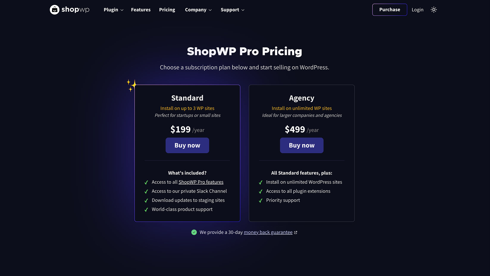

# Installing

Before installing ShopWP you must have a Shopify store. We recommended the [Shopify Starter plan](https://www.shopify.com/starter), but any plan will work.

Okay, let's begin! 🙌

## Getting started

### 1. Purchase ShopWP Pro

Begin by [purchasing ShopWP](https://wpshop.io/purchase). Simply select the subscription you want and finish the checkout process.

### 2. Access your account

After purchasing, you will be redirected to a confirmation page. Here you can see your payment details and ShopWP license key. If you can't access your account dashboard, try [resetting your password](https://wpshop.io/wp-login.php?action=lostpassword&redirect_to=https%3A%2F%2Fwpshop.io%2Flogin%3Fcheckemail%3Dconfirm%26edd_reset_password%3Dconfirm%26edd_redirect%3Dhttps%253A%252F%252Fwpshop.io%252Flogin%252F). If that still doesn't work, please send us an email and we can help you directly. [hello@wpshop.io](mailto:hello@wpshop.io)

### 3. Configure the plugin

Open your WordPress dashboard and go to `Plugins - Add New`.

From there, click the `Upload Plugin` button toward the top of the screen.

Click `Choose File` and select the downloaded .zip file from Step 2.

Finally, click `Install Now`.

Once it's finished installing click `Activate`. Afterwards you'll be redirected to the main plugin page where you'll see the ShopWP Pro plugin listed with your other plugins.

### 4. Activate your license key

After installing ShopWP Pro you'll need to activate your license key.

You can find the license key within your [ShopWP account](https://wpshop.io/login) under the `Licenses` tab. It should also be available on the payment confirmation screen as well as in the post purchase email.

Once you have your ShopWP license key, open the plugin settings and navigate to the `License` tab. Add the key here and click the "Activate License" button.

After entering your key you should see a confirmation notice indicating that your license is now active.

