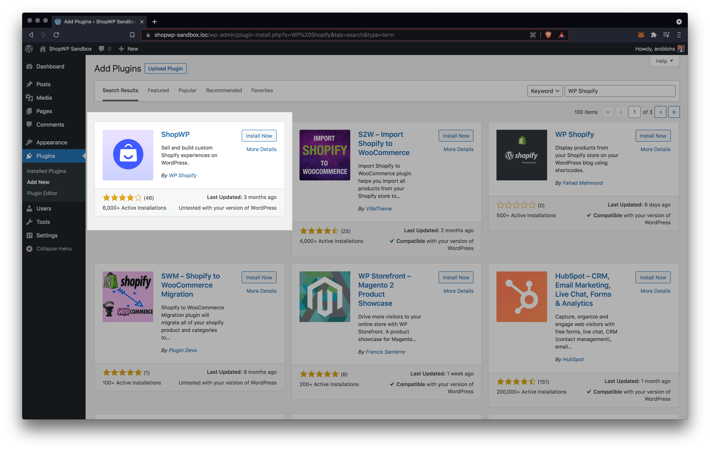
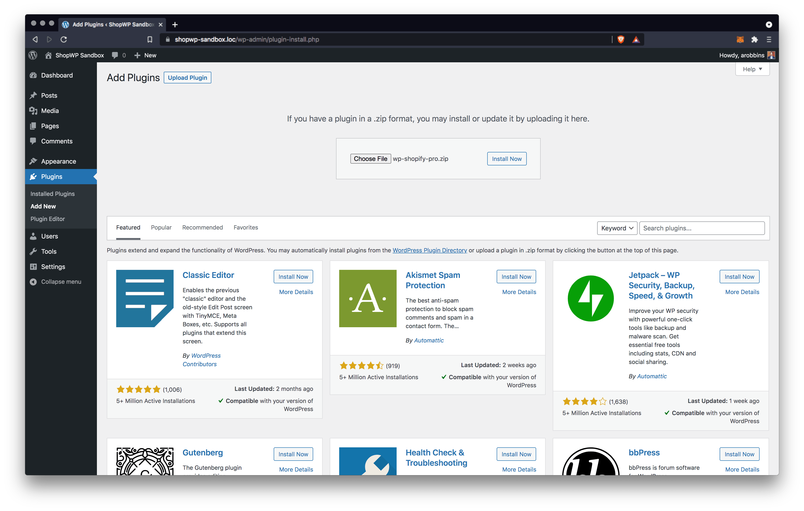

# Installing

:::caution

Before you can use ShopWP you must already have an active Shopify store. The plugin is compatible with any Shopify plan including [14-day free trials](https://www.shopify.com/?ref=wps) and the more affordable $9 [Lite plan](https://www.shopify.com/lite).

:::

As mentioned in the introduction, ShopWP comes in two versions; a [free version](https://wordpress.org/plugins/wpshopify/) and a [Pro version](https://wpshop.io/purchase/). They are two seperate plugins and only one should be activated at any given time. Installing is like any other WordPress plugin, but there are some specific steps that need to be taken for the Pro version. If you're upgrading from free to Pro please read the [Upgrading](#upgrading) section.

We recommended the [Shopify Lite plan](https://www.shopify.com/lite) if you intend to only sell on WordPress and other sales channels such as Facebook or Instagram. All plugin features will work with Shopify Lite and is a great option if want to save money!

Okay, let's get started! 🙌

## Installing the free version

### 1. Open the plugins page

Within the WordPress dashboard open the plugins page.

### 2. Search for ShopWP

While on the plugins page search for ShopWP. It should be the first result. You can also try searching for the old name, ShopWP.

### 3. Install and activate the plugin

Click the "Install Now" button. Once it's finished installing click the "Activate" button. When it's done, you'll be redirected to the main plugin page where you'll see the ShopWP plugin listed with your other plugins.

You're all set!

## Installing the Pro version

Installing the Pro version comes with a few more steps. If you've already purchased ShopWP Pro, please skip to step 2.

### 1. Purchase the Pro version

Before you can install the Pro version you must [purchase it](https://wpshop.io/purchase). Simply select the subscription you want and finish the checkout process.

### 2. Download the Pro version

After purchasing, you should be redirected to a confirmation page. Here you can download the plugin directly. You can also download the Pro version from your [account dashboard](https://wpshop.io/login/) (see below). If you can't access your account dashboard, try [resetting your password](https://wpshop.io/wp-login.php?action=lostpassword&redirect_to=https%3A%2F%2Fwpshop.io%2Flogin%3Fcheckemail%3Dconfirm%26edd_reset_password%3Dconfirm%26edd_redirect%3Dhttps%253A%252F%252Fwpshop.io%252Flogin%252F). If that still doesn't work, please send us an email and we can help you directly. [hello@wpshop.io](mailto:hello@wpshop.io)

### 3. Install and activate the Pro version

After downloading the Pro version open your WordPress dashboard and go to `Plugins - Add New`. From there, click the `Upload Plugin` button toward the top of the screen. Click `Choose File` and select the downloaded .zip file from Step 2. Finally, click `Install Now`.

Once it's finished installing click `Activate`. When it's done, you'll be redirected to the main plugin page where you'll see the ShopWP Pro plugin listed with your other plugins.

### 4. Activate your license key

After installing and activating the plugin, you'll need to activate your license key.

Begin by finding your license key. It should be listed in your ShopWP account under the `Licenses` tab. You can also find it on the payment confirmation screen as well as in the post purchase email.

Once you've found your key, open the plugin settings and navigate to the `License` tab. Add the key here and click the "Activate License" button.

After entering your key you should see a confirmation notice indicating that your license is now active.

## Upgrading

If you're upgrading from the free version, then follow the steps above for installing ShopWP Pro. Once installed, you should have both the free and pro versions activated. **At this point it is safe to delete the free version of the plugin**.
