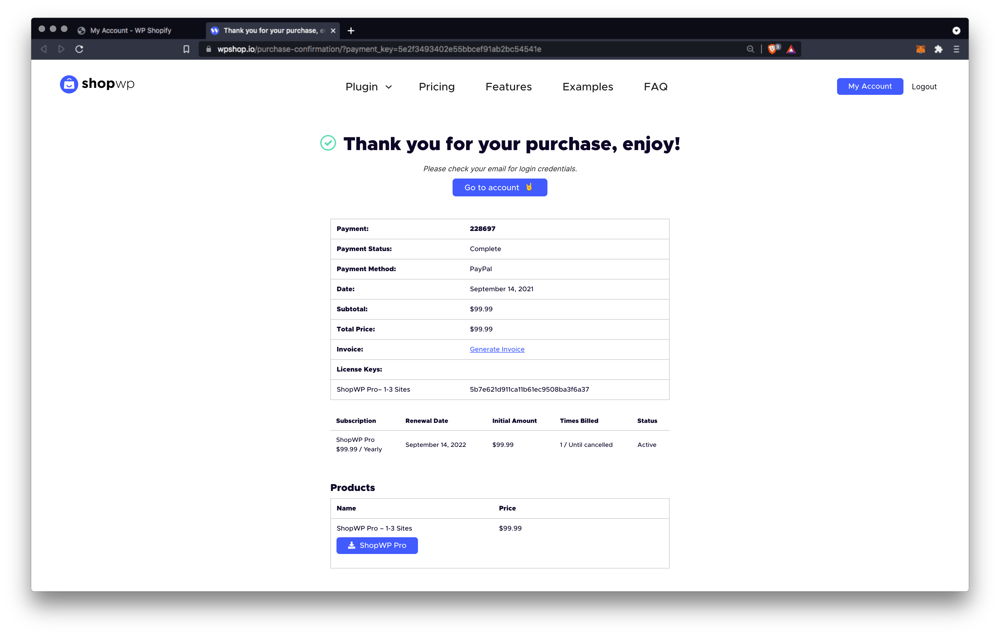

# Installing

ShopWP comes in two versions; a [free version](https://wordpress.org/plugins/wpshopify/) and a [Pro version](https://wpshop.io/purchase/). _The free version is no longer maintained_. They are two separate plugins and only one should be activated at once.

:::caution
Before you can install any version of ShopWP, you must have an active Shopify store. The plugin is compatible with any [Shopify plan](https://shopify.pxf.io/b39yJv) including [14-day free trials](https://shopify.pxf.io/5bPL0L) _and_ the more affordable $9 [Lite plan](https://shopify.pxf.io/vnqbrj).
:::

:::info
If you're upgrading from free to Pro, please read the [Upgrading](/guides/upgrading-to-pro) guide.
:::

We recommended the [Shopify Lite plan](https://shopify.pxf.io/vnqbrj) if you intend to only sell on WordPress and other sales channels such as Facebook or Instagram. All plugin features will work with Shopify Lite and is a great option if want to save money!

Okay, let's get started! 🙌

## Getting started

Installing ShopWP Pro comes with a few steps. If you've already purchased ShopWP Pro, please [skip to step 2](#2-download-plugin).

### 1. Purchase ShopWP Pro

Before you can install ShopWP Pro version you must [purchase it](https://wpshop.io/purchase). Simply select the subscription you want and finish the checkout process.

### 2. Download plugin

After purchasing, you should be redirected to a confirmation page. Here you can download the plugin directly. You can also download the Pro version from your [account dashboard](https://wpshop.io/login/) (see below). If you can't access your account dashboard, try [resetting your password](https://wpshop.io/wp-login.php?action=lostpassword&redirect_to=https%3A%2F%2Fwpshop.io%2Flogin%3Fcheckemail%3Dconfirm%26edd_reset_password%3Dconfirm%26edd_redirect%3Dhttps%253A%252F%252Fwpshop.io%252Flogin%252F). If that still doesn't work, please send us an email and we can help you directly. [hello@wpshop.io](mailto:hello@wpshop.io)

### 3. Install and activate plugin

After downloading ShopWP Pro, open your WordPress dashboard and go to `Plugins - Add New`.

From there, click the `Upload Plugin` button toward the top of the screen.

Click `Choose File` and select the downloaded .zip file from Step 2.

Finally, click `Install Now`.

Once it's finished installing click `Activate`. Afterwards you'll be redirected to the main plugin page where you'll see the ShopWP Pro plugin listed with your other plugins.

### 4. Activate your license key

After installing ShopWP Pro you'll need to activate your license key.

You can find the license key within your [ShopWP account](https://wpshop.io/login) under the `Licenses` tab. It should also be available on the payment confirmation screen as well as in the post purchase email.

Once you have your ShopWP license key, open the plugin settings and navigate to the `License` tab. Add the key here and click the "Activate License" button.

After entering your key you should see a confirmation notice indicating that your license is now active.

## Upgrading to ShopWP Pro

Please follow our [upgrading guide](http://localhost:3000/guides/upgrading-to-pro).
