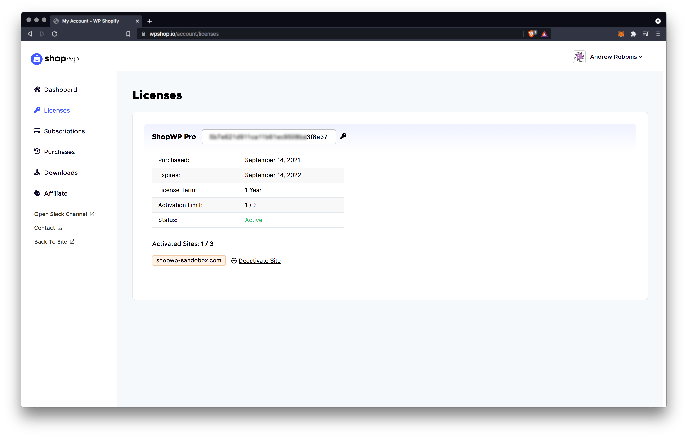

# ShopWP Pro License

When you purchase [ShopWP Pro](https://wpshop.io/purchase?utm_medium=docs&utm_source=license&utm_campaign=upgrade) you're given a single license key 🔑. This key gives you access to:

- Pro-only features
- Plugin updates
- Dedicated support (Slack channel)

:::info

To continue receiving access to the above features, you must have an **active** license key.

:::

If you purchased the [Standard plan](https://wpshop.io/purchase/), your license key can be added up to **three** WordPress sites. If you purchased the [Agency plan](https://wpshop.io/purchase/), your key can be added to an unlimited amount of sites.

## Finding your license key

Your license key is listed in your ShopWP account under the `Licenses` tab. You can also find it in the following places:

- Payment confirmation screen (after checkout)
- The post purchase email

## Activating your license key

Once you've found your key, open the plugin settings and navigate to the `License` tab. Add the key here and click the "Activate License" button.

After entering your key you should see a confirmation notice indicating that your license is now active.

If you're running into problems, please send us a message in Slack or email directly [hello@wpshop.io](mailto:hello@wpshop.io).

## Working with localhost

**For developers:** if you activate your license key on a dev environment, the system will **_not count it towards your activation limit_**. A development environment will be recognized when using one of the following domains patterns:

- localhost
- 10.0.0.0/8
- 172.16.0.0/12
- 192.168.0.0/16
- \*.dev
- .\*local
- dev.\_
- staging.\_
- staging-\*
- \*.wpengine.com
