# Syncing

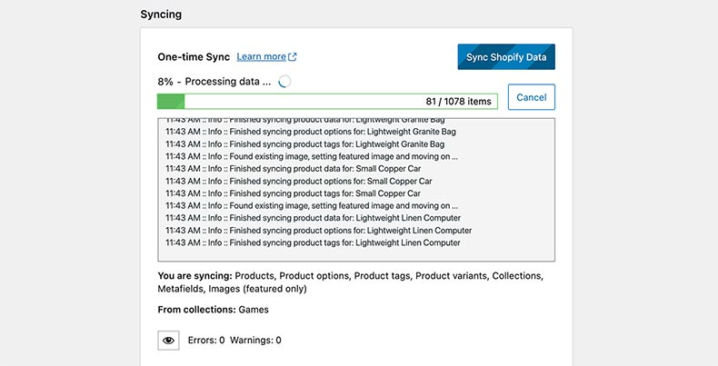

One of the main features of ShopWP is the ability to sync your Shopify data into WordPress. This includes things like:

```
- Products
- Collections
- Tags
- Variants
- Images
- Metafields
etc
```

You can also choose to create detail pages for each product / collection assigned to the [ShopWP sales channel](/guides/common-issues#products--collections-not-showing).

:::info
Only products assigned to the [ShopWP sales channel](/guides/common-issues#products--collections-not-showing) will be synced into WordPress.
:::

:::info
ShopWP will automatically clear it's cache after every sync
:::

## Syncing Tools

ShopWP comes with various syncing tools. You can find these tools within the settings page under the `Sync` tab.

### One-time sync

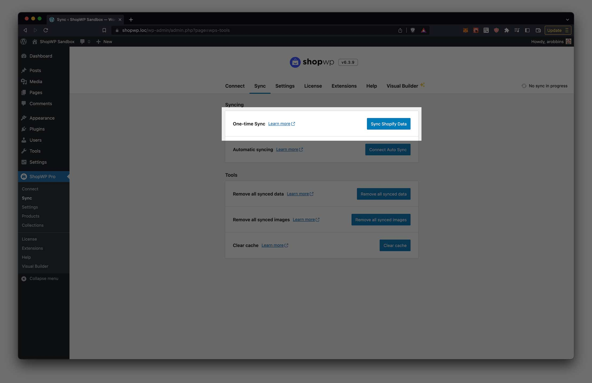

As the name implies, one-time sync will sync your Shopify data only once. It's a great way to manually sync data if you want more control over when the data is pushed to WordPress.

This **will not keep things updated automatically**. If you change anything inside Shopify, you'll need to manually sync again to pull the changes back into WordPress.

The syncing process will use the settings that you have configured under `ShopWP Pro - Settings - Syncing`. This includes whether to create product detail pages, syncing feature images, etc. Depending on your syncing settings ShopWP will attempt to create a "product post" for each Shopify product that you have assigned to the [ShopWP sales channel](/guides/common-issues#products--collections-not-showing).

### Automatic syncing

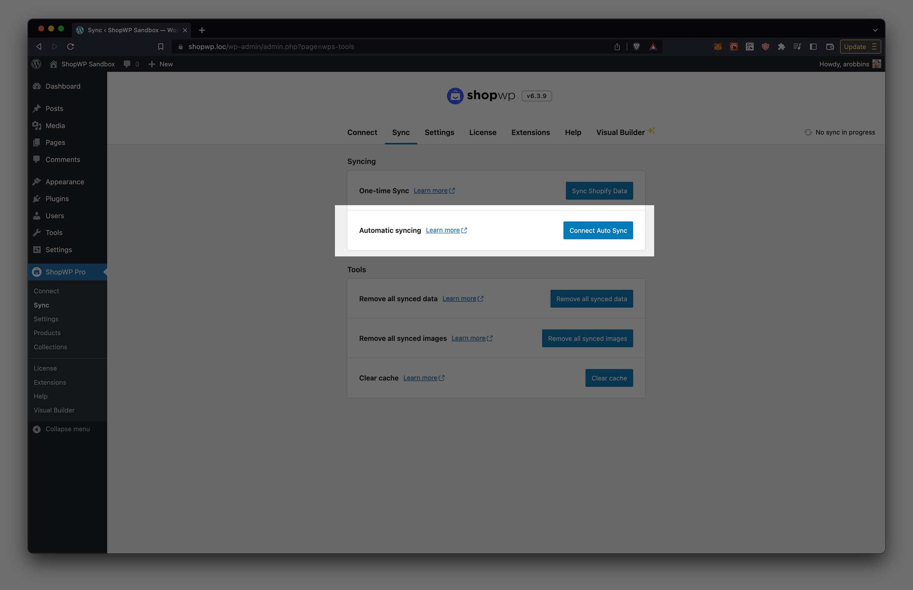

The auto sync tool is basically a one-time sync repeated at a specified interval. Starting in version 6.0, this feature has been completely rebuilt from the ground up using WordPress cron jobs.

When auto sync is "connected", you will see a countdown timer displayed within the `Sync` tab. This timer counts down to the next sync. The interval that the timer uses can be set within the plugin's syncing settings under:

`ShopWP - Settings - Syncing - Auto sync cron interval`

Auto sync uses a WordPress cron job to keep things on track. Because of this, it may require that you occasionally navigate to the Sync tab to ensure the cron continues to fire.

::: warning
Auto sync will not work if you have WP CRON turned off.
:::

### Remove all synced data

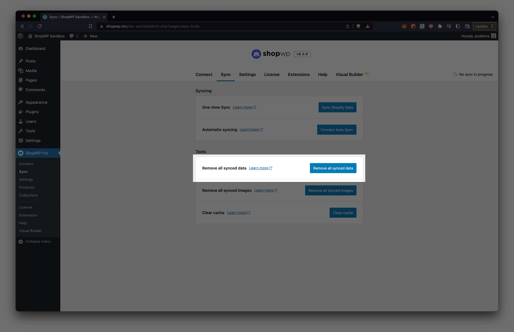

This tool will delete all synced data including:

- Product and collection detail pages
- Data saved in custom tables
- Custom fields

**Nothing will be changed or deleted from Shopify**.

This tool is useful for "clearing everything out" so you can resync with a fresh start. This also also can fix possible permalink or 404 errors.

### Remove all synced images

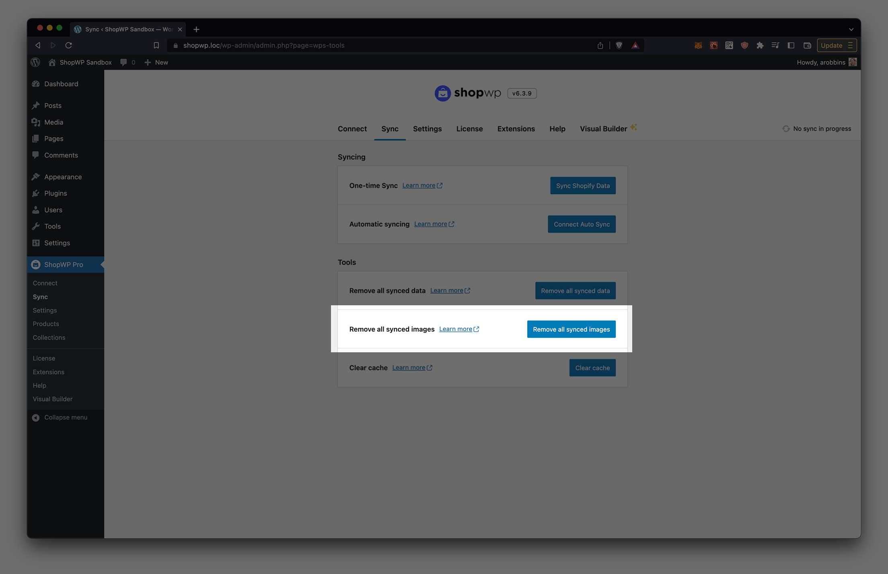

This tool will delete all images that have been synced using ShopWP. **Only ShopWP related images will be removed. Nothing else from the media library will be deleted**.

### Clear Cache

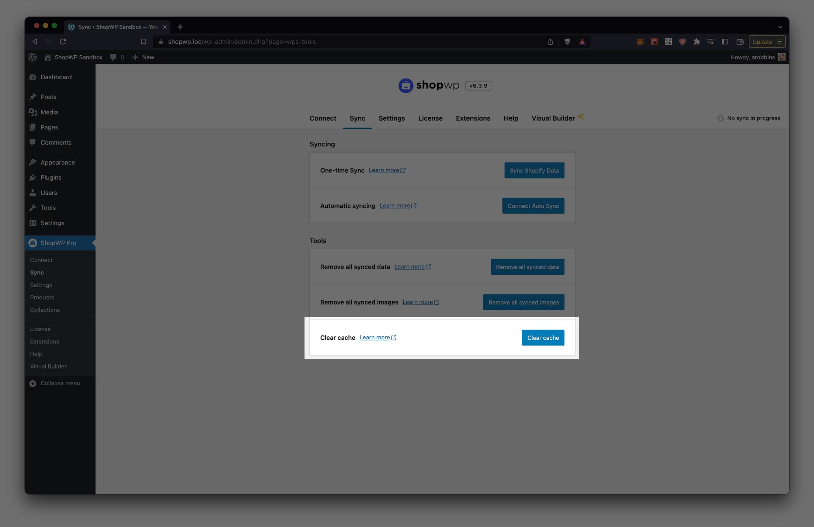

ShopWP stores it's own cache to help speed things up. If you're noticing that your product information is not showing up correctly, or the plugin isn't behaving as expected, try clearing the cache with this tool.

Things stored in the cache are:

1. Product and collection data
2. Tags, vendors, product types and collections. This info is primarily used with the Storefront component
3. Product listing page queries
4. Product detail page queries

## Products sync query

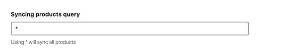

The `Products sync query` tells ShopWP which products to sync. By default, the `*` character is used which means "sync all products". You can leverage the [Shopify Search syntax](https://shopify.dev/api/usage/search-syntax#examples) to customize this in powerful ways.

For example, if you only want to sync product with the tag `Apple`, you can use this:

```
tag:Apple
```

Sync products within a specific inventory range, or if the title is `Caramel Apple`.

```
(title:Caramel Apple) OR (inventory_total:>500 inventory_total:<=1000)
```

## Internal PHP functions

After you sync the data you'll need a way to access it. By default, Data Sync does not sync anything to post_meta fields. **However you can enable this within the plugin settings.**

To access your data, you can also use the new internal PHP function `get_product()`, like this:

```php
$Products = ShopWP\Factories\Data_Factory::build();
$post_id = 137459;

$product_data = $Products->get_product($post_id);
```

There will be more functions exposed before the main launch.

## Using localhost

For the syncing to work properly, ShopWP requires a publicly accessible WordPress site. Because of this, if you're using localhost you'll need to proxy your web server with a service like [ngrok](https://ngrok.com/). This will allow the syncing to work like normal.

### Setup

After installing [ngrok](https://ngrok.com/), you can run this command:

```
ngrok http 8000
```

If you're using a dedicated domain such as `.local`, you can run the below command instead. (Replace yoursite.local with your domain)

```
ngrok http -host-header=yoursite.local 80
```

ngrok also has a WordPress specific guide that you can view here: [https://ngrok.com/docs/using-ngrok-with#wordpress](https://ngrok.com/docs/using-ngrok-with#wordpress)

### Find the public URL

Once you have ngrok running, copy the `https` Forwarding URL and paste it into the ShopWP `Syncing URL` setting like below:

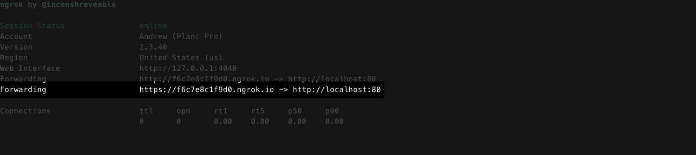
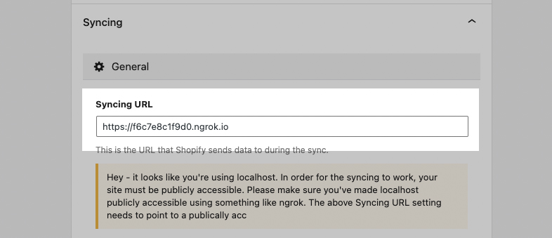

After saving the plugin settings the syncing should work like normal. You can keep ngrok running in the background for as long as you'd like.

### Deploying

After deploying your site to a live web server, make sure to change the Syncing URL to the real domain instead of ngrok.

## Common syncing issues

We've done our best to make syncing work across different environments. However, if you're running into issues try going the below steps one by one.

**First things to check ...**

1. Make sure your "Syncing URL" setting **matches the domain of your WordPress site**. This is the domain where Shopify will "send" the data to during sync. So if it's not correct, the syncing process will hang indefinitely. This should be set correctly by default but can sometimes change during database migrations (e.g., staging to production).
2. The most common reason for syncing issues are conflicts with other plugins. Try temporarily deactivating every other plugin and syncing again. If the issue persists, we can rule out any plugin conflicts.
3. Make sure you have a **valid SSL certificate** on your WordPress site. Syncing will not work without one.
4. Make sure your site is not password protected. Sometimes managed hosts like WP Engine or Flywheel will have this turned on by default. If you can't turn it off, try [enabling basic auth](#fixing-basicauth).
5. If you're seeing a "timeout" error message, try adding this to your `wp-config.php` file: `ini_set( 'default_socket_timeout', 300 )`;
6. Check your PHP and Apache/Nginx logs for any errors. If you don't know how to do this, contact your web host and ask them to look on your behalf. If you find any errors, [please send them to us by email](mailto:hello@wpshop.io) or in the private Slack channel for further help.
7. Ask your web host if they have a firewall enabled. This can potentially restrict the Shopify network requests made during sync. If they do have a firewall, ask them to make an exception for requests sent to your `.myshopify.com` domain.
8. Ensure you meet the ShopWP [minimum requirements](/getting-started/requirements).

If none of these steps resolve your syncing issues, [please send us an email](mailto:hello@wpshop.io) and we'll be happy to fix it for you.

### Sync stuck at "Fetching Shopify data"

A common reason for this issue is not having any collections selected when choosing to sync collections. Open the ShopWP syncing settings and find the "Sync products from collections" setting. Make sure _at least one collection_ is selected. Try syncing again.

If you don't want to sync collections, then uncheck the "Collections" option under "Which Shopify data do you want to sync"? You can then try syncing again.

This can also happen if you have redirects placed inside your [`.htaccess`](https://wordpress.org/documentation/article/htaccess/) file.

Try opening your `.htaccess` file and replacing the contents with the below. Save the file and try syncing again.

```
# BEGIN WordPress

RewriteEngine On
RewriteRule .* - [E=HTTP_AUTHORIZATION:%{HTTP:Authorization}]
RewriteBase /
RewriteRule ^index\.php$ - [L]
RewriteCond %{REQUEST_FILENAME} !-f
RewriteCond %{REQUEST_FILENAME} !-d
RewriteRule . /index.php [L]

# END WordPress
```

Another possible reason for this behavior is having WordPress installed in a subdirectory. ShopWP does not currently support sub directory installations. So your options are to either use a top-level domain or a subdomain instead.

Finally, another reason could be due to syncing on localhost. You need to make sure your local dev environment is [exposed to the internet via a proxy](#using-localhost).

### Sync stuck at "Removing previously synced data ..."

This can happen if you have overly aggressive security settings blocking access to the WordPress REST API.

We've also seen this occur in sites that have their privacy settings set too high. Switching this from private to public can sometimes help.

### Stuck stuck at "Processing data ..."

This indicates that you web sever is having trouble processing the amount of data ShopWP is trying to process.

Open the ShopWP Syncing settings `ShopWP Pro - Settings - Syncing`, and change the "Items per chunk" value to `20` instead of 250.

Stop any existing sync, use the Remove all sync tool, and then perform a new one-time sync.

### "The webhook from Shopify is either invalid or expired"

This error will occur if your `Syncing URL` setting does not match your WordPress domain. These two values **must** match for the syncing to work properly.

To check, open your ShopWP settings and open the `Syncing` section. Scroll down and find the `Syncing URL` field. Make sure this matches your WordPress domain exactly. It should only be the top-level domain, like this:

```
https://mysite.org
```

You can also try enabling the `Allow alternative webhook auth` setting. You can find this within the ShopWP settings

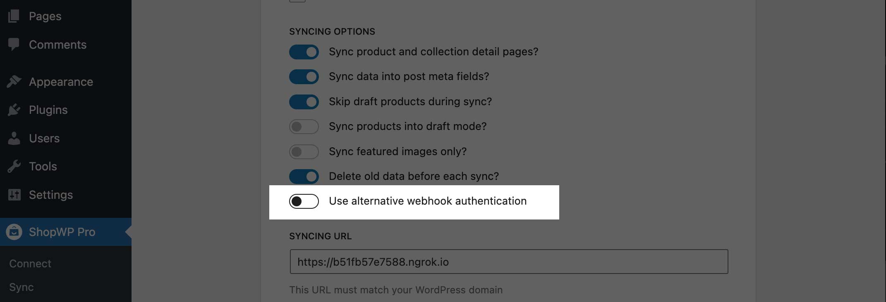

### "Address cannot be any of the domains..."

This error will show up if the value for the ShopWP `Syncing URL` setting does not point to your WordPress site URL. This setting must be set to the same domain that you're using for the WordPress site.

It will be the domain Shopify uses to send data to during the syncing process. Below is a screenshot of how it should look:

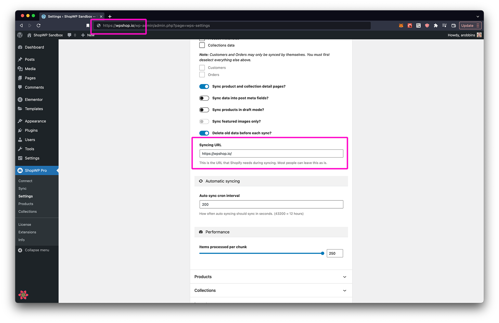

:::info
If you're a developer trying to sync on localhost, this Syncing URL must be made public to the internet via a proxy like ngrok
:::

Another reason this error can show is if you have a redirect setup within the Shopify domain settings. To check for this, login to Shopify and go to Settings. From there, click the `Domains` section.

You should see your `.myshopify.com` domain listed. This should set as your primary domain. If you see your WordPress domain make sure it's not being redirected to `.myshopify.com` OR set as your primary domain. You are ok to delete these.

### "Tried running the bulk query ..."

This error indicates that ShopWP wasn't able to find any products to sync. Try making sure the products you want to sync are assigned to the [ShopWP sales channel](/guides/common-issues#products--collections-not-showing) inside Shopify.

### "Variable $id of type ID! was provided invalid value"

This error seems to be a result of a sync staying in limbo. Opening a browser and entering `<yourdomain>?shopify_bulk_webhook=true` should force the sync to clear. At that point you can try re-syncing again.

Another thing to try: inside Shopify, remove the ShopWP app manually, disconnecting ShopWP within WordPress and reconnect again.

### "[API] Invalid API key or access token (unrecognized login or wrong password)"

This can be fixed by disconnecting and reconnecting your Shopify store. You can do this from the "Connect" tab inside ShopWP.

### "Due to an unexpected technical problem, Shopify is temporarily unavailable"

This can sometimes happen if you try connecting your Shopify store using a staff account without the correct permissions. Try logging into your Shopify store using the owner account instead, and then go through the ShopWP connection process again.

### "Starting new Shopify sync..." message repeats endlessly during sync

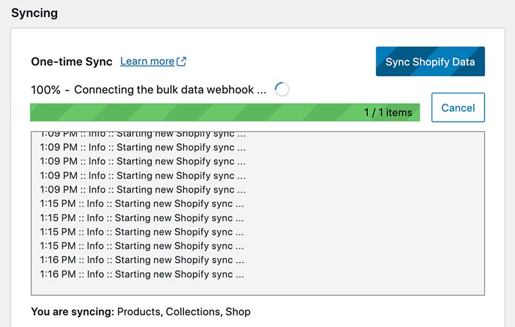

If you notice the message `Starting new Shopify sync...` repeating indefinitely during sync, this could be due to a failed upgrade from the free version.

The best way to check for this is to deactivate the plugin and reactivate again. This will force the ShopWP Pro custom database tables to reconcile and fix itself.

Another reason for this error is that the database column `enable_automatic_syncing` is set to `0`. Setting this to `1` can fix the issue. This database column is found inside the `wp_wps_settings_general` table.

### Fixing BasicAuth

If your site is behind BasicAuth, the syncing process will probably fail to complete. This is because ShopWP relies on the WordPress HTTP API, which requires you to attach your BasicAuth credentials to each request. The easiest way to do this is using the following filter:

```php
function wpbp_http_request_args( $r, $url ) {
	$r['headers']['Authorization'] = 'Basic ' . base64_encode( USERNAME . ':' . PASSWORD );

	return $r;
}
add_filter( 'http_request_args', 'wpbp_http_request_args', 10, 2);
```

### "AccessDenied: We're sorry, but this service is not available in your location"

This error is usually a result of a bad CNAME entry.

There might be a conflict in the CNAME being used twice for redirecting to shopify.

Log in to your Shopify dashboard and go to the domain settings. From there, check if there are any warnings or errors. You may see an error such as `Your domain has no CNAME record`.

### Products do not automatically update with Webhooks extension

If products are not being created or deleted automatically using the Webhooks extension, try the below two things:

1. Reconnect your Shopify store. You can do this within the ShopWP Connect tab
2. Try enabling the `Allow alternative webhook auth` setting. You can find this within the ShopWP settings


