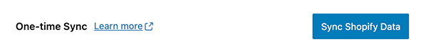
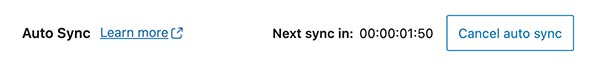

# Syncing


ShopWP allows you to sync your products and collections into WordPress. This allows you to sync things like featured images, metafields, collections as categories, etc. You can also create detail pages for each product or collection assigned to the ShopWP sales channel.

:::info
Only products assigned to the ShopWP sales channel will be synced into WordPress.
:::

Starting in version `6.0`, there is now a clear distinction between a single or "one-time" sync and auto syncing.

You will only be able to sync using one of these two methods.

Let's talk about each.

### One-time sync



As the name implies, the one-time sync tool will sync your Shopify data just once. It's a great way to manually sync things if you want more control over how data is pushed to WordPress.

This **will not keep things updated automatically**. If you change anything inside Shopify, you'll need to manually sync again to pull the changes down.

### Auto sync



The auto sync feature has been completely rebuilt from the ground up.

When auto sync is "connected", you will see a countdown timer displayed within the `Sync` tab. This timer counts down to the next sync. The interval that the timer uses can be set within the plugin's syncing settings. `ShopWP - Settings - Syncing - Auto sync cron interval`.

Auto sync uses a WordPress cron job to keep things on track. Because of this, it may require that you occasionally navigate to the Sync tab to ensure the cron continues to fire.

### Products sync query


A brand new syncing option called `Products sync query` has been added. This field tells ShopWP which products to sync. By default, the `*` character is used which means "sync all products". You can leverage the [Shopify Search syntax](https://shopify.dev/api/usage/search-syntax#examples) to customize this however you wish.

For example, if you only want to sync product with the tag `Apple`, you can use this:

```
tag:Apple
```

Sync products within a specific inventory range, or if the title is `Caramel Apple`.

```
(title:Caramel Apple) OR (inventory_total:>500 inventory_total:<=1000)
```

## Internal PHP functions

After you sync the data you'll need a way to access it. By default, Data Sync does not sync anything to post_meta fields. **However you can enable this within the plugin settings.**

To access your data, you can also use the new internal PHP function `get_product()`, like this:

```php
$Products = ShopWP\Factories\Data_Factory::build();
$post_id = 137459;

$product_data = $Products->get_product($post_id);
```

There will be more functions exposed before the main launch.

## Using localhost

For the syncing to work properly, ShopWP requires a publicly accessible WordPress site. Because of this, if you're using localhost you'll need to proxy your web server with a service like [ngrok](https://ngrok.com/). This will allow the syncing to work like normal.

### Setup

After installing [ngrok](https://ngrok.com/), you can run this command:

```
ngrok http 8000
```

If you're using a dedicated domain such as `.local`, you can run the below command instead. (Replace yoursite.local with your domain)

```
ngrok http -host-header=yoursite.local 80
```

ngrok also has a WordPress specific guide that you can view here: [https://ngrok.com/docs/using-ngrok-with#wordpress](https://ngrok.com/docs/using-ngrok-with#wordpress)

### Find the public URL

Once you have ngrok running, copy the `https` Forwarding URL and paste it into the ShopWP `Syncing URL` setting like below:


After saving the plugin settings the syncing should work like normal. You can keep ngrok running in the background for as long as you'd like.

### Deploying

After deploying your site to a live web server, make sure to change the Syncing URL to the real domain instead of ngrok.

## Common syncing issues

We continue to try our best to ensure that the syncing process works across multiple different environments. However if you're running into trouble, try going through the below steps one by one.

**Things to check:**

1. The most common reason for syncing issues are conflicts with other plugins. The first thing you should try doing is temporarily deactivating every other plugin and re-syncing. If the issue persists, we can rule out any plugin conflicts.
2. Make sure your site is not password protected. Sometimes managed hosts like WP Engine or Flywheel will have this turned on by default.
3. Make sure your site is not using BasicAuth. If it is, skip to the [BasicAuth section](/getting-started/syncing#basicauth) below for a workaround.
4. If you're seeing a "timeout" error message, try adding this to your `wp-config.php` file: `ini_set( 'default_socket_timeout', 300 )`;
5. Check your PHP and Apache/Nginx logs for any errors. If you don't know how to do this, contact your web host and ask them to look on your behalf. If you find any errors, [please send them to us by email](mailto:hello@wpshop.io) or in the private Slack channel for further help.
6. Ask your web host if they have a firewall enabled that restricts numerous third-party API requests during a short period of time. If they do have a firewall, ask them to make an exception for requests sent to ".myshopify.com".
7. Make sure you have a working SSL certificate on your WordPress site
8. Ensure you meet the ShopWP [minimum requirements](/getting-started/requirements).

If none of these steps resolve your syncing issues, [please send us an email](mailto:hello@wpshop.io) and we'll be happy to debug with you.

### Fixing BasicAuth

If your site is behind BasicAuth, the syncing process will probably fail to complete. This is because ShopWP relies on the WordPress HTTP API, which requires you to attach your BasicAuth credentials to each request. The easiest way to do this is using the following filter:

```php
function wpbp_http_request_args( $r, $url ) {
	$r['headers']['Authorization'] = 'Basic ' . base64_encode( USERNAME . ':' . PASSWORD );

	return $r;
}
add_filter( 'http_request_args', 'wpbp_http_request_args', 10, 2);
```
