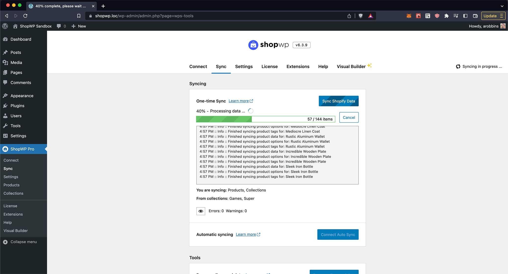

# Syncing



One of the main features of ShopWP is the ability to sync your Shopify data into WordPress. This includes things like:

- Collections
- Tags
- Variants
- Images
- Metafields
- etc ...

You can also choose to create detail pages for each product / collection assigned to the ShopWP sales channel.

:::info
Only products assigned to the ShopWP sales channel will be synced into WordPress.
:::

## Tools

ShopWP comes with various syncing-related tools. You can find these tools within the settings page under the `Sync` tab.

### One-time sync


As the name implies, one-time sync will sync your Shopify data only once. It's a great way to manually sync data if you want more control over when the data is pushed to WordPress.

This **will not keep things updated automatically**. If you change anything inside Shopify, you'll need to manually sync again to pull the changes back into WordPress.

The syncing process will use the settings that you have configured under `ShopWP Pro - Settings - Syncing`. This includes whether to create product detail pages, syncing feature images, etc. Depending on your syncing settings ShopWP will attempt to create a "product post" for each Shopify product that you have assigned to the ShopWP sales channel.

### Auto sync


The auto sync tool is basically a one-time sync repeated at a specified interval. Starting in version 6.0, this feature has been completely rebuilt from the ground up using WordPress cron jobs.

When auto sync is "connected", you will see a countdown timer displayed within the `Sync` tab. This timer counts down to the next sync. The interval that the timer uses can be set within the plugin's syncing settings under:

`ShopWP - Settings - Syncing - Auto sync cron interval`

Auto sync uses a WordPress cron job to keep things on track. Because of this, it may require that you occasionally navigate to the Sync tab to ensure the cron continues to fire.

### Remove all synced data


This tool will delete all synced data including:

- Product and collection detail pages
- Data saved in custom tables
- Custom fields

**Nothing will be changed or deleted from Shopify**.

This tool is useful for "clearing everything out" so you can resync with a fresh start. This also can fix possible permalink or 404 errors.

### Clear Cache


ShopWP stores it's own cache to help speed things up. If you're noticing that your product information is not showing up correctly, or the plugin isn't behaving as expected, try clearing the cache with this tool.

Things stored in the cache are:

1. Product and collection data
2. Tags, vendors, product types and collections. This info is primarily used with the Storefront component
3. Product listing page queries
4. Product detail page queries

## Products sync query


The `Products sync query` tells ShopWP which products to sync. By default, the `*` character is used which means "sync all products". You can leverage the [Shopify Search syntax](https://shopify.dev/api/usage/search-syntax#examples) to customize this in powerful ways.

For example, if you only want to sync product with the tag `Apple`, you can use this:

```
tag:Apple
```

Sync products within a specific inventory range, or if the title is `Caramel Apple`.

```
(title:Caramel Apple) OR (inventory_total:>500 inventory_total:<=1000)
```

## Internal PHP functions

After you sync the data you'll need a way to access it. By default, Data Sync does not sync anything to post_meta fields. **However you can enable this within the plugin settings.**

To access your data, you can also use the new internal PHP function `get_product()`, like this:

```php
$Products = ShopWP\Factories\Data_Factory::build();
$post_id = 137459;

$product_data = $Products->get_product($post_id);
```

There will be more functions exposed before the main launch.

## Using localhost

For the syncing to work properly, ShopWP requires a publicly accessible WordPress site. Because of this, if you're using localhost you'll need to proxy your web server with a service like [ngrok](https://ngrok.com/). This will allow the syncing to work like normal.

### Setup

After installing [ngrok](https://ngrok.com/), you can run this command:

```
ngrok http 8000
```

If you're using a dedicated domain such as `.local`, you can run the below command instead. (Replace yoursite.local with your domain)

```
ngrok http -host-header=yoursite.local 80
```

ngrok also has a WordPress specific guide that you can view here: [https://ngrok.com/docs/using-ngrok-with#wordpress](https://ngrok.com/docs/using-ngrok-with#wordpress)

### Find the public URL

Once you have ngrok running, copy the `https` Forwarding URL and paste it into the ShopWP `Syncing URL` setting like below:


After saving the plugin settings the syncing should work like normal. You can keep ngrok running in the background for as long as you'd like.

### Deploying

After deploying your site to a live web server, make sure to change the Syncing URL to the real domain instead of ngrok.

## Common syncing issues

We continue to try our best to ensure that the syncing process works across multiple different environments. However if you're running into trouble, try going through the below steps one by one.

**Things to check:**

1. The most common reason for syncing issues are conflicts with other plugins. The first thing you should try doing is temporarily deactivating every other plugin and re-syncing. If the issue persists, we can rule out any plugin conflicts.
2. Make sure your site is not password protected. Sometimes managed hosts like WP Engine or Flywheel will have this turned on by default.
3. Make sure your site is not using BasicAuth. If it is, skip to the [BasicAuth section](/getting-started/syncing#basicauth) below for a workaround.
4. If you're seeing a "timeout" error message, try adding this to your `wp-config.php` file: `ini_set( 'default_socket_timeout', 300 )`;
5. Check your PHP and Apache/Nginx logs for any errors. If you don't know how to do this, contact your web host and ask them to look on your behalf. If you find any errors, [please send them to us by email](mailto:hello@wpshop.io) or in the private Slack channel for further help.
6. Ask your web host if they have a firewall enabled that restricts numerous third-party API requests during a short period of time. If they do have a firewall, ask them to make an exception for requests sent to ".myshopify.com".
7. Make sure you have a working SSL certificate on your WordPress site
8. Ensure you meet the ShopWP [minimum requirements](/getting-started/requirements).

If none of these steps resolve your syncing issues, [please send us an email](mailto:hello@wpshop.io) and we'll be happy to debug with you.

### "Address cannot be any of the domains..."

This error will show up if the value for the ShopWP `Syncing URL` setting does not point to your WordPress site URL. This setting must be set to the same domain that you're using for the WordPress site.

It will be the domain Shopify uses to send data to during the syncing process. Below is a screenshot of how it should look:


:::info
If you're a developer trying to sync on localhost, this Syncing URL must be made public to the internet via a proxy like ngrok
:::

### "Variable $id of type ID! was provided invalid value"

This error seems to be a result of a sync staying in limbo. Opening a browser and entering `<yourdomain>?shopify_bulk_webhook=true` should force the sync to clear. At that point you can try re-syncing again.

Another thing to try: inside Shopify, remove the ShopWP app manually, disconnecting ShopWP within WordPress and reconnect again.

### Fixing BasicAuth

If your site is behind BasicAuth, the syncing process will probably fail to complete. This is because ShopWP relies on the WordPress HTTP API, which requires you to attach your BasicAuth credentials to each request. The easiest way to do this is using the following filter:

```php
function wpbp_http_request_args( $r, $url ) {
	$r['headers']['Authorization'] = 'Basic ' . base64_encode( USERNAME . ':' . PASSWORD );

	return $r;
}
add_filter( 'http_request_args', 'wpbp_http_request_args', 10, 2);
```
