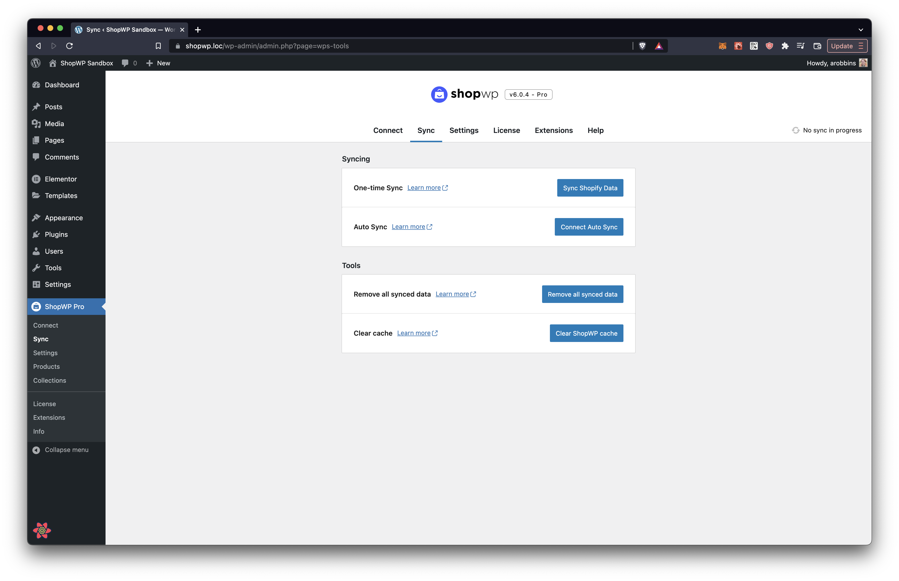

# Tools

ShopWP comes with various tools to help with things like syncing detail pages and managing the plugin's cache. These can be found within the settings page under the `Tools` tab.

## Sync Detail Pages

This is the main tool you'll use to create product and collection detail pages. The plugin will attempt to create a "product post" for each Shopify product that you have assigned to the ShopWP sales channel.

:::info
Only products assigned to the ShopWP sales channel will be synced
:::

If you're using the [Pro version](https://wpshop.io/purchase), you can use the Selective Sync feature to only sync products from certain collections.



## Remove Synced Detail Pages

This will delete all ShopWP product and collection detail pages. **Nothing will be changed or deleted from Shopify**. This tool is useful for fixing any possible permalink or 404 errors.


## Connect Auto Post Syncing

This will connect the auto post syncing feature of ShopWP Pro. This is responsible for keeping the product detail pages in-sync with Shopify. For example, creating a new product inside Shopify will automatically create the product detail page in WordPress.

This tool will use the values you select within the `Auto post syncing` plugin setting. You'll also want to make sure the `Webhooks URL` is set to your WordPress domain. If you're using localhost, you'll need to publicly expose your network using something like [ngrok](https://ngrok.com/).

Each webhook comes with a unique "callback" PHP file that you can customize. The code in this template file will be ran anytime an update occurs on the given webhook. For example, if you connect the `Product Create` webhook, the callback file `product-create.php` will run. Inside this file you will have access to a PHP variable called `$data`. This variable contains the new information from Shopify—which in this case the the newly created product.

You can customize the `product-create.php` file by adding the below folder structure to your WordPress theme:

```
<your-theme>/wps-templates/webhooks/products/product-create.php
```


## Remove Auto Post Syncing

This tool is very simple and allows you to remove any active webhooks previously connected via the above tool.


## Clear Cache

ShopWP stores it's own cache to help speed things up. If you're noticing that your product information is not showing up correctly, or the plugin isn't behaving as expected, try clearing the cache with this tool.

Things stored in the cache are:

1. Product and collection data
2. Tags, vendors, product types and collections. This info is primarily used with the Storefront component
3. Product listing page queries
4. Product detail page queries


