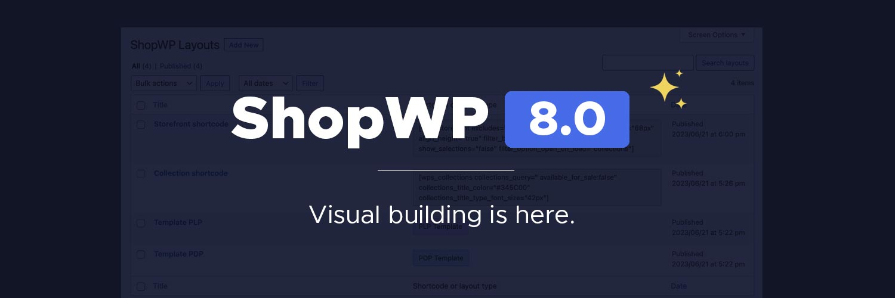

# 8.0 Migration Guide



ShopWP `8.0` is a major update which _**may**_ require migration steps on your end. [See below](#breaking-changes).

## Before updating

1. Please backup your site. This will ensure that you can roll back incase anything goes wrong.
2. If possible, perform the update on a staging site first.
3. Make a note of which customizations you've made to ShopWP (templates overrides, PHP code, CSS, etc) and compare that with the list of breaking changes below.

## After updating

1. After updating the plugin, go to the plugins page and deactivate ShopWP. Then reactivate it. This will guarantee the plugin has updated correctly.
2. If you're using a host with aggressive caching such as WP Engine, Siteground or Pantheon, be sure to clear all caches after updating ShopWP.
3. If you've customized the product or collection templates you will need to make sure your [templates are up-to-date](#templates).

## List of major updates

- The new Layout builder allows for creating templates for PDP and PLP, CDP, CLP, and shortcodes!
- You can now customize the Product and Collection permalinks
- ShopWP default pages have been removed to make customizing easier
- Added Storefront, Collections, Cart Icon, and Search Gutenberg blocks
- Added a ton more settings to the plugin blocks
- Over 11 annoying bug fixes, including an issue syncing images into the media library
- Added a new JavaScript filter `before.productActionButton` to append HTML before the add to cart button
- You can now adjust the plugin's default border radius within the ShopWP settings

## Breaking changes

- The ShopWP templates inside the `wps-templates` folder [have changed](#templates).
- The `[wps_collections]` [shortcode attributes have changed](#wps_collections-shortcode).
- ShopWP no longer configures a default page for listing pages. Instead, create a normal WordPress page, add your products, and then open the WordPress permalink settings to adjust the slug of your PLP.
- There have been various [hook and shortcode changes](#hook-and-shortcode-changes).

### Templates

There have been minor changes to the ShopWP templates (the files inside your `wps-templates` folder). If you're not customizing these files you can ignore these changes.

- There is now a conditional check inside all four templates to determine whether to display content from the new Layout Builder or not. It looks like this:

```php
$posts_with_template = get_posts([
   'meta_key' => 'layout_type',
   'meta_value' => 'template-plp',
   'post_type' => 'shopwp_shortcodes',
   'post_status' => 'publish',
   'posts_per_page' => -1
]);
```

and

```php
<?php  if (empty($posts_with_template)) { ?>

   <header class="wps-products-header">
      <h1 class="wps-heading">
         Products
      </h1>
   </header>

   <?= do_action('shopwp_breadcrumbs') ?>

   <div class="wps-products-all">
      <?php $Products->products(apply_filters('shopwp_products_all_args', $products_args)); ?>
   </div>

<?php } else {

   echo $posts_with_template[0]->post_content;

} ?>
```

The new Layout Builder will not work without this code. The easiest way to add this is by opening your template file, the new ShopWP template file, and compare the two. Add the code from the new template code where necessary.

### [wps_collections] shortcode

The attribute names for the `[wps_collections]` shortcode have changed. Any attribute used for customizing the **collection** will need to be prefixed with `collections_`. For example, if you previously used the `excludes` attribute to hide the collection image like this:

```php
[wps_collections excludes="image"]
```

It will now be this instead:

```php
[wps_collections collections_excludes="image"]
```

Additionally, any attribute you're using with the collections shortcode that was previously prefixed with `products_` will now need that prefixed removed.

For example, if you were doing this:

```php
[wps_collections products_excludes="title, pricing"]
```

You can now do this instead:

```php
[wps_collections excludes="title, pricing"]
```

### Hook and shortcode changes

- Filter `shopwp_storefront_default_payload_settings` has changed to `shopwp_storefront_default_settings`.
- Filter `shopwp_collections_default_payload_settings` has changed to `shopwp_collections_default_settings`.
- The storefront setting `dropzone_options` is now set to `false` by default.
- The products shortcode attribute `show_search` has been changed to `with_search`
- The `single` shortcode attribute has been removed. Use `collections_title` or `collections_query` instead.
