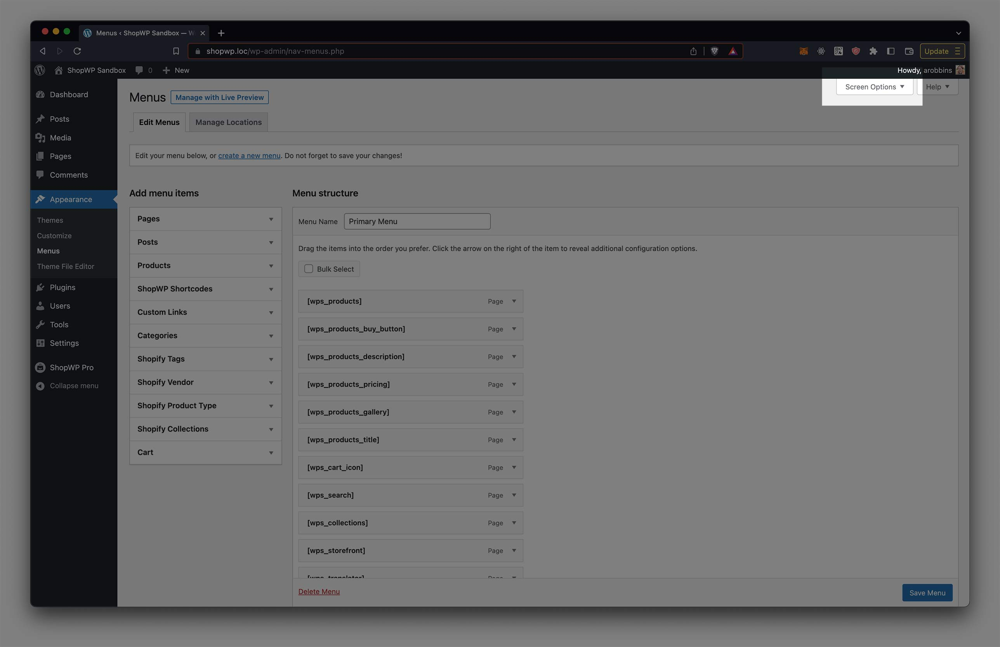
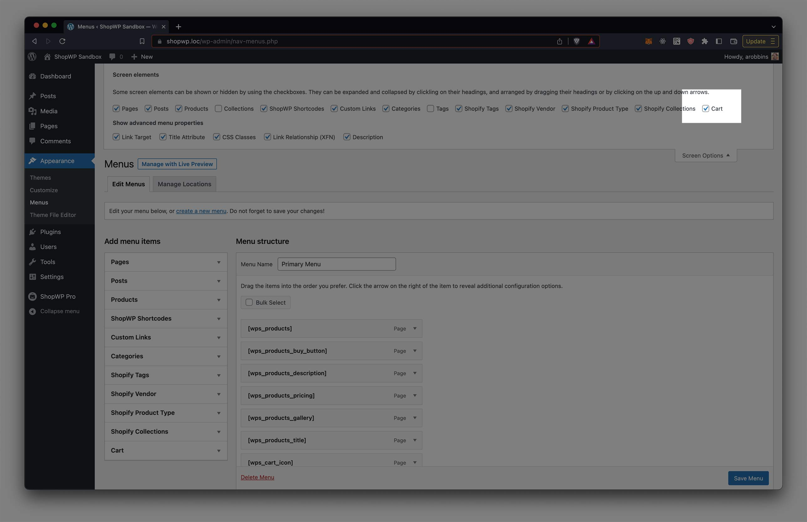
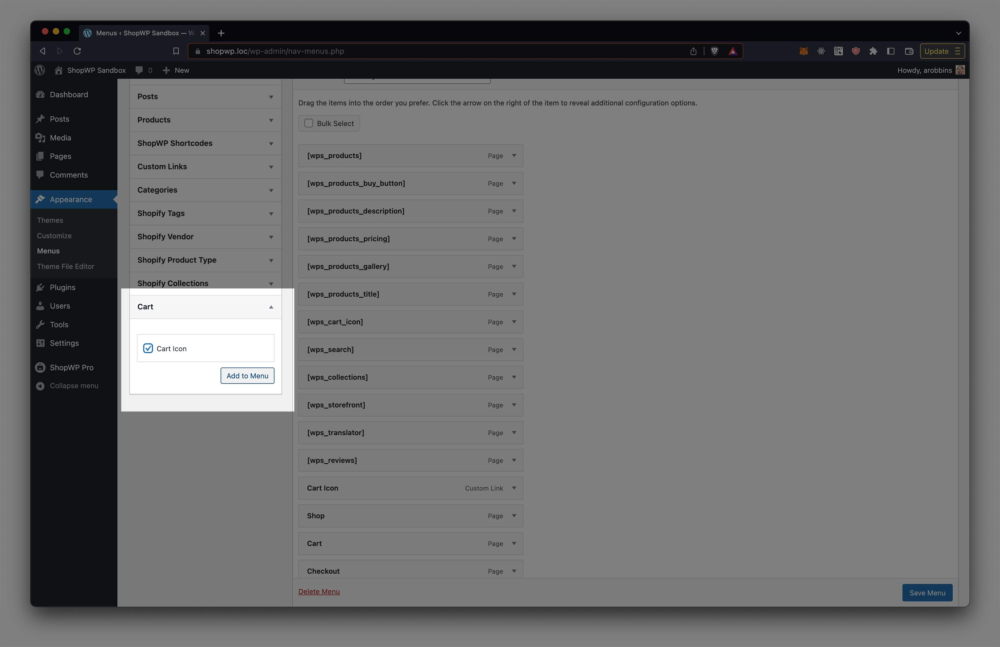

# Add cart icon menu

ShopWP comes with a custom menu item called `Cart`. You can add this to any menu to easily enable a cart icon in your WordPress nav.

## Ensure the menu is enabled

Go to `Apperance - Menus` and click the button in the top right corner called `Screen Options`. Once open, ensure that the Cart menu item is enabled.



## Use the cart menu item

Once enabled, you should see a section called Cart under the menu items. You can open this and add the cart icon into any WordPress menu.




## Create a custom cart toggle

You can turn any HTML element into a cart toggle button by adding the CSS class: `shopwp-cart-trigger`, like this:

```html
<div class="shopwp-cart-trigger"></div>
```
