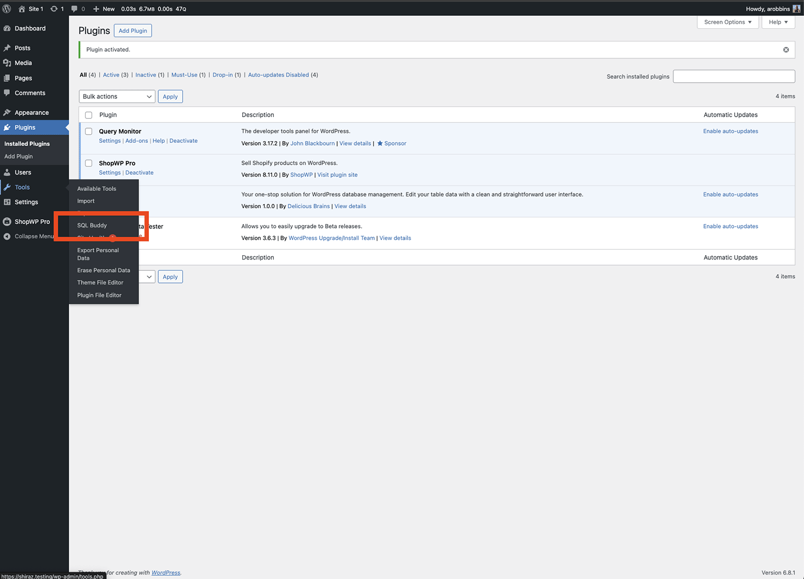

# Shopify app workaround

If the ShopWP Shopify app is down and you need to connect your Shopify store, you can use this workaround.

:::warning
Note: This is only a workaround and should not be used long term.
:::

These are the steps that ShopWP normally takes care of for you behind the scenes.

## Create a custom app inside Shopify

Open your Shopify dashboard and click "Settings". Then click "Apps and sales channels"

You'll most likely need to enable the custom app development feature by clicking the "Allow custom app development" button.

Again click "Allow custom app development" one more time.

From there, click the "Develop apps" button.

Now click "Create an app"

Give your custom app a name such as, "ShopWP temp workaround"

Once the custom app is created, click the "Configure Admin API scopes" and ensure the following scopes are selected:

- read_customers
- read_discounts
- read_inventory
- read_product_feeds
- read_product_listings
- read_products

Once you have all the scopes selected, click save.

Click the Configuration tab and then click the "Configure" button next to the "Storefront API integration".

Ensure the following scopes are selected:

- unauthenticated_read_customers
- unauthenticated_read_product_listings
- unauthenticated_read_product_inventory
- unauthenticated_read_product_pickup_locations
- unauthenticated_read_product_tags
- unauthenticated_read_selling_plans
- unauthenticated_write_bulk_operations
- unauthenticated_read_bulk_operations
- unauthenticated_read_bundles

Once you have all the scopes selected, click save.

Go back to the "Overview" tab and click the "Install app" button.

Once you're done installing the app, you'll need to copy and paste these two API keys. Be sure to keep them somewhere safe like a text file. We will use them later in the guide.

- Admin API access token
- Storefront API access token

Now open WordPress and go to the Plugins page. Search for the plugin called "SQL buddy" and install it.

Once installed, go to the "SQL Buddy" link from the Tools menu.

Click the "wp_wps_settings_connection" table

Copy the two API keys into the below columns:

access_token - Admin API access token
storefront_access_token - Storefront API access token

Done! You can now use ShopWP.
