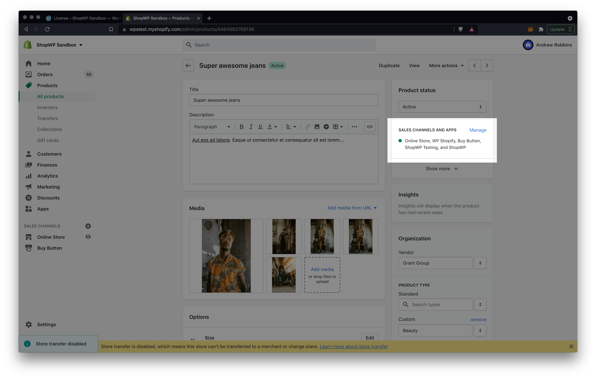
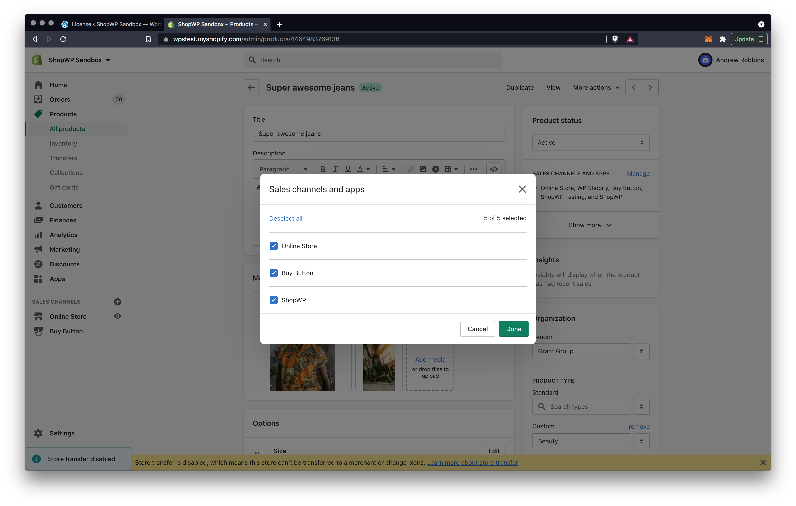
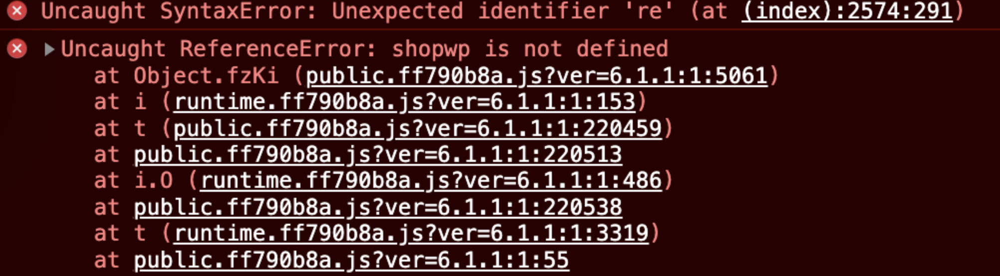
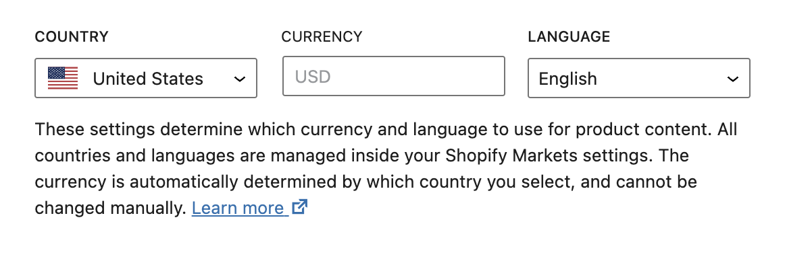
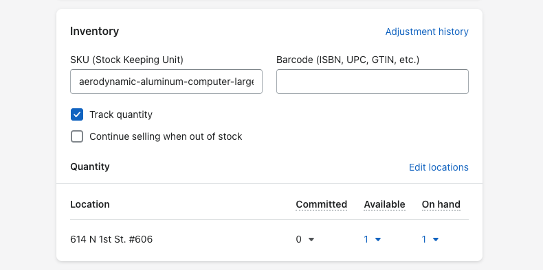
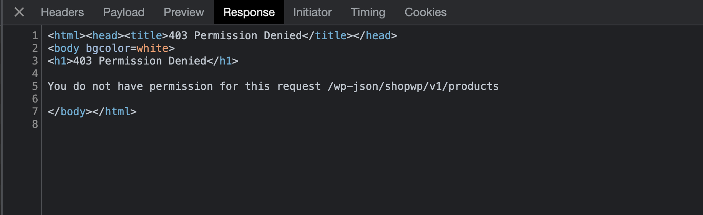
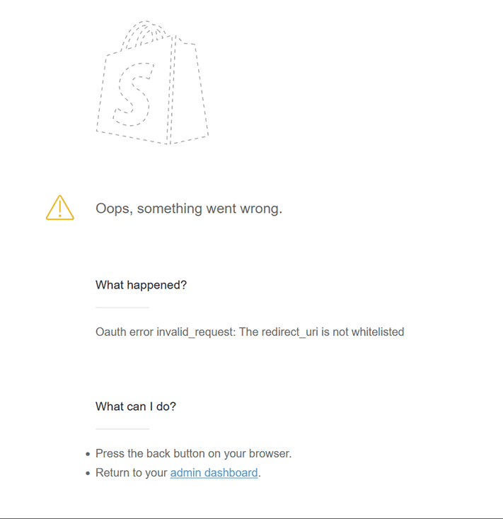

# Common Issues

Below are the most common issues people experience with ShopWP and how to fix them. If you're having a problem not listed here, please [send us an email](mailto:hello@wpshop.io).

## Cookie check failed

This error is usually due to another plugin caching the WordPress REST API nonce too aggressively. WordPress uses a [cookie nonce to authenticate the REST API](https://developer.wordpress.org/rest-api/using-the-rest-api/authentication/). By default, this nonce is "valid" for between 12 and 24 hours.

If you're using a caching plugin with a cache lifespan longer than 12 hours, this may cause the error. Try changing this to something lower like 10 hours.

Also, try temporarily deactivating your other plugins and check again. You may also need to disable any host-level cache.

Another thing to look for is whether your website has a CDN enabled. If it does, try temporarily disabling this to see if the error goes away.

## Unauthorized

This can usually be fixed by reconnecting your Shopify store. Open the ShopWP Pro settings and find the "Connect" tab. From there, disconnect and reconnect your store.

If this doesn't help the culprit could be a ShopWP license key issue. Open your ShopWP settings and find the `License` tab. From there, either add your ShopWP Pro license key or remove it and add it back.

## Error: while calling undefined

When you receive this error, there's a good chance it's because your web server is running out of memory. Or it has hit the max execution time during the syncing process.

Both of these things can be increased by following the tutorials below:

[Tutorial: Increase the Max Execution Time](https://wpastra.com/docs/increase-php-time-limit-wordpress-sites)

[Tutorial: Increase the Memory Limit](https://wpastra.com/docs/increasing-php-memory-limit-website/)

## Error: Failed to assign Shopify ID 0

This error usually occurs because a previously failed sync. To fix, follow the below steps:

1. First, go to the Tools tab within the plugin settings and use the `Remove all synced data` button

2. Once that’s done, use the `Sync Product & Collection Detail Pages` button once more.

:::info
This will remove any custom fields applied to your product posts as well as any product post menu items.
:::

## Checkout redirects to page not found

Issue: Clicking the "Begin checkout" button inside the ShopWP cart takes you to a page not found error. Or, it redirects you to a login page.

This can occur if your Shopify online store is password protected. The solution is to remove the password protection so that the checkout page can be reached by non-logged in users.

This can also occur if your products are not assigned to the Online Store sales channel. Make sure any products you wish to sell with ShopWP are assigned to both the ` ShopWP` and `Online Store` sales channels.

## Elementor widgets disappear after updating ShopWP

Run this sql query in your database to make your widgets appear again:

```msql
UPDATE wp_postmeta SET meta_value = replace( meta_value, 'wpshopify', 'shopwp' ) WHERE (CONVERT(`meta_id` USING utf8) LIKE '%wpshopify%' OR CONVERT(`post_id` USING utf8) LIKE '%wpshopify%' OR CONVERT(`meta_key` USING utf8) LIKE '%wpshopify%' OR CONVERT(`meta_value` USING utf8) LIKE '%wpshopify%') AND meta_key <> "_wp_attachment_metadata";
```

## Internal error. Looks like something went wrong on our end.

This error can sometimes happen if the product or collection in Shopify is saved incorrectly. The easiest fix is to open the product in Shopify and set it to `draft`. Then republish. After doing this check the WordPress site again.

## Products / collections not showing

When your products are failing to show, it usually means that you need to assign them to the [ShopWP sales channel](/guides/common-issues#products--collections-not-showing). This sales channel is created automatically when you initially connect your store. It's used to control what products are visible in ShopWP. Below are the steps for assigning your products to the sales channel.

1. Open the product inside Shopify and look for the section called, "Sales channels and apps". Click the manage link.



2. Assign the product to the [ShopWP sales channel](/guides/common-issues#products--collections-not-showing) and click "Done". Now head back to WordPress to see if the product shows up. Sometimes this can take 1-2 minutes.



Another common reason for this is Shopify's API cache. If you're noticing that many of your products and collections **are showing**, except for one or two, you can try forcing Shopify's API cache to flush. To do this, open the offending product or collection in Shopify. Turn the [ShopWP sales channel](/guides/common-issues#products--collections-not-showing) off. Then, update the description by adding a period or something small. Save the product again. Finally, set the [ShopWP sales channel](/guides/common-issues#products--collections-not-showing) back to active again and save the product. Wait 10mins and it should start showing.

## ReferenceError: shopwp is not defined



This JavaScript error can can happen if a theme or plugin is preventing the ShopWP JavaScript from loading, or loading in the correct order. The first thing to do is check for a theme or plugin conflict.

Start by temporarily switching themes. Does the error go away?

If not, turn off all your other plugins besides ShopWP. Does the error go away?

Some users have also reported this error showing up due to the [Soil plugin](https://roots.io/products/soil/). If you're using this plugin, make sure you're on the latest version.

## DOCTYPE is not valid JSON

This issue is usually caused by a misconfigured `.htaccess` file. Some plugins, like All In One WP Security, will add additional lines of code to your `.htaccess` file. However this can sometimes conflict with ShopWP.

The easiest way to check for a conflict is by manually editing your `.htaccess` file. Open it up in a text editor and replace the entire contents with the default WordPress values below:

```
# BEGIN WordPress

RewriteEngine On
RewriteRule .* - [E=HTTP_AUTHORIZATION:%{HTTP:Authorization}]
RewriteBase /
RewriteRule ^index\.php$ - [L]
RewriteCond %{REQUEST_FILENAME} !-f
RewriteCond %{REQUEST_FILENAME} !-d
RewriteRule . /index.php [L]

# END WordPress
```

Another thing that can cause this issue is overly aggressive security settings. A common culprit can be Cloudflare at the DNS level. For developers, take a closer look at the Network tab. You should see a 403 error. Open the raw response and you should see an actual error message.

## Missing languages within the Pricing settings

If you're missing the "Currency" and "Language" dropdowns in the below screenshot, try logging out of WordPress and logging back in. The REST API nonce could very well be expired.



## Redirect product links to Shopify

If you're trying to link all of your products to Shopify, you may need to add the below chunk of PHP to your WordPress theme's `functions.php` file:

```php
function shopwp_link_to_shopify($permalink, $post, $leavename) {

	if ($post->post_type === 'wps_products') {
		$shopify_url = get_post_meta($post->ID, 'product_shopify_url', true);

		if (!empty($shopify_url)) {
			return $shopify_url;
		}
	}

	return $permalink;

};

add_filter( 'post_type_link', 'shopwp_link_to_shopify', 10, 3 );
```

This will essentially change the permalink of all synced product posts. It will change the link to point to the Shopify detail page instead.

## Adding product programmatically does nothing

Usually when this happens, the variant you're trying to add is out of stock. Open your product variant inside Shopify and make sure the "Available" inventory is greater than zero. Or turn off the "Track quantity" setting.



## cURL 7 error

This is usually due to your webhost blocking the Shopify domain or IP address. Please contact them and make sure they're not blocking these.

## cURL 6 error

This has been found to be due to having a VPN enabled on your network. Try turning this off and checking again.

## Direct checkout doesn't work

If the direct checkout feature stalls on the redirect step&mdash;never sending users to checkout&mdash;this could be due to having the ShopWP cart disabled.

Login to WordPress and open the ShopWP Cart settings. Make sure `Load cart?` is enabled.

## Unexpected token ... is not valid JSON

This error is usually due to a ShopWP network request returning a 403 or 404 error as HTML, and not a proper JSON response. See example below:



The fix usually requires investigating why the network request is returning a 4xx response. This could be due to a plugin conflict, aggressive security settings, etc.

## The connection process doesn't save the connection after redirecting back to WordPress

This can happen if you have basic authentication installed such as password protection. These tools can sometimes interfere with the WordPress REST API and prevent ShopWP from accessing certain data.

To fix, deactivate the basic authentication altogether. Then clear your browser cache completely. After that try performing the Shopify connection again.

## Access denied. Required access: unauthenticated_read_product_inventory access scope.

This can usually be fixed by reconnecting your Shopify store. Open the ShopWP Pro settings and find the "Connect" tab. From there, disconnect and reconnect your store. Then try again.

## Access denied. Required access: unauthenticated_read_sellings_plans access scope.

This can usually be fixed by reconnecting your Shopify store. Open the ShopWP Pro settings and find the "Connect" tab. From there, disconnect and reconnect your store. Then try again.

## Unexpected end of JSON input

This error is usually the result of the WordPress REST API url containing a language code. For example:

Working:
`https://119c44085e74.ngrok.app/wp-json`

Not working:
`https://119c44085e74.ngrok.app/fr/wp-json`

Usually this is because of a translation plugin changing your site URL

## useSyncExternalStore is not a function

This error is due to not being on WordPress `6.2` or higher.

## The "Remove all synced data" tool will time out

This is known to happen when deleting all data after synced thousands of products. The PHP memory will be exhausted and the operation times out.

The solution is to add this code to your `wp-config.php` file to increase the memory limit, and try again:

```php
define( 'WP_MEMORY_LIMIT', '500M' );
```

## "Loading chunk failed ..."

Usually these type of errors are due to a conflict with caching plugins. Check whether you have a caching plugin installed. If so, you can tell them to "ignore" ShopWP which usually fixes the issue.

You'll want to make sure to exclude ShopWP from any JavaScript optimizations such as minification or concatenation.

## Custom Shopify domain is not being used

If you've setup a custom domain in Shopify but it's not showing up on your product links, check to make sure your store is not password protected.

Shopify will default to using the `.myshopify.com` domain if your store is password protected.

## Oauth error

During the connection process, if you're redirected to a page that looks like the screenshot below, it most likely means that you're logged into the wrong Shopify store. Shopify will complain that you don't have the correct permissions to connect the store.

First log out of Shopify. Then log in to the specific store that you're trying to connect. After that's done, try the connection process again.


