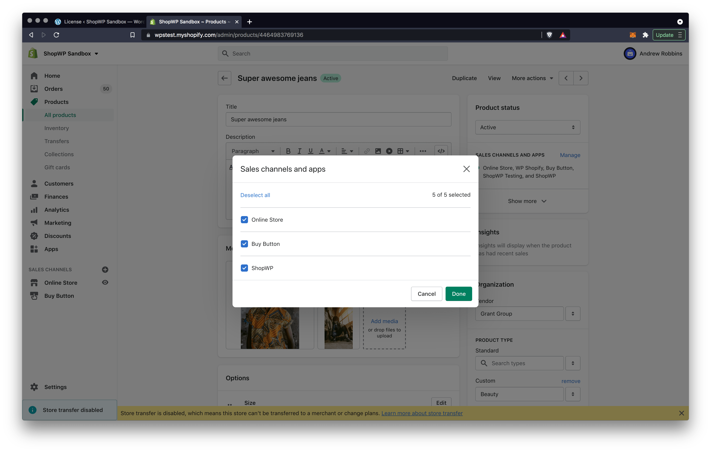

# Common Issues

Below are the most common issues people experience with ShopWP and how to fix them. If you're having a problem not listed here, please [send us an email](mailto:hello@wpshop.io).

## Products not showing

When your products are failing to show, it usually means that you need to assign them to the ShopWP sales channel. This sales channel is created automatically when you initially connect your store. It's used to control what products are visible in ShopWP. Below are the steps for assigning your products to the sales channel.

1. Open the product inside Shopify and look for the section called, "Sales channels and apps". Click the manage link.


2. Assign the product to the ShopWP sales channel and click "Done". Now head back to WordPress to see if the product shows up. Sometimes this can take 1-2 minutes.



## Checkout redirects to page not found

Issue: Clicking the "Begin checkout" button inside the ShopWP cart takes you to a page not found error.

Explanation: This can occur if your Shopify online store is password protected. The solution is to remove the password protection so that the checkout page can be reached by non-logged in users.

## Cookie nonce expiration

When this JavaScript error shows, it's usually due to another plugin caching the WordPress REST API too aggressively. WordPress uses a [cookie nonce to authenticate the REST API](https://developer.wordpress.org/rest-api/using-the-rest-api/authentication/), which ShopWP in turns also uses.

Please try temporarily deactivating your other plugins to see if that fixes the issue. You may also need to disable any host-level cache.

## Error: while calling undefined

When you receive this error, there's a good chance it's because your web server is running out of memory, OR it has hit the max execution time during the syncing process. Both of these things can be increased below:

```
To increase the Max Execution Time: https://wpastra.com/docs/increase-php-time-limit-wordpress-sites
To increase the Memory Limit: https://wpastra.com/docs/increasing-php-memory-limit-website/
```

## Error: Failed to assign Shopify ID 0

When you see this error, it's usually because a previous sync failed which resulted in stale data. To fix, you can follow these two steps:

1. First, go to the Tools tab within the plugin settings and use the `Remove all synced data` button

2. Once that’s done, use the `Sync Product & Collection Detail Pages` button once more.

Note: this will remove any custom fields applied to your product posts, and any product post menu items.

## Elememtor widgets disappear after updating ShopWP

Run this sql query in your database to make your widgets appear again:

```msql
UPDATE wp_postmeta SET meta_value = replace( meta_value, 'wpshopify', 'shopwp' ) WHERE (CONVERT(`meta_id` USING utf8) LIKE '%wpshopify%' OR CONVERT(`post_id` USING utf8) LIKE '%wpshopify%' OR CONVERT(`meta_key` USING utf8) LIKE '%wpshopify%' OR CONVERT(`meta_value` USING utf8) LIKE '%wpshopify%') AND meta_key <> "_wp_attachment_metadata";
```

## Internal error. Looks like something went wrong on our end.

This error can sometimes happen if the product or collection in Shopify is saved incorrectly. The easiest fix is to open the product in Shopify and set it to "draft". Then republish it again. After doing this check the WordPress site again.

## Update failed: Download failed. Unauthorized

Usually this error shows up when attempting to update the plugin. the main culprit is usually a license key issue.

If you see this error, open your ShopWP settings and find the `License` tab. From there, either add your ShopWP Pro license key, or remove it and add it back. This should solve the issue.
