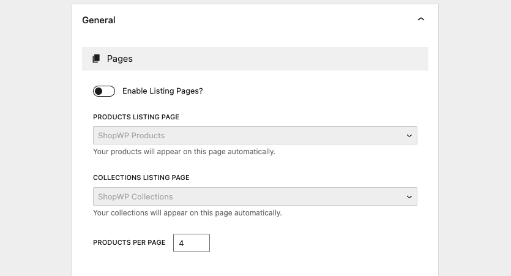

# Custom product listing page

By default, ShopWP creates it's own product listing page. But you can use your own!

### Step 1. Turn off the default listing pages

First, turn off the default listing pages inside the plugin settings.



### Step 2, Adjust the product slug

Next, open your WordPress theme and add the below PHP snippet to `functions.php`.

:::info
Make sure to use a child theme. If you're not, the code you add will be removed after updating your theme!
:::

Be sure to change `custom-products-page-slug` to the real slug of your custom page.

```php
add_filter('shopwp_register_products_args', function($settings) {

    $settings['rewrite']['slug'] = '/custom-products-page-slug';

    return $settings;

});
```
