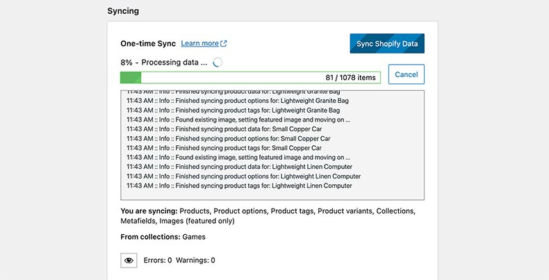
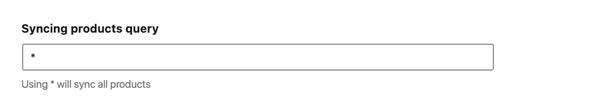

# Data sync (beta) guide



The syncing functionality of ShopWP has been rebuilt from the ground up!

`Data Sync` is the name given for this upcoming change and it enables you to fully sync Shopify into WordPress including things like featured images, metafields, collections as categories, etc.

## Before you start

:::info
I highly recommend that you **do not try testing Data Sync on your live site**. Create a staging site and test everything there instead.
:::

Thank you for offering to test Data Sync. It helps me iron out any lingering issues and improve the overall project. You're awesome!

## Installation

:::info
If you're installing this on a site that already has ShopWP installed, please make sure to deactivate the old ShopWP before installing this beta version.
:::

Data Sync is a **separate** plugin that must be installed along side the main ShopWP plugin. I haven't committed to this approach yet so if you have opinions about whether it should be bundled in the main plugin or not, let me know!

**To get started:**

1. Install and activate ShopWP Pro 6.0 - [Download ShopWP Pro 6.0](https://wpshop.io/datasync/shopwp-pro.zip) ⬇️
2. Install and activate the separate Data Sync plugin - [Download ShopWP Pro Data Sync 0.1.0](https://wpshop.io/datasync/shopwp-datasync.zip) ⬇️

## Syncing

There is now a clear distinction between a single or "one-time" sync and auto syncing. You will only be able to sync using one of these two methods.

Let's talk about each.

### One-time sync


As the name implies, the one-time sync tool will sync your Shopify data just once. It's a great way to manually sync things if you want more control over how data is pushed to WordPress.

This **will not keep things updated automatically**. If you change anything inside Shopify, you'll need to manually sync again to pull the changes down.

### Auto sync


The auto sync feature has been completely rebuilt from the ground up.

When auto sync is "connected", you will see a countdown timer displayed within the `Sync` tab. This timer counts down to the next sync. The interval that the timer uses can be set within the plugin's syncing settings. `ShopWP - Settings - Syncing - Auto sync cron interval`.

Auto sync uses a WordPress cron job to keep things on track. Because of this, it may require that you occasionally navigate to the Sync tab to ensure the cron continues to fire.

### Products sync query



A brand new syncing option called `Products sync query` has been added. This field tells ShopWP which products to sync. By default, the `*` character is used which means "sync all products". You can leverage the [Shopify Search syntax](https://shopify.dev/api/usage/search-syntax#examples) to customize this however you wish.

For example, if you only want to sync product with the tag `Apple`, you can use this:

```
tag:Apple
```

Sync products within a specific inventory range, or if the title is `Caramel Apple`.

```
(title:Caramel Apple) OR (inventory_total:>500 inventory_total:<=1000)
```

## Internal PHP functions

After you sync the data you'll need a way to access it. By default, Data Sync does not sync anything to post_meta fields. **This may change depending on the feedback I receive from everyone.**

To access your data, use the new internal PHP function `get_product()`, like this:

```php
$Products = ShopWP\Factories\Data_Factory::build();
$post_id = 137459;

$product_data = $Products->get_product($post_id);
```

There will be more functions exposed before the main launch.

## Feedback / open questions

- Do you enjoy data sync as a separate plugin? Or do you wish to keep the functionality bundled into the main plugin?
- Do you wish product and collection data was synced as post meta fields? Or is fetching the product information using the get_product() method ok?
