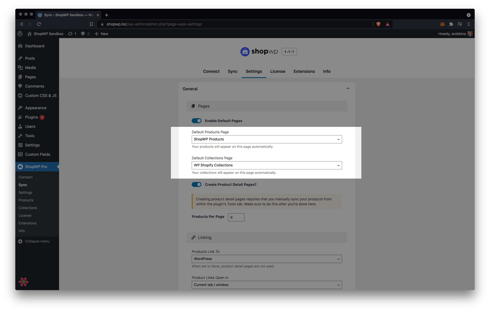
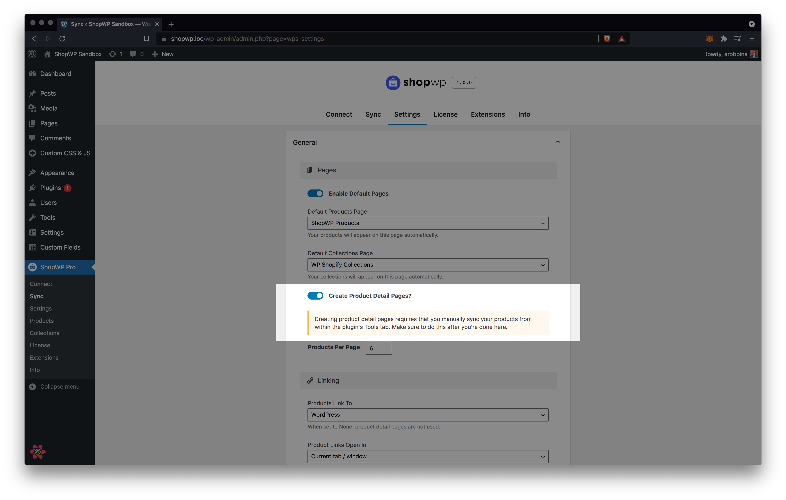
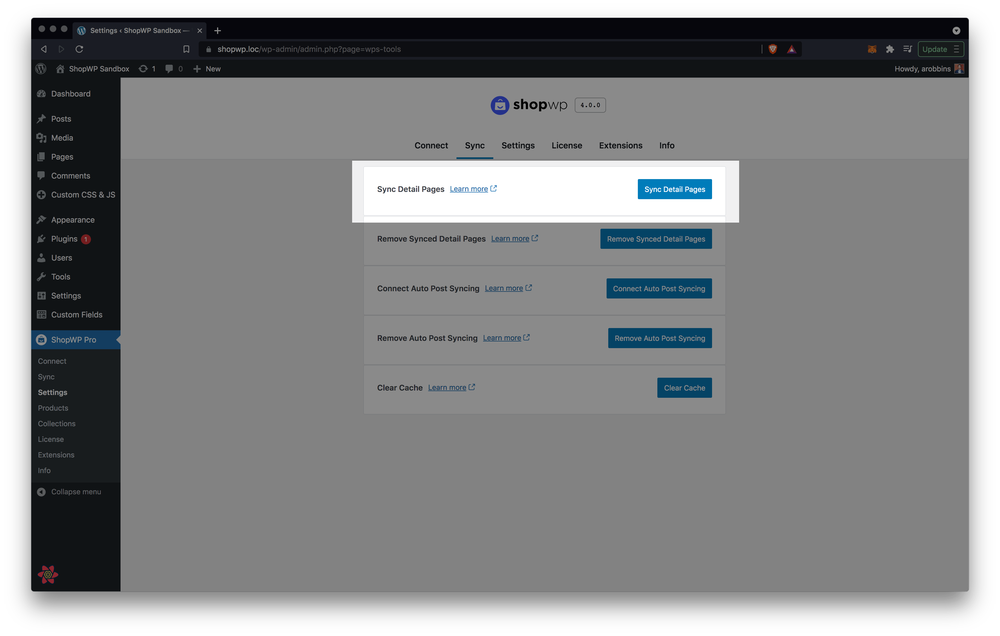

# Default Pages

## Listing Pages

ShopWP comes with two default listing pages: `ShopWP Products` and `ShopWP Collections`. These two pages are created when the plugin is first installed. The purpose of these pages is to display a list of your products or collections.

If you don't want to use these pages, you can turn them off within the plugin settings. You can also choose a different page to be used instead.

### Changing the listing pages

If you would like to change the default listing pages, go into the plugin settings and open the General section. Once open, configure the `Default Products Page` and `Default Collections Page` options and click save settings toward the bottom.

### Turning listing pages off

In order to turn the default pages off, go into the plugin settings and open the General section. Once open, toggle the `Enable Default Pages` option and save the settings.

## Detail Pages

ShopWP allows you to create detail pages for your products and collections. They are turned off by default, however. So before you can use them you'll need to go through a couple steps to turn them on.

### Creating Product Detail Pages

1. First, go into the plugin settings and open the General section. Once open, enable `Create Product Detail Pages` and click save.

2. The next step is to actually sync the detail pages. You can do this by clicking the "Tools" tab at the top and using the `Sync Detail Pages` button.

3. Once the sync is finished, you should see a list of products within WordPress under `ShopWP - Products`.

