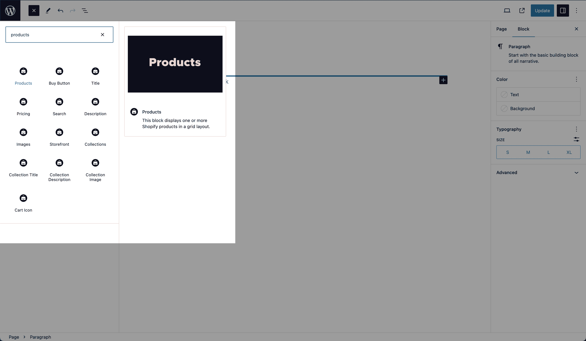

# Gutenberg Blocks

ShopWP Pro comes with 13 Gutenberg Blocks for displaying Shopify products and collections.

:::info
This feature is only available in [ShopWP Pro](https://wpshop.io/purchase?utm_medium=docs&utm_source=features&utm_campaign=upgrade).
:::

## Products block

Displays one or more Shopify products in a grid layout. All product components (title, pricing, etc) will be shown by default but can be selectively excluded if needed.

## Product Buy Button block

Displays the buy button of one or more product(s), excluding the other layout components.

## Product Title block

Displays the title of one or more product(s), excluding the other layout components.

## Product Pricing block

Displays the pricing of one or more product(s), excluding the other layout components.

## Product Description block

Displays the pricing of one or more product(s), excluding the other layout components.

## Product Images block

Displays the images of one or more product(s), excluding the other layout components.

## Storefront block

Displays the entire Storefront component. This is equivalant to using the [[wps_storefront]](/shortcodes/wps_storefront) shortcode.

The Storefront component comes with product filters and sorting.

## Collections block

Displays one or more Shopify collections in a grid layout. This will **not show** the collection products by default, but can be selectively included if needed.

## Collection Title block

Displays the title of one or more collections(s), excluding the other layout components.

## Collection Description block

Displays the description of one or more collections(s), excluding the other layout components.

## Collection Image block

Displays the image of one or more collections(s), excluding the other layout components.

## Cart Icon block

Displays a cart icon that allows users to toggle the ShopWP cart.

## Search block

Displays an input field that allows users to dynamically search for products without a page load.
