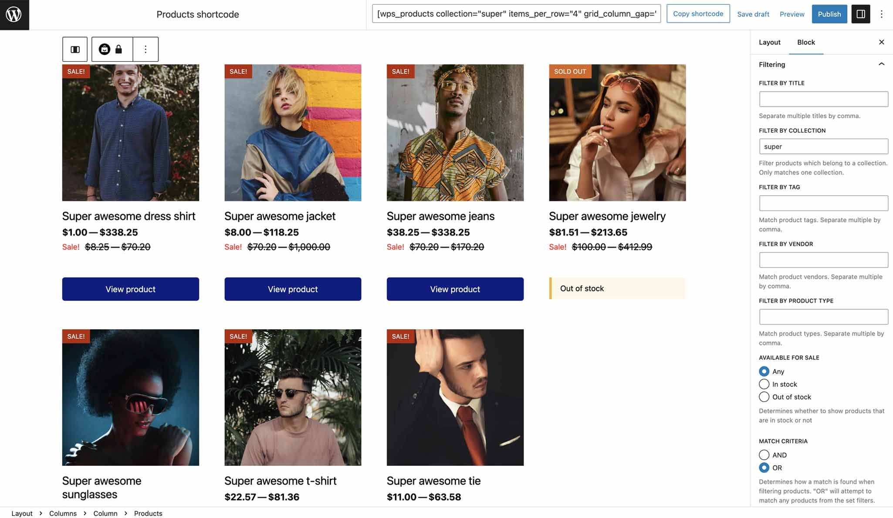
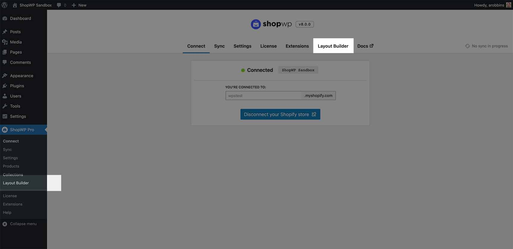
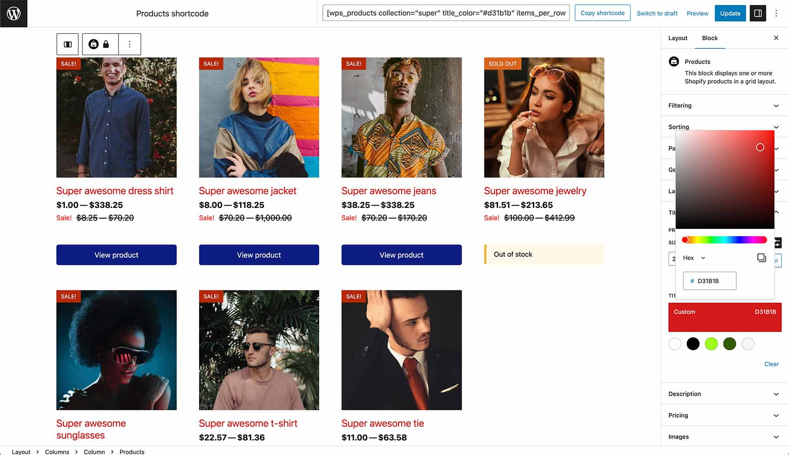
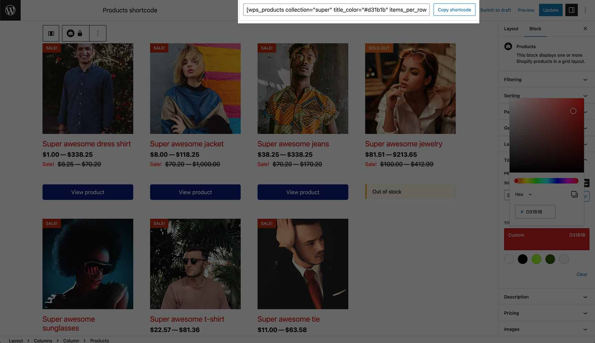
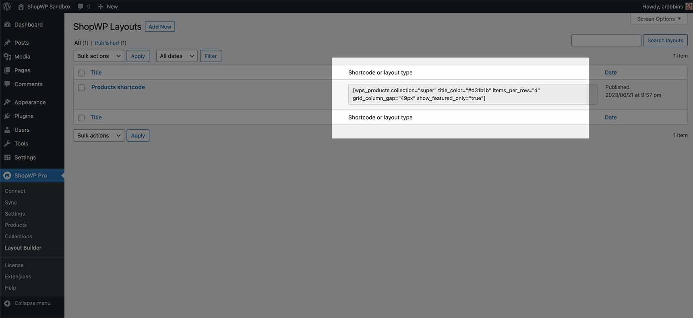
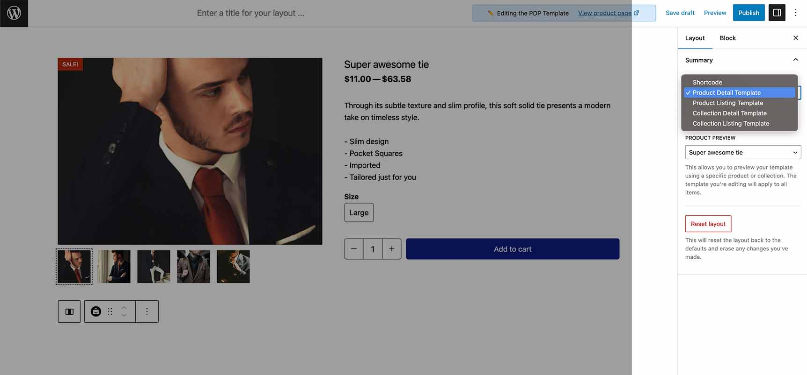
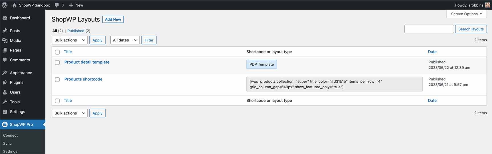

# Layout Builder

The ShopWP Layout Builder allows you to visually design your products and collections in various ways.

<iframe width="560" height="315" src="https://www.youtube.com/embed/YKIbiE_ZNsU" title="YouTube video player" frameBorder="0" allow="accelerometer; autoplay; clipboard-write; encrypted-media; gyroscope; picture-in-picture; web-share" allowfullscreen></iframe>

## How it works

The Layout Builder uses a customized version of the Gutenberg editor. This provides a powerful workflow enabling you to combine ShopWP blocks with other third-party blocks. When creating a layout, you can choose between five different layout types:

- **Shortcode**
- **Product Detail Page** (PDP)
- **Product Listing Page** (PLP)
- **Collection Detail Page** (CDP)
- **Collection Listing Page** (CLP)

The Shortcode layout type gives you five additional options to pick from. This determines the type of shortcode to create. All ShopWP shortcodes are available:

- **Products** - [[wps_products]](/shortcodes/wps_products)
- **Collections** - [[wps_collections]](/shortcodes/wps_collections)
- **Storefront** - [[wps_storefront]](/shortcodes/wps_storefront)
- **Search** - [[wps_search]](/shortcodes/wps_search)
- **Cart icon** - [[wps_cart_icon]](/shortcodes/wps_cart_icon)

As you build your layout, a shortcode will be created to copy and paste throughout your WordPress site. All available design options for the layout come from the core ShopWP blocks.

## Creating a layout

First, make sure you're using [ShopWP Pro `8.0` or greater](/guides/8.0).

:::info
The Layout Builder requires the Gutenberg block editor. If you have the [Classic Editor](https://wordpress.org/plugins/classic-editor/) plugin installed you'll need to [manually enable Gutenberg](#using-with-classic-editor) specifically for the Layout Builder.
:::

### Open Layout Builder

You can access the Layout Builder in two places:

Clicking Layout Builder will show you a list of all your generated layouts. If you haven't created anything yet, click `Add new`.

### Build your layout

When you first create a layout the Shortcode layout type will be selected automatically.

The ShopWP Layout Builder uses Gutenberg blocks, so the interface should be very familiar. Select the products block and find a list of available settings on right-hand side of the interface.

The above screenshot demonstrates changing the product title color to red. Each settings group (Filtering, Sorting, Layout, etc) has a wide variety of options to choose from.

### Copy the shortcode

Within the Layout Builder, you'll notice a big shortcode field at the very top of the page.

As you build your layout, this generated shortcode will change automatically for you. You can copy it at anytime and use it within your pages.

You can also find the shortcode within the listing page here:

## Using with Classic Editor

To use Layout Builder with the Classic Editor plugin, you'll need to turn on the `Allow users to switch editors` option. This allows you to enable the block editor for the Layout Builder, while using the classic editor for your other posts / pages.

You can access this setting within: `WordPress Dashboard - Settings - Writing`

## Creating template layouts

You can choose to create a template layout from the side nav.

After selecting a template type, the Layout Builder will automatically change the design to mimic the layout chosen. For example, the product detail layout will automatically create a two column layout as a default. You can change this to whatever you wish.

You can also preview your layout in any product (or collection) by selecting a new value in the "Product preview" dropdown.

Publishing your template will automatically apply it to your products. You can easily view your template in action by clicking the "View product page" link in the top nav.

All "template" layout types will show a badge so they're easily identifiable.

