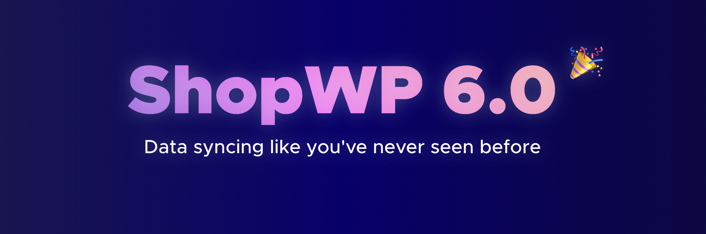

# ShopWP 6.0 Migration Guide

ShopWP `6.0` is a major update to the plugin which _**may**_ require some migration steps on your end depending on whether you're using deprecated features or not.

## What has changed?

- The Shopify connection has been changed and requires reconnecting
- The syncing process has been re-built from the ground up
- The default product and collection templates have been slightly modified
- Webhooks have been removed, and replaced with auto syncing

## Before updating

1. Backup your site. This will ensure you can roll back incase anything goes wrong
2. Perform the update on a staging site first
3. Make a note of what customizations you've made to ShopWP (templates overrides, PHP code, CSS, etc)
4. [Disconnect your old webhooks](#disconnect-webhooks-recommended)

## After the update

1. After updating to `6.0`, go to the "Connect" tab within the ShopWP plugin settings. From there, disconnect and reconnect your Shopify store. This will ensure that you're using the latest Shopify connection.

2. If you've customized the product or collection templates, rename the `wps-templates` folder to `wps-templates-off` after the update. You will need to make sure your [templates are up-to-date](#template-changes). After the templates are updated, rename the folder back to `wps-templates`.

3. Finally, visit the plugin settings look through everything to make sure it's set correctly. All of your existing settings should carry over correctly, but it's wise to double-check.

## Template changes

There have been minor changes to the default product and collection templates. If you're not customizing these templates in your theme, you won't need to take any action. Otherwise, read below.

**All instances of `WP_Shopify` will need to be replaced with `ShopWP`**. This needs to be done in any file that you have inside your `wps-templates` folder.

One quick way to ensure that your templates contain the latest changes is to copy the contents of your customized template (and the new template) into a [diff checker](https://www.diffchecker.com/). From there, you can figure out which pieces of the new template to add into your customized one.

**To make this easier, try using an online diff tool like this one: [https://www.diffchecker.com/](https://www.diffchecker.com/)**

## Disconnect webhooks (recommended)

:::info
As of February 2, 2023 Webhooks can now be disconnected with the new [ShopWP Webhooks extension](https://wpshop.io/extensions/webhooks/)
:::

If you're upgrading from ShopWP `4.x` or `5.x`, chances are you're using the old webhooks syncing method.

To avoid a torrent of emails from Shopify claiming that your webhook is failing, you'll want to manually disconnect these webhooks before updating to version `6.0`. ShopWP `6.0` does not provide a tool to disconnect old webhooks at this time, so you'll need to do it before updating.

### How to disconnect old webhooks

1. While still on `4.x` or `5.x`, open the ShopWP settings page and click the `Sync` sub nav.
2. Find the tool called `Remove automatic post syncing`.
3. Wait for it to finish. It could take a couple minutes

Once the removal process finishes, you'll be ready to upgrade to `6.0`.
