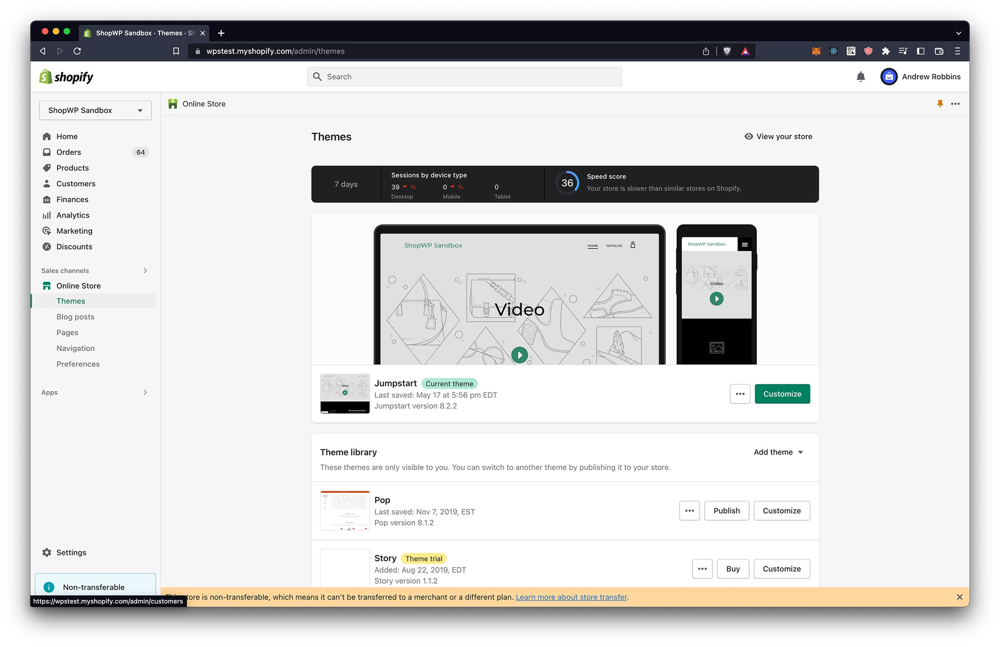
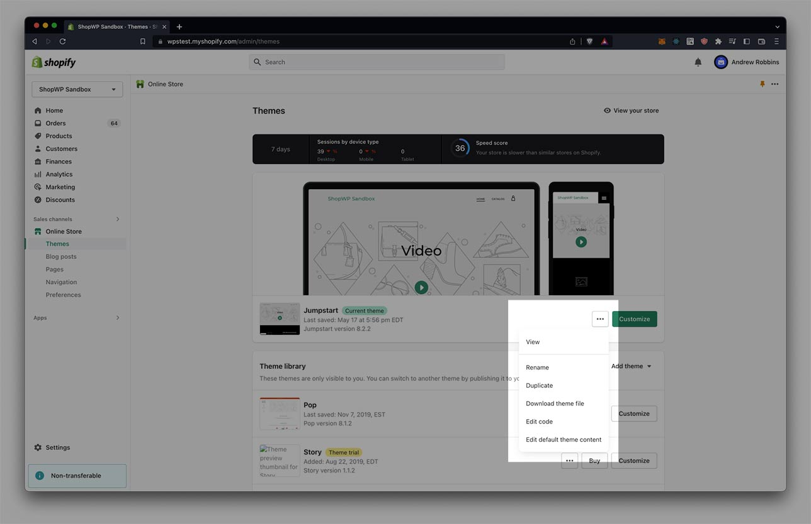
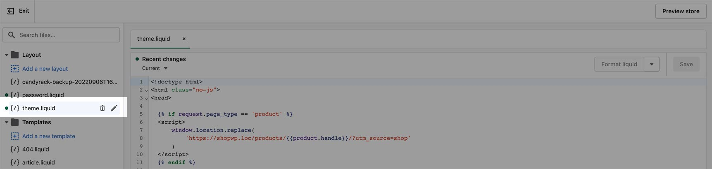
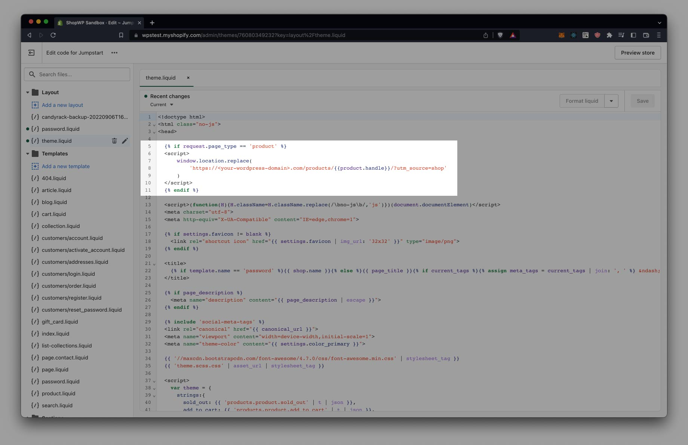
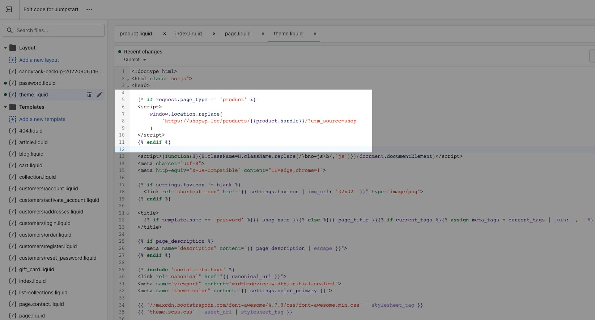

# Redirect Shopify pages

Often times, you may not want to use Shopify's product detail pages that come with the Online Store theme. You might want to redirect these pages to the ShopWP detail pages on WordPress.

Here's how to do that.

## Using liquid code

### Open your Shopify theme

Login to Shopify and click the `Online Store` link in the sidenav. From there, click `Themes`.

It should look something like the below:



I'm using the theme "Jumpstart", but you might be using a different theme.

### Edit the code

You should see three small dots next to the `Customize` button. After clicking the dots, click `Edit code`.



### Add the code snippet

This step will look different depending on what theme you have installed. However, the general idea will be the same.

We need to find the main `.liquid` template for the theme. The most common name for this file is `theme.liquid`. Open that file. You can tell it's the right file if it contains the `<head>` HTML tag.

It should look something like this:



Immediately after the opening `<head>` tag, add the below snippet:

```html

<script>
	window.location.replace(
		'https://<your-wordpress-domain>.com/products/{{product.handle}}' +
			window.location.search
	)
</script>

```

It should look like this:



### Customize the snippet

Afterwards, make sure to replace `<your-wordpress-domain>` with your WordPress domain. This will be the URL that users are sent to during the redirect. So be sure it's the correct one. In my case, `https://shopwp.loc` is the WordPress domain I'm using.

After the edits, it should look something like this:



:::info
`{{product.handle}}` will change dynamically depending on which product page is loaded on the Shopify side.
:::

## Headless theme

There’s a really good Shopify “headless” theme that you can use as well: [https://github.com/instantcommerce/shopify-headless-theme](https://github.com/instantcommerce/shopify-headless-theme)

After installing the theme you can set a “destination” URL, which will be your WordPress site. The theme will then use this URL to take care of redirecting everything for you.

## Other code snippets

Here are some other useful code snippets:

**Detecting the homepage:**

```html
 
```
