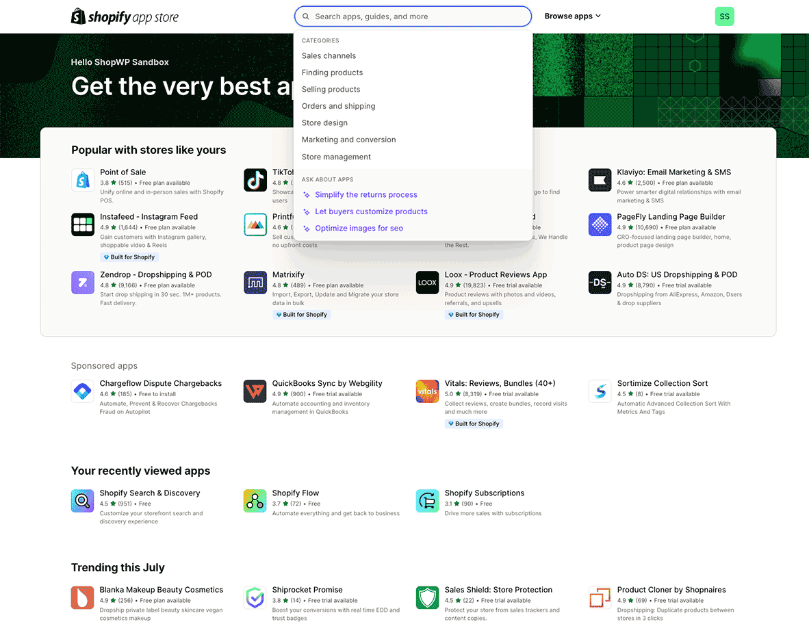
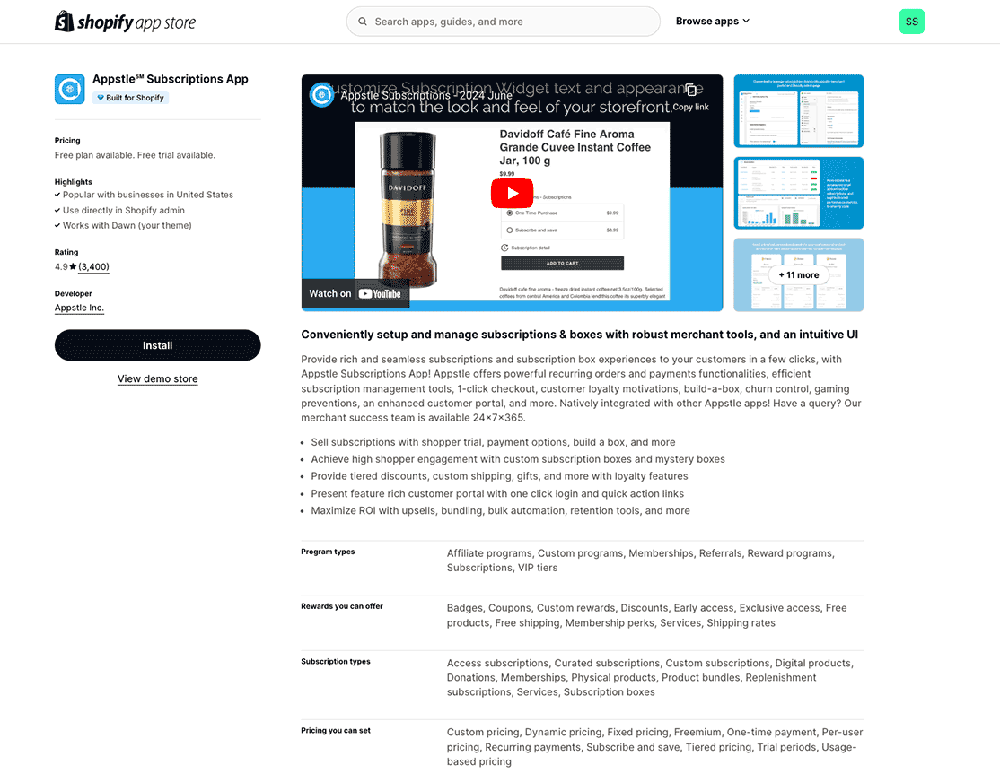

# Subscriptions

Starting in ShopWP version `8.0`, subscriptions functionality is now built-in for free. You will still need to manage your subscriptions using a [Shopify app](https://apps.shopify.com/), but any app will now work seamlessly with ShopWP.

## Getting started

Before you start, please make sure to meet the below requirements:

### Requirements

1. Purchase and install [ShopWP Pro](https://wpshop.io/purchase)
2. Install a subscriptions [Shopify app](https://apps.shopify.com/)
3. Show the subscriptions widget

### Install a subscriptions app

1. First, open the `Apps` page within your Shopify store and type in subscriptions.



2. Choose an app. Any will work, but there are pros and cons to each. We'll install Appstle because they provide a reasonably cheap subscriptions solution for smaller stores.



3. After installing the app, you'll want to configure it. This step will vary depending on which app you choose, so please follow the steps provided by the app developer for creating subscription products.

## Displaying the Subscriptions widget

By default, the subscriptions widget won't show with your products. The feature is "opt-in" only, meaning you'll need to manually enable it on each shortcode or block. You can also choose to enable subscriptions globally for all products.

### Showing subscriptions with shortcodes

To show subscriptions with a shortcode, add the `subscriptions` attribute with the value `true`. It should look like this:

```js
[wps_products subscriptions="true"]
```

:::info
For more information on the available shortcode attributes, reference the [subscriptions section](/shortcodes/wps_products#subscriptions).
:::

### Show subscriptions globally

To show the subscriptions for all products, you'll need to enable the `Show subscriptions by default` setting. To do this, open the plugin settings and find the `Subscriptions` section. Once open, turn on `Show subscriptions by default` and click save.


## How the checkout process works

One of the coolest aspects of the subscriptions feature is the seamless integration with Shopify checkout.

Traditionally, Shopify subscription products required developers to create their own checkout pages. This was cumbersome for many reasons. Thankfully, we're now able to use the _same_ checkout page that your customers are used to. This also means that you should be able to continue using any third-party Shopify apps that may customize the checkout experience.

The checkout process will work the same way it does with non-subscription products. In fact, your customers can even add subscription and non-subscription products to the same cart and purchase together.

### Additional questions

If you have additional question, make a comment in the Slack channel or send us an email: [hello@wpshop.io](mailto:hello@wpshop.io)
