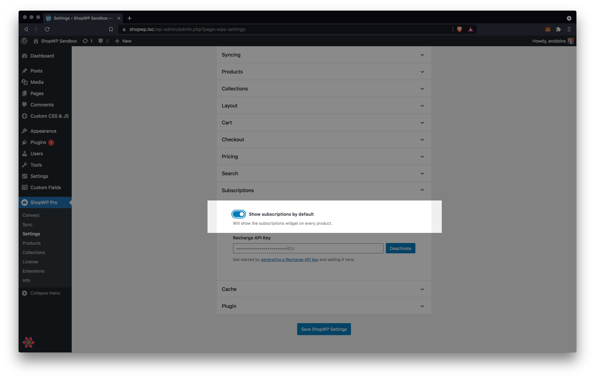

# Subscriptions

ShopWP integrates with the [Recharge app](https://apps.shopify.com/subscription-payments), enabling you to display and sell subscription products on any WordPress site.

## Getting started

Before you can start showing your subscription products, there are a couple steps you must take.

First, you must meet the below requirements and install _both_ [ShopWP Pro](https://wpshop.io/purchase) and the [ShopWP Pro Recharge](https://wpshop.io/extensions/recharge) extension. You also need to have the Recharge Shopify app installed. Once you have these requirements met, skip to the section ["Adding the Recharge API key"](#adding-the-recharge-api-key) to finish.

### Requirements

1. [ShopWP Pro](https://wpshop.io/purchase)
2. [ShopWP Pro Recharge Extension](https://wpshop.io/extensions/recharge)
3. [Recharge Shopify app](https://apps.shopify.com/subscription-payments) installed and configured
4. Your [Recharge API key added](#adding-the-recharge-api-key) to the ShopWP settings

### Adding the Recharge API key

1. First, open the `Apps` page within your Shopify store and click the Recharge app.


2. Once the next page loads, click the `Integrations` link found in the top nav bar.


3. Next, click the `API tokens...` link on the right-hand side of the page.


4. You may need to agree to the Recharge terms of service if this is your first time using their API. Click all the checkboxes and then click Accept.


5. Click the `Create an API token` button on the right-hand side of the page.


6. Give your token a name. This can be anything you want, but something to easily identify your site would be useful such as your wordpress domain. Next, add your contact email address (probably the same as your WordPress user email). For the permissions, set the `Subscriptions` and `Products` to read and write. Finally, click the terms of service checkbox and save.


7. You should then be shown a confirmation notice with your newly generated API token displayed.


8. The last step is to copy the API token and paste it into the plugin settings under the "Subscriptions" section. Click save to finish. You're now ready to [start displaying your subscriptions](#displaying-the-subscriptions-widget).


## Displaying the Subscriptions widget

By default, the subscriptions widget won't show with your products. The feature is "opt-in" only, meaning you'll need to manually enable it on each shortcode or block. You can also choose to enable subscriptions globally for all products.

### Showing subscriptions with shortcodes

To show subscriptions with a shortcode, add the `subscriptions` attribute with the value `true`. It should look like this:

```js
[wps_products subscriptions="true"]
```

:::info
For more information on the available shortcode attributes, reference the [subscriptions section](/shortcodes/wps_products#subscriptions).
:::

### Show subscriptions globally

To show the subscriptions for all products, you'll need to enable the `Show subscriptions by default` setting. To do this, open the plugin settings and find the `Subscriptions` section. Once open, turn on `Show subscriptions by default` and click save.



## How the checkout process works

One of the coolest aspects of the subscriptions feature is the seamless integration with Shopify checkout.

Traditionally, Shopify subscription products required developers to create their own checkout pages. This was cumbersome for many reasons. Thankfully, we're now able to use the _same_ checkout page that your customers are used to. This also means that you should be able to continue using any third-party Shopify apps that may customize the checkout experience.

The checkout process will work the same way is does with non-subscription products. In fact, your customers can even add subscription and non-subscription products to the same cart, and purchase them together.

### Additional questions

If you have additional question or need extra support, make a comment in the Slack channel or send us an email: [hello@wpshop.io](mailto:hello@wpshop.io)
