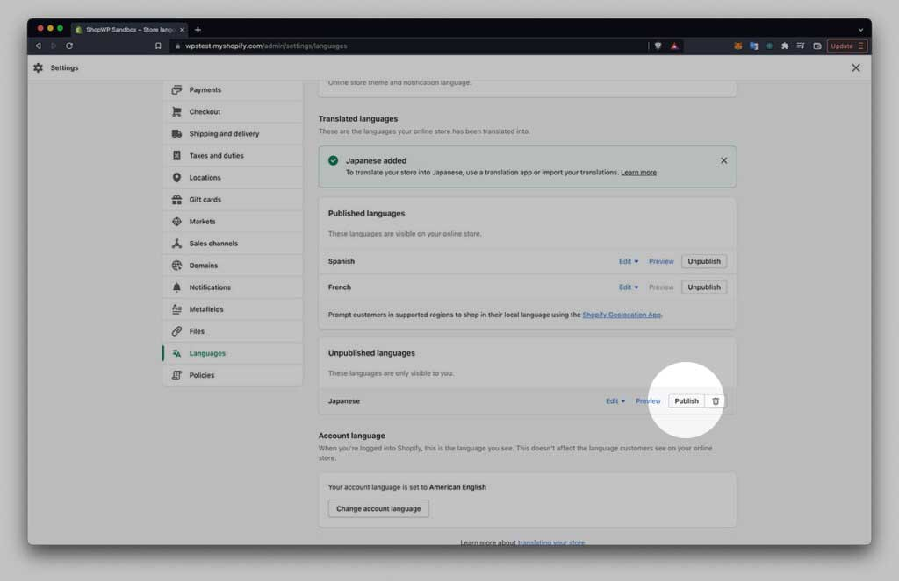

# Translator

ShopWP allows users to translate their products into different languages and currencies using the [Translator extension](https://wpshop.io/extensions/translator).

## Getting started

Before continuing, please make sure to meet the below requirements:

### Requirements

- Purchase and install [ShopWP Pro](https://wpshop.io/purchase/)
- Purchase and install [ShopWP Translator extension](https://wpshop.io/extensions/translator)

### How it works

The [Translator extension](https://wpshop.io/extensions/translator) is installed with the main ShopWP Pro plugin. The extension reads from your [Shopify Markets settings](#shopify-markets), and allows you to display a translator widget for your customers.

When a customer switches to a different language or currency, that choice is persisted across page reloads and follows the user through the checkout process.

## Step 1: Shopify Markets

Shopify Markets is at the heart of everything. It's the place you go to configure each "market" for your store, which languages will be available, and much more. I encourage you to look through the official [Shopify Markets guide](https://help.shopify.com/en/manual/markets).

:::info
ShopWP does not maintain it’s own list of countries, languages or currencies. Instead, this information comes from your Shopify Markets settings. Therefore, only the languages and currencies manually enabled inside Shopify will be available in ShopWP.
:::

Let's start by creating a new market.

### Creating a new market

1. Login to your Shopify dashboard and click `Settings`

2. Once the settings are open, click the `Markets` link. Depending on your existing setup you may only see one market listed. In the below screenshot I have three: US, Canada, and Mexico.

3. Next click the `Add market` button to begin setting up a new market. Give your Market a name. For this guide I’ll be creating a new market for Japan so I'll name mine `Japan`.

4. Next click the `Add countries/regions` link. After adding your region click done to exit the modal. You’ll then click the Save button in the top right corner to finish.

5. You should now see an edit screen for your new Market. You can go here to add languages, currencies, shipping info, etc.

### Adding a currency to your Market

After creating a new market, make sure you have the proper currency assigned. This will be the currency that ShopWP can use as well.

1. Within your market edit screen, click the Manage link next to Currency and Pricing.

Shopify will attempt to find the currency automatically based on the region you chose earlier. If this isn’t the currency that you want to use, you can change it here. You can also adjust the prices of your products.

:::info
It’s important to note that you can only assign one currency to every market.
:::

### Adding languages to your Market

Every market you create can have one or more languages assigned to it. It will use your store’s default language automatically unless you change it. Shopify has written a nice [guide that you can read](https://help.shopify.com/en/manual/markets/languages/manage-languages) on this.

For our purpose, let’s add Japanese to our newly created market for Japan.

1. Begin by clicking the **Languages** side nav link. From there, click the green **Add language** button in the top right corner.

2. Next, choose the language you want to add.

3. The next step is important. It tripped me up at first. After adding the language **you must manually publish it**. You can do this on the same screen (see below screenshot).

4. After publishing your new language it will show under the “Published languages” section. It should also give you a success notice.

5. Now that you’ve created a new language and set it to Published, you’ll need to tell your market to use it.

To do this, go back to the Markets section and click the manage link to edit your market.

From there, click the manage link next to the “Domains and languages” section.

Scroll down and you should see your new language. Select it and click the save button.

ShopWP can now use your new market!

### How currency conversion works

One of the nice features of the ShopWP Translator functionality is the ability to lean on Shopify for all the complex currency conversions.

After switching currencies within the ShopWP settings, or within the Translator widget, your product prices will be automatically converted into the currency you selected. This is done by Shopify using the current market exchange rate at the time.

For more details, read the [Pricing in local currencies](https://help.shopify.com/en/manual/markets/pricing) article from Shopify.

## Step 2: Translating products

Shopify does not provide translations out of the box. Instead, they rely on third-party apps to do the translations for things like product titles, descriptions, variant names, etc.

The app I'll be using for this tutorial is called: [Translate & Adapt](https://apps.shopify.com/translate-and-adapt)

1. Once you have [Translate & Adapt](https://apps.shopify.com/translate-and-adapt) installed, open the app inside Shopify.

2. You can now choose which content type to translate. Click the `Edit` button next to `Products`.

3. Now, go to the search box and select the product you want to translate.

3. Make sure to also select the language that you want to begin **translating to**

4. Add your translations to the fields. Here we translate our content to Japanese

After translating your content the correct translations should begin showing within ShopWP.

## Step 3: The translator widget

The translator widget allows customers to switch between languages **and** currencies in one place. The selection is then stored in the user's browser to maintain the selection from page to page.

You also have the ability to "fix" the translator widget to the bottom of the page by adding `fixed="true"` to the shortcode.

### How to display

The translator widget can be displayed using the [`[wps_translator]`](/shortcodes/wps_translator) shortcode.

Visit the [shortcode page](/shortcodes/wps_translator) for a full list of available shortcode options.
