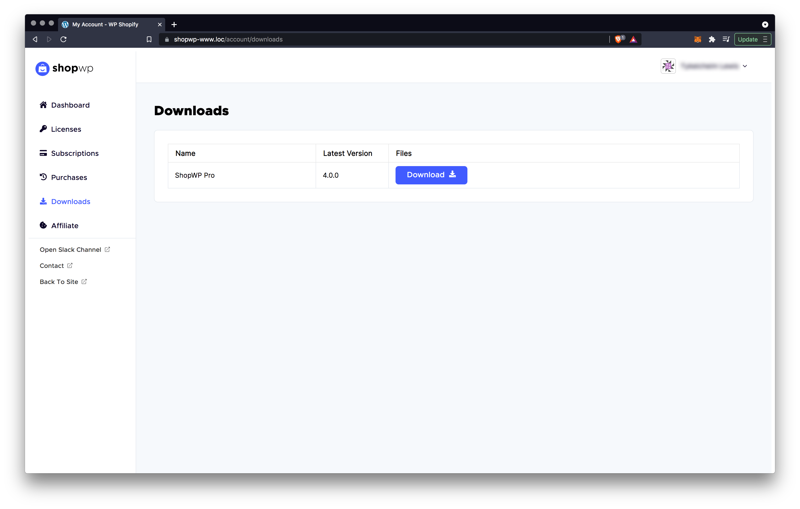
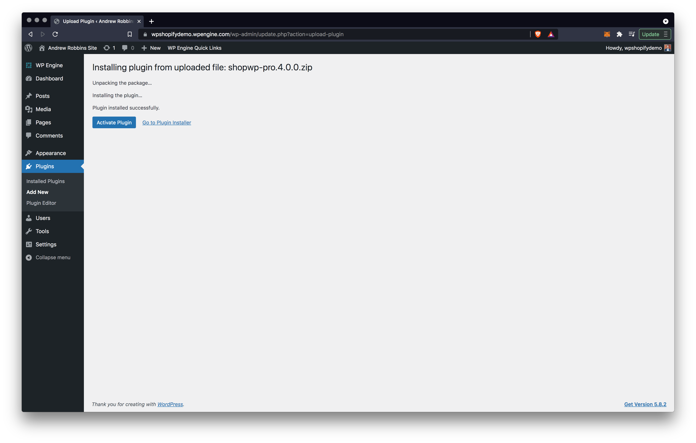
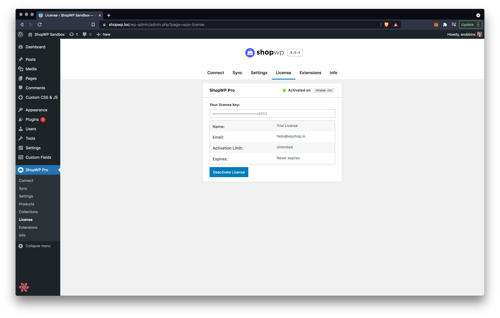

# Upgrading to ShopWP Pro

Before we get started, keep in mind that ShopWP and ShopWP Pro are _separate_, independent plugins. You'll want to use one or the other.

:::info
The upgrade process will _not_ remove any content you may have added, including synced product posts, updated settings, etc.
:::

### 1. Purchase a License Key

The first step is to purchase a license key. You can do this by [visiting our purchase page](https://wpshop.io/purchase).

### 2. Download the Pro Version

After purchasing ShopWP Pro, you'll receive access to an account for https://wpshop.io. This account will give you access to the download files and allow you to manage your ShopWP Pro subscription as well.

After logging into your account, you can download ShopWP Pro under the "Downloads" tab. You can also find a download link within the welcome email sent to you.

### 3. Deactivate Free Version (important)

Before you install and activate the Pro version, open your WordPress dashboard and deactivate the free version. Make sure to do this _before_ installing the Pro version.

### 4. Install the Pro Version

Open your WordPress dashboard and install the plugin by going to `Plugins -> Add New`.

### 5. Activate the Pro Version

Now that the plugin is installed, click "Activate Plugin" to finish the installation.

### 6. Delete the Free Version

After activating ShopWP Pro you can now safely delete the free version.

### 7. Enable Updates

Lastly, go to the License tab located under `ShopWP Pro - License` and add your license key.

You will now receive plugin updates!

