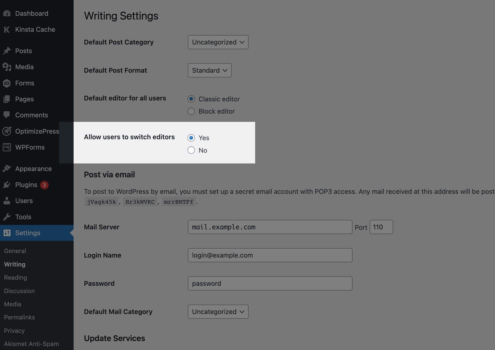

# Visual Builder

Visually create product layouts that automatically generate shortcodes. As you build your layout, a shortcode will be created to copy and paste throughout your WordPress site.

## How it works

First, make sure you're on [ShopWP Pro `6.3` or greater](https://wpshop.io/pricing).

:::info
The Visual Builder requires the Gutenberg block editor. If you have the [Classic Editor](https://wordpress.org/plugins/classic-editor/) plugin installed, you'll need to [manually enable Gutenberg](#using-with-classic-editor) specifically for the Visual Builder.
:::

### Open Visual Builder

You can access the Visual Builder in two places:

Once open, you'll see a list of your generated shortcodes. If you haven't created anything yet, click `Add new`.

:::info
You can create as many layouts as you want. Easily reference the shortcode on the listing page, or find it at the top of the shortcode edit screen.
:::

### Build your layout

The ShopWP Visual Builder uses Gutenberg blocks, so the interface should be very familiar. Select the products block and find a list of available settings on right-hand side of the interface.

Each settings group (Filtering, Sorting, Layout, etc) has a wide variety of options to choose from.

### Copy the shortcode

Within the visual builder, you'll notice a big shortcode field at the very top of the page.

As you build your layout, this generated shortcode will change automatically for you. You can copy it at anytime and use it within your pages.

You can also find the shortcode within the listing page here:

## Using with Classic Editor

To use Visual Builder with the Classic Editor plugin, you'll need to turn on the `Allow users to switch editors` option. This allows you to enable the block editor for the visual builder, while using the classic editor for your other posts / pages.

You can access this setting within: `WordPress Dashboard - Settings - Writing`

